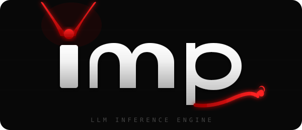

<p align="center">
  
</p>

<p align="center">
  High-performance LLM inference engine for NVIDIA Blackwell — RTX 5090 (sm_120f) only.
</p>

<p align="center">
  <b>~40k lines of C++20/CUDA — built entirely by <a href="https://claude.ai/claude-code">Claude Code</a> (Opus 4.6).</b>
</p>

<p align="center">
  <a href="LICENSE"></a>
  
  
  <a href="https://github.com/kekzl/imp/commits/main"></a>
</p>

---

## What is this?

imp is a CUDA inference engine written from scratch — every line of code, every kernel, every optimization was generated by [Claude Code](https://claude.ai/claude-code) (Claude Opus 4.6). The goal: see how far an AI coding agent can go on a genuinely hard systems programming task.

This is not a wrapper. imp implements its own GGUF parser, SafeTensors loader (NVFP4 prequant from NVIDIA Model Optimizer + llm-compressor), Jinja2 template engine, BPE tokenizer, paged KV cache, attention kernels (FP8 / FP16 / MXFP4 FMHA, paged decode with split-K), quantised GEMV (dp4a + NVFP4), MoE routing, Gated DeltaNet (GDN) recurrent layers, CUDA Graphs, and more — targeting Blackwell `sm_120f` (RTX 5090, GB202) only with CUDA 13.2+.

## Performance

**RTX 5090** (Blackwell, sm_120, 32 GB GDDR7) &mdash; CUDA 13.2.1, NVFP4 decode + FP8 prefill.

### Decode Throughput (tok/s, higher = better)

| Model | Quant | imp | llama.cpp | Speedup |
|---|---|---:|---:|---:|
| Qwen3-4B | Q8_0 | **401** | 244 | **+64%** |
| Qwen3-8B | Q8_0 | **255** | 157 | **+62%** |
| Qwen3.5-4B (GDN) | Q8_0 | **220** | 180 | **+22%** |
| Qwen3.5-9B (GDN) | Q8_0 | **140** | &mdash; | &mdash; |
| Llama-3.2-3B | Q8_0 | **208** | &mdash; | &mdash; |
| Qwen3-Coder-30B-A3B | Q6_K | **234** | &mdash; | MoE auto-offload |
| Qwen3.6-35B-A3B | Q4_K_M | **143** | &mdash; | GDN+MoE hybrid |
| Qwen3.6-35B-A3B | NVFP4 | **196** | &mdash; | post #95 (cache budget + thinking fixes) |
| Gemma-4-26B-A4B-it | Q4_K_M | **183** | 151 | **+21%** |
| Gemma-4-26B-A4B-it | NVFP4 | **201** | &mdash; | post #95 (CUTLASS scratch + thinking fixes) |

### Prefill Throughput (tok/s)

| Model | Quant | pp512 |
|---|---|---:|
| Qwen3-4B | Q8_0 | **27,201** |
| Qwen3-8B | Q8_0 | **17,636** |
| Qwen3.5-4B (GDN) | Q8_0 | **14,823** |
| Qwen3.5-9B (GDN) | Q8_0 | **8,520** |
| Llama-3.2-3B | Q8_0 | **22,544** |

### Long-Context Prefill (pp=8192, new in v0.7)

Previously broken at `n>1024` due to an FP8 FMHA shared-memory bug (PR #33).

| Model | imp v0.7 | llama.cpp | Speedup |
|---|---:|---:|---:|
| Qwen3-4B Q8_0 | **13,566** | 7,978 | **×1.70** |
| Qwen3-8B Q8_0 | **11,050** | 6,749 | **×1.64** |
| Qwen3.5-4B GDN Q8_0 | **13,090** | &mdash; | &mdash; |
| Mistral-24B Q6_K | **3,595** | 3,058 | ×1.18 |
| Qwen3-32B Q4_K_M | **2,040** | 1,802 | ×1.13 |

<sub>All numbers: single RTX 5090, greedy sampling (temp=0), 256 output tokens, 3 repetitions average. Full results: **[BENCHMARKS.md](BENCHMARKS.md)** &middot; Changelog: **[CHANGELOG.md](CHANGELOG.md)**</sub>

## Quickstart

No local CUDA toolkit needed &mdash; everything runs in Docker.

```bash
# 1. Clone and enter the repo
git clone https://github.com/kekzl/imp.git && cd imp

# 2. Download a model (any GGUF from Hugging Face)
mkdir -p models
# Example: Qwen3-8B Q8_0 (~8.6 GB)

# 3. Build
docker compose build imp-server

# 4. Run the server
docker run --gpus all -v ./models:/models -p 8080:8080 \
  imp:latest --model /models/Qwen3-8B-Q8_0.gguf

# 5. Chat (OpenAI-compatible API)
curl -s http://localhost:8080/v1/chat/completions \
  -H "Content-Type: application/json" \
  -d '{"messages":[{"role":"user","content":"Hello!"}],"max_tokens":64}'
```

**Works with any OpenAI-compatible client:**

```python
# pip install openai
from openai import OpenAI
client = OpenAI(base_url="http://localhost:8080/v1", api_key="none")
r = client.chat.completions.create(
    model="default", messages=[{"role": "user", "content": "Hello!"}],
    max_tokens=64, stream=True)
for chunk in r:
    print(chunk.choices[0].delta.content or "", end="", flush=True)
```

**Or use the CLI directly:**

```bash
# Interactive chat
docker run -it --gpus all -v ./models:/models \
  imp:latest imp-cli --model /models/Qwen3-8B-Q8_0.gguf --interactive

# Single prompt
docker run --gpus all -v ./models:/models \
  imp:latest imp-cli --model /models/Qwen3-8B-Q8_0.gguf \
  --prompt "Explain quantum computing in 3 sentences."

# Benchmark (compare with llama-bench)
docker run --gpus all -v ./models:/models \
  imp:latest imp-cli --model /models/Qwen3-8B-Q8_0.gguf \
  --bench --bench-pp 512 --max-tokens 128 --bench-reps 5
```

## CLI

```bash
# Single prompt
./build/imp-cli --model model.gguf --prompt "Hello, world!"

# Interactive chat
./build/imp-cli --model model.gguf --interactive

# Vision (Gemma-3)
./build/imp-cli --model gemma-3-12b-it.gguf --mmproj mmproj.gguf \
  --image photo.jpg --prompt "Describe this image"

# NVFP4 decode cache (auto-enabled on Blackwell)
./build/imp-cli --model model.gguf --decode-nvfp4 --interactive

# Benchmark (matches llama-bench methodology)
./build/imp-cli --model model.gguf --bench --bench-pp 512 --max-tokens 128 --bench-reps 5
```

<details>
<summary>Full CLI options</summary>

```
Model:
  --model <path>            Path to GGUF or SafeTensors model
  --mmproj <path>           Vision encoder GGUF for multimodal
  --image <path>            Input image (requires --mmproj)
  --device <n>              CUDA device ID (default: 0)
  --gpu-layers <n>          Layers on GPU, -1 = all (default: -1)

Generation:
  --prompt <text>           Input prompt
  --max-tokens <n>          Max tokens to generate (default: 256)
  --max-seq-len <n>         KV context ceiling in tokens (default: auto from VRAM)
  --min-kv-tokens <n>       Minimum KV capacity in tokens (default: auto)
  --interactive             Interactive chat mode
  --stop <str>              Stop sequence (repeatable, up to 4)
  --chat-template <t>       auto|none|chatml|llama2|llama3|nemotron|gemma|deepseek_r1|phi

Sampling:
  --temperature <f>         (default: 0.7)
  --top-p <f>               (default: 0.9)
  --top-k <n>               (default: 40)
  --min-p <f>               (default: 0.0, disabled)
  --typical-p <f>           (default: 1.0, disabled)
  --repeat-penalty <f>      (default: 1.0, disabled)
  --repeat-last-n <n>       Penalty window (default: 0, all tokens)
  --frequency-penalty <f>   (default: 0.0)
  --presence-penalty <f>    (default: 0.0)
  --seed <n>                -1 for random (default: -1)
  --dry-multiplier <f>      DRY penalty scale (default: 0.0, disabled)
  --dry-base <f>            DRY exponential base (default: 1.75)
  --dry-allowed-length <n>  (default: 2)
  --dry-penalty-last-n <n>  (default: 0, all)
  --mirostat <n>            0=off, 2=v2 (default: 0)
  --mirostat-tau <f>        (default: 5.0)
  --mirostat-eta <f>        (default: 0.1)

Performance:
  --kv-fp8                  FP8 E4M3 KV cache
  --kv-int8                 INT8 KV cache
  --prefill-fp8             FP8 weight cache for prefill
  --prefill-chunk-size <n>  Max tokens per prefill chunk (default: 0)
  --decode-nvfp4            NVFP4 decode cache (FP16 prefill + NVFP4 decode)
  --decode-nvfp4-only       NVFP4 decode-only (saves VRAM, slower prefill)
  --no-nvfp4                Disable NVFP4 auto-detection
  --ssm-fp16                FP16 SSM state
  --no-cuda-graphs          Disable CUDA Graphs
  --mxfp4-prefill           CUTLASS MXFP4 GEMM for prefill (sm_120)

Benchmark:
  --bench                   Synthetic benchmark mode (warmup + timed reps)
  --bench-pp <n>            Prompt tokens (default: 512)
  --bench-reps <n>          Repetitions (default: 3)
```

</details>

## Features

- **Architectures:** LLaMA, Mistral, Mixtral, DeepSeek, Qwen3, Qwen3-MoE, **Qwen3.5 (Gated DeltaNet)**, **Qwen3.6 (GDN + MoE hybrid)**, Phi-4, Gemma-3 (text + vision), **Gemma-4 (26B-A4B MoE)**, Nemotron-H (Mamba2 + Attention + MoE)
- **Model formats:** GGUF, SafeTensors (NVFP4 prequant from NVIDIA Model Optimizer + llm-compressor), MXFP4 GGUF (imp-proprietary)
- **Quantization:** Q2_K, Q3_K, Q4_0, Q4_K_M, Q5_K, Q6_K, Q8_0, FP8 E4M3, NVFP4 (FP4 E2M1), MXFP4 (FP4 E2M1 + UE8M0), INT8, INT4
- **Vision:** Gemma-3 SigLIP encoder (896×896, 256 image tokens) via separate mmproj.gguf
- **Attention:** Blackwell paged decode (FP16/FP8 KV split-K), CUTLASS SM120 FMHA prefill (FP16/FP8/MXFP4), Programmatic Dependent Launch (PDL)
- **KV cache:** paged blocks (configurable 16/32/64), LRU eviction, prefix caching with block pinning, FP16 (default) / FP8 (opt-in) / INT8 / INT4 / NVFP4 / TurboQuant
- **Decode:** CUDA Graphs (conditional WHILE loop), PDL, fused RMSNorm+Q8_1, fused QKV/gate+up GEMV, NVFP4 decode cache with prmt register LUT, multi-block argmax, NVFP4-prequant MoE fast-path (Qwen3.6, Gemma-4)
- **Prefill:** CUTLASS SM120 FMHA, CUTLASS NVFP4 GEMM, CUTLASS 3.x grouped MoE GEMM, FP8 cuBLASLt, FP16/FP8 weight cache, batched K/V GEMM
- **Sampling:** temperature, top-p, top-k, min-p, typical-p, repetition/frequency/presence penalties (windowed), DRY, Mirostat v2
- **Runtime:** continuous batching, Green Context SM partitioning, upfront VRAM budget planner, `imp.conf` (TOML, replaces ~50 `IMP_*` env vars)
- **Agentic:** prefix cache block pinning, JSON schema constraining, tool calling (ChatML + Llama3), thinking/reasoning budgets, TTFT metrics
- **API:** C library, OpenAI-compatible HTTP server (SSE streaming, tool calling, logprobs, JSON mode, concurrent requests), Anthropic `/v1/messages` (streaming + non-streaming)

> **Tested models:** Qwen3-4B, Qwen3-8B, Qwen3-32B (Q4_K_M), Qwen3-Coder-30B (MoE Q6_K + NVFP4), Qwen3.5-4B/9B (GDN hybrid), Qwen3.6-35B-A3B (GDN + MoE, Q4_K_M + NVFP4), Gemma-3-12B/27B, Gemma-4-26B-A4B (Q4_K_M / Q5_K_M / Q8_0 / NVFP4), DeepSeek-R1-Distill 7B/14B, Mistral-Small-3.2 (NVFP4), Nemotron-3-Nano-30B (Mamba2+MoE), Phi-4-Mini, Llama-3.2-3B, Llama 3.1 8B, Mistral 7B, Mixtral 8×7B, Devstral. Other models sharing the same architectures should work.

## Documentation

| Document | Description |
|---|---|
| **[Benchmarks](BENCHMARKS.md)** | Decode + prefill throughput vs llama.cpp on RTX 5090 |
| **[CHANGELOG](CHANGELOG.md)** | Per-release notes; latest section covers all post-v0.7.0 PRs |
| **[TODO](TODO.md)** | Open bugs and performance work |
| **[Usage & Reference](docs/usage.md)** | Build instructions, server setup, C API |
| [imp.conf example](imp.conf.example) | All runtime configuration keys (TOML, replaces former `IMP_*` env vars) |
| [Memory Management](docs/memory-management-comparison.md) | VRAM/RAM strategies: imp vs llama.cpp vs Ollama vs vLLM |
| [GEMV Dispatch](DISPATCH.md) | Map of quantisation dispatch across decode paths (last refreshed 2026-03; partial drift after PR #72 type-system refactor) |
| [Memory-traffic catalog](docs/memory-traffic-reduction-catalog.md) | Open KV / weight / activation traffic-reduction options, with status |
| [SM120 status](docs/SM120_OPTIMIZATION_STATUS.md) | Sm_120f-specific kernel optimisation notes |
| [MXFP4](docs/MXFP4_QUANTIZATION.md) | MXFP4 background and tooling |
| [CUTLASS 3.x MoE roadmap](docs/CUTLASS3X_MOE_ROADMAP.md) | NVFP4 grouped GEMM roadmap |
| [Project B (MXFP4 FMHA)](docs/PROJECT_B_MXFP4_FMHA_UPGRADE.md) | `mxf4nvf4.block_scale` upgrade plan |
| [Qwen3.6 roadmap](docs/QWEN36_SUPPORT_ROADMAP.md) | GDN + MoE hybrid bring-up |
| [Recommended models](docs/RECOMMENDED_MODELS.md) | Quality-per-VRAM picks for RTX 5090 |

## Acknowledgments

Built by [@kekzl](https://github.com/kekzl) with [Claude Code](https://claude.ai/claude-code) (Claude Opus 4.6) as a proof of concept for AI-assisted systems programming.

Stands on the shoulders of [llama.cpp](https://github.com/ggerganov/llama.cpp) — the GGUF format, quantization schemes, and the entire concept of practical local LLM inference were pioneered by Georgi Gerganov and the llama.cpp community.

## License

MIT — see [LICENSE](LICENSE).
