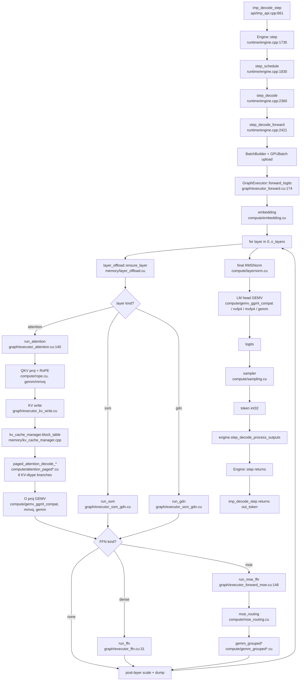

# Phase 1 — Cartographer Inventory

Static, mechanical map of the imp codebase as of `review/architecture-2026-05-16`
(`HEAD = f58eb9e`, `feat(compute): Q4_K direct-mmq (v1 dp4a + v2 HMMA) + MoE
prefill refactor`). No opinions, no recommendations — facts with citations.

- Repo root: `/home/kekz/github.com/kekzl/imp`
- Target hardware: **sm_120a only** (RTX 5090 / RTX PRO 6000, GB202 Blackwell)
- Fallback PTX: `compute_120f` (RTX 5080 / 5070 Ti via JIT) — gated by
  `IMP_DISABLE_120F_FALLBACK` (`CMakeLists.txt:30`)
- Source tree LOC (`.cu/.cpp/.h/.hpp/.cuh`, raw `wc -l` including blanks/comments):
  src=90 204, include=325, tools=8 127, tests=32 022 → **130 678 LOC total**

---

## 1. Subsystem dependency graph

Edges derived from `grep -rE '^#include "(api|compute|core|graph|memory|model|quant|runtime|vision)/'` over every `.cu/.cpp/.h/.hpp/.cuh` file. Direction = "depends on". Self-loops omitted from the diagram. Counts are header-include occurrences (multi-file headers may inflate weight vs. true coupling).

```mermaid
graph LR
    api --> model
    api --> runtime
    api --> memory
    api --> core

    compute --> core
    compute --> runtime
    compute --> quant
    compute --> model
    compute --> graph

    graph --> compute
    graph --> quant
    graph --> core
    graph --> memory
    graph --> runtime
    graph --> model

    memory --> core
    memory --> runtime
    memory --> model

    model --> core
    model --> quant
    model --> runtime

    quant --> core
    quant --> compute
    quant --> runtime

    runtime --> compute
    runtime --> core
    runtime --> model
    runtime --> memory
    runtime --> vision
    runtime --> graph

    vision --> core
    vision --> runtime
    vision --> model
    vision --> memory
    vision --> compute
```

### Edge weights (cross-subsystem include count, self-edges excluded)

| from \ to | api | compute | core | graph | memory | model | quant | runtime | vision |
|---|---|---|---|---|---|---|---|---|---|
| api      |   - |   0 |   1 |   0 |   1 |   5 |   0 |   2 |   0 |
| compute  |   0 |   - |  58 |   1 |   0 |   4 |  10 |  11 |   0 |
| core     |   0 |   0 |   - |   0 |   0 |   0 |   0 |   0 |   0 |
| graph    |   0 | 108 |  26 |   - |  24 |   3 |  41 |  16 |   0 |
| memory   |   0 |   0 |  10 |   0 |   - |   1 |   0 |   1 |   0 |
| model    |   0 |   0 |  21 |   0 |   0 |   - |   3 |   2 |   0 |
| quant    |   0 |   2 |  15 |   0 |   0 |   0 |   - |   1 |   0 |
| runtime  |   0 |  20 |  19 |   3 |  13 |  15 |   0 |   - |   4 |
| vision   |   0 |   1 |   4 |   0 |   1 |   1 |   0 |   2 |   - |

### Cycles

Several mutual edges (graph cycles of length 2 or 3) exist:

1. `compute ↔ quant` — `compute/*.cu` includes `quant/*.h` 10×; `quant/*.cu`
   includes `compute/*.h` 2× (`grep -E '#include "compute/' src/quant/`).
2. `compute → runtime` (11) and `runtime → compute` (20) — runtime owns
   `executor_*`-adjacent state and dispatches into compute; compute reads
   `runtime/config.h` and runtime-tunable env-driven flags.
3. `graph → runtime` (16) and `runtime → graph` (3) — `GraphExecutor` (in
   `src/graph/`) is owned by `Engine` (in `src/runtime/`).
4. `compute → graph` (1) — one-off back-edge from `src/compute/*` into
   `src/graph/` (single header reference; flagged for Phase 3 follow-up).
5. `runtime → vision` (4) and `vision → runtime` (2) — `vision_pipeline` is a
   runtime concept, `vision_encoder` is a compute kernel.

No true 4-node cycle observed at directory granularity.

### Notes
- `core/` is a strict leaf (no outgoing cross-subsystem includes) — see row.
- `api/` is shallow: 9 cross-subsystem includes total in `src/api/imp_api.cpp` +
  `src/api/imp_internal.h`. Only `api/imp_internal.h` includes the public
  header (`imp/imp.h`) — no other public→private leak.

---

## 2. Public C API surface

Public headers live in `include/imp/` (325 LOC total). All four headers are
plain C with `extern "C"` guards and **never include any non-public header**
(verified `grep -nE '#include' include/imp/*.h`).

### Headers

| Header | LOC | Purpose |
|---|---:|---|
| `imp/imp.h`    | 142 | Entry point: model load/free, context create/free, prefill, decode_step, generate, tokenize, MTP toggle, vision image set, version. |
| `imp/config.h` | 102 | `ImpConfig` struct (39 user-tunable fields incl. device, KV dtype, chunked prefill, prefix cache, StreamingLLM, vision). `imp_config_default()`. |
| `imp/types.h`  |  58 | Enums: `ImpDType` (12 values), `ImpModelArch` (14 values), `ImpQuantType` (7 values), `ImpModelFormat` (2 values). |
| `imp/error.h`  |  23 | `ImpError` (9-value enum) + `imp_error_string`. |

### Function surface (22 functions)

| # | Function | Header:line |
|---:|---|---|
|  1 | `imp_error_string`               | `error.h:19` |
|  2 | `imp_config_default`             | `config.h:98` |
|  3 | `imp_model_load`                 | `imp.h:34` |
|  4 | `imp_model_free`                 | `imp.h:36` |
|  5 | `imp_model_arch`                 | `imp.h:39` |
|  6 | `imp_model_n_layers`             | `imp.h:40` |
|  7 | `imp_model_d_model`              | `imp.h:41` |
|  8 | `imp_model_vocab_size`           | `imp.h:42` |
|  9 | `imp_model_max_seq_len`          | `imp.h:43` |
| 10 | `imp_context_create`             | `imp.h:47` |
| 11 | `imp_context_free`               | `imp.h:49` |
| 12 | `imp_generate_params_default`    | `imp.h:79` |
| 13 | `imp_generate_streaming`         | `imp.h:85` |
| 14 | `imp_generate`                   | `imp.h:89` |
| 15 | `imp_tokenize`                   | `imp.h:93` |
| 16 | `imp_detokenize`                 | `imp.h:95` |
| 17 | `imp_prefill`                    | `imp.h:105` |
| 18 | `imp_prefill_with_params`        | `imp.h:111` |
| 19 | `imp_decode_step`                | `imp.h:115` |
| 20 | `imp_context_reset`              | `imp.h:118` |
| 21 | `imp_enable_mtp_spec_decode`     | `imp.h:125` |
| 22 | `imp_set_image`                  | `imp.h:132` |
| 23 | `imp_set_image_from_memory`      | `imp.h:135` |
| 24 | `imp_version`                    | `imp.h:138` |

(24 functions including the version pseudo-getter and the two boolean defaults.)

### Types / Opaque handles / Enums

- **Opaque handles (2):** `ImpModel`, `ImpContext` (`imp.h:29-30`).
- **Structs (2):** `ImpConfig` (`config.h:11-95`), `ImpGenerateParams`
  (`imp.h:53-77`, 26 fields).
- **Callbacks (1):** `ImpTokenCallback` (`imp.h:82`).
- **Enums (5):** `ImpDType`, `ImpModelArch`, `ImpQuantType`, `ImpModelFormat`
  (in `types.h`); `ImpError` (in `error.h`).

### ABI leak audit

- All public headers include only `<stdint.h>`, `<stddef.h>`, `<cstdint>` and
  each other. **No private header is included.** PASS.
- `src/api/imp_internal.h:1` is the only file that bridges public →
  internal — and it lives in `src/`, so it is not part of the installed
  surface. PASS.

---

## 3. Subsystem LOC + file count + role

LOC = `wc -l` over `.cu/.cpp/.h/.hpp/.cuh` for each subsystem. "Hottest file" =
single largest LOC under that subsystem.

| Subsystem | Files | LOC | Role (one sentence) | Hottest file (LOC) |
|---|---:|---:|---|---|
| `src/api`     |   2 |    866 | Thin C-API translation layer: marshals `ImpConfig` → `imp::RuntimeConfig`, owns `ImpContext_T` (Engine + active Request). | `imp_api.cpp` (864) |
| `src/compute` | 108 | 36 321 | All device kernels: GEMM/GEMV (FP16/Q*/NVFP4/MXFP4/FP8), paged attention (8 dtype variants), FMHA SM120 prefill, RoPE, LayerNorm/RMSNorm, activations, embedding, sampling, JSON/schema constrain, MoE routing, SSM/GDN, Hadamard. | `sampling.cu` (1 701) |
| `src/core`    |  16 |  1 309 | Foundational types only: `Tensor`, `Buffer`, `Allocator`, `QType`, `TensorKind`, logging, threading. Leaf subsystem. | `qtype.cpp` (~280) |
| `src/graph`   |  29 | 15 818 | `GraphExecutor` (imperative transformer forward pass): per-layer attention/FFN/MoE/SSM/GDN dispatch, workspace planning, expert cache, weight handles, pre-dequant cache, MoE workspace. | `executor_forward_moe.cu` (2 563) |
| `src/memory`  |  16 |  3 524 | Device/pinned allocators, paged KV cache + manager, SSM/GDN state buffers, layer offload manager, VRAM allocator. | `kv_cache_manager.cpp` (1 142) |
| `src/model`   |  34 | 16 643 | GGUF + SafeTensors loaders, HF config parser, weight uploader/dequantizer, BPE/SentencePiece tokenizers, Jinja chat templates, weight map, MTP head, tensor-kind dispatch table. | `jinja.cpp` (2 629) |
| `src/quant`   |  25 |  5 391 | Quantization GEMMs and kernels: NVFP4 GEMM (1 324 LOC), MXFP4 GEMM, FP8 quant/utils, INT8/Q4_K/Q6_K dequant, TurboQuant, GPTQ dequant. | `nvfp4_gemm.cu` (1 324) |
| `src/runtime` |  30 |  8 881 | `Engine` (request scheduler + step driver), config translation, CUDA Graph capture, green-ctx split, PDL, VRAM budgeter, storage planner, MTP forward, vision pipeline. | `engine.cpp` (3 066) |
| `src/vision`  |   8 |  1 451 | SigLIP / Qwen2-VL vision encoder kernel + loader, image processor (stb_image-backed). | `vision_encoder.cu` (~840) |
| **TOTAL src** | **268** | **90 204** | | |
| `include/imp` |   4 |    325 | Public C ABI. | `imp.h` (142) |
| `tools`       |  16 |  8 127 | `imp-cli` (1 020), `imp-server` (6 052), `imp-bench` (1 055). | `imp-server/*` (6 052 split across 7 TUs) |
| `tests`       |  82 | 32 022 | GTest suite (~863 `TEST()` invocations across `.cu/.cpp` files). | `test_e2e.cpp` + see §8. |

Top 10 single files by LOC (any subsystem):

| LOC | File |
|---:|---|
| 3 066 | `src/runtime/engine.cpp` |
| 2 629 | `src/model/jinja.cpp` |
| 2 563 | `src/graph/executor_forward_moe.cu` |
| 2 556 | `src/graph/executor_pre_dequant.cu` |
| 2 327 | `src/graph/executor_kernels.cu` |
| 2 108 | `src/model/tokenizer.cpp` |
| 2 092 | `src/model/weight_upload.cu` |
| 1 701 | `src/compute/sampling.cu` |
| 1 694 | `src/compute/gemm.cu` |
| 1 683 | `src/model/gguf_loader.cpp` |
| 1 667 | `src/compute/mmq_q4k_v2.cu` |

---

## 4. Hot-path TUs (touched ≥ 1× per decode token)

Traced from `imp_decode_step` (`src/api/imp_api.cpp:661`) → `Engine::step`
(`src/runtime/engine.cpp:1735`) → `step_decode` (l. 2360) →
`step_decode_forward` (l. 2421) → `GraphExecutor::forward_logits`
(`src/graph/executor_forward.cu:174`) → per-layer
`run_attention`/`run_ffn`/`run_moe_ffn`/`run_ssm`/`run_gdn` (l. 383-417) →
attention/MoE dispatch (`executor_attention.cu:140`, `executor_forward_moe.cu`)
→ paged attention + GEMM kernels.

Order: outer driver first, then per-layer dispatch, then the kernel
translation units invoked once per layer per token.

| Tier | File | Per-decode-token role |
|---|---|---|
| **driver** | `src/api/imp_api.cpp` (864) | `imp_decode_step` → `engine->step()` (1 call/token). |
| driver | `src/runtime/engine.cpp` (3 066) | `step` → `step_schedule` → `step_decode` → `step_decode_forward`; builds `Batch`, uploads `GPUBatch`, invokes executor. |
| driver | `src/runtime/batch.cpp` (134) | `BatchBuilder` rebuilt every decode step (l. 2433). |
| driver | `src/runtime/scheduler.cpp` | Selects active sequences. |
| **executor** | `src/graph/executor_forward.cu` (775) | `forward_logits` outer loop over layers (l. 380-625). |
| executor | `src/graph/executor_attention.cu` (1 299) | Per-layer Q/K/V proj, RoPE, KV write, attention dispatch (8 KV dtype branches l. 988-1112). |
| executor | `src/graph/executor_ffn.cu` (468) | Dense FFN per non-MoE layer. |
| executor | `src/graph/executor_forward_moe.cu` (2 563) | MoE FFN — routing + grouped GEMM + shared MLP; `run_moe_decode_fast` (l. 2316) is the captured-graph hot path. |
| executor | `src/graph/executor_ssm_gdn.cu` (~530) | `run_ssm` / `run_gdn` for hybrid arches (Qwen3.5/3.6, Nemotron-H). |
| executor | `src/graph/executor_kernels.cu` (2 327) | `dispatch_gemv_fp32`, `gemm_dispatch`, weight-typed launchers — called from FFN and LM head. |
| executor | `src/graph/executor_kv_write.cu` (~480) | KV cache write per attention layer. |
| executor | `src/graph/executor_pre_dequant.cu` (2 556) | Built once per load (cache setup); the **dispatch fast-path lookup** of `q4k_v2_cache` runs every Q4_K GEMM call. |
| executor | `src/graph/executor_workspace.cu` (~270) | `resize_workspace` / `use_workspace` per step. |
| executor | `src/graph/moe_workspace.cu` | MoE scratch (touched only on MoE steps). |
| executor | `src/graph/expert_cache.cu` | Expert weight pin/page (only on MoE steps). |
| **compute (attention)** | `src/compute/attention_paged.cu` (1 587) | Default paged attention (FP16 KV). |
| compute | `src/compute/attention_paged_fp8.cu` (685) | FP8 KV. |
| compute | `src/compute/attention_paged_int4.cu` (713) | INT4 KV. |
| compute | `src/compute/attention_paged_int8.cu` (~480) | INT8 KV. |
| compute | `src/compute/attention_paged_nvfp4.cu` (~530) | NVFP4 KV (scalar). |
| compute | `src/compute/attention_paged_nvfp4_tc.cu` (1 216) | NVFP4 KV with TC dispatch (BitDecoding Phase 3). |
| compute | `src/compute/attention_paged_turboquant.cu` (1 108) | TurboQuant / Lite KV. |
| compute | `src/compute/attention_dispatch.cu` (~120) | Prefill dispatcher (off the decode hot path but in same TU group). |
| **compute (GEMM/GEMV)** | `src/compute/gemm.cu` (1 694) | `gemm`, `gemm_dispatch` — cuBLAS / cuBLASLt path. |
| compute | `src/compute/gemv_ggml_compat.cu` (~400) | Q*_K GEMV (decode hot path on Q4/Q6 models). |
| compute | `src/compute/ggml_mmvq.cu` (~520) | mmvq decode kernels (dp4a). |
| compute | `src/compute/mmq_q4k_v2.cu` (1 667) | HMMA Q4_K direct mmq — **dispatched only when `IMP_FORCE_Q4K_V2=1`** (gated by cache presence, `executor_kernels.cu:2158`). |
| compute | `src/compute/gemm_grouped.cu` (~600) | Grouped GEMM for MoE (cuBLAS). |
| compute | `src/compute/gemm_grouped_nvfp4_smallM.cu` (948) | NVFP4 grouped GEMM (CUTLASS, M<16 specialization). |
| compute | `src/compute/gemm_moe_fused.cu` (~470) | Scalar fused MoE kernel. |
| compute | `src/compute/gemm_moe_fused_tc.cu` (~520) | WMMA-based fused MoE kernel. |
| compute | `src/compute/gemm_q6k.cu` (~310) | Q6_K direct-GEMM decode path. |
| compute | `src/compute/gemm_dp4a.cu` (~330) | dp4a fallback. |
| **compute (norm/activation/aux)** | `src/compute/layernorm.cu` (~440) | RMSNorm/LayerNorm — every layer. |
| compute | `src/compute/rope.cu` (~570) | RoPE — every layer. |
| compute | `src/compute/activation.cu` (~300) | GELU/SiLU — every FFN. |
| compute | `src/compute/embedding.cu` (~270) | Token embedding lookup (1×/decode). |
| compute | `src/compute/sampling.cu` (1 701) | Sampler (greedy + top-k/top-p/min-p/typical/DRY/Mirostat/penalties/JSON-constrain mask) — 1×/decode. |
| compute | `src/compute/softmax.cu` (~360) | Softmax (used by sampler and attention). |
| compute | `src/compute/kv_gather.cu` (~430) | Paged KV gather for cuBLAS prefill path. |
| compute | `src/compute/moe_routing.cu` (1 031) | Router softmax + top-k expert select — every MoE layer. |
| compute | `src/compute/reduce.cu` (~290) | Block reductions used widely. |
| compute | `src/compute/hadamard.cu` (~220) | MXFP4 Hadamard transform (on MXFP4 paths). |
| compute | `src/compute/ssm.cu` (~480) | Mamba2 SSM scan. |
| compute | `src/compute/gdn.cu` (~410) | Gated DeltaNet recurrent scan. |
| **memory** | `src/memory/kv_cache.cu` (~620) | Paged KV cache buffer ops. |
| memory | `src/memory/kv_cache_manager.cpp` (1 142) | Block table per request — `block_table()` called every decode (`engine.cpp:2444`). |
| memory | `src/memory/gdn_state.cu` (~270) | GDN state (hybrid models). |
| memory | `src/memory/ssm_state.cu` (~260) | SSM state (hybrid models). |
| memory | `src/memory/layer_offload.cu` (~370) | Layer offload manager (`ensure_layer` / `prefetch_layer` per layer per step, l. 370-374). |
| **quant** | `src/quant/dequant_gpu.cu` (~480) | Generic dispatch — used by LM head FP16 fallback (`executor_forward.cu:652`). |
| quant | `src/quant/nvfp4_quant.cu` (~440) | NVFP4 quant kernel — fires when KV-NVFP4 enabled. |
| quant | `src/quant/fp8_quant.cu` (~290) | FP8 quant for KV write. |
| **runtime aux** | `src/runtime/cuda_graph.cu` (989) | Replays captured decode graph (decode fast-path; lookup once per step). |
| runtime | `src/runtime/mtp_forward.cu` (936) | MTP draft step — only on MTP-enabled decode. |

Conservative count of TUs definitely touched on every decode token (excluding
arch-conditional MoE/SSM/GDN/MTP files): **~28 TUs**, summing roughly
**24 000 LOC**.

---

## 5. External dependencies

Sourced from `CMakeLists.txt`, `Dockerfile`, and grep of `#include <...>` /
`#include "..."` at file heads.

| Dependency | Used in | Purpose | Coupling depth |
|---|---|---|---|
| **CUDA Toolkit ≥ 13.2** (`CMakeLists.txt:15`) | all `.cu`, plus `core/cuda_raii.h` | Runtime + driver + nvcc | Pervasive (compile + link) |
| **cuBLAS** (`CUDA::cublas`, `CMakeLists.txt:288`) | 11 files (incl. `src/compute/gemm.cu`, `attention_cublas.cu`, `gemm_grouped.cu`, `vision_encoder.cu`) | FP16/BF16/FP8 GEMM, attention QKᵀ + Sₛₘₐₓ·V on cuBLAS prefill path. | Moderate (10+ TUs) |
| **cuBLASLt** (`CUDA::cublasLt`, `CMakeLists.txt:289`) | `src/compute/weight_dispatch.{h,cu}`, `gemm.cu`, `attention_mxfp4_prefill.cu`, `gemm_grouped.cu` | FP8 + heuristics-based algorithm selection. | Moderate |
| **CUDA driver** (`CUDA::cuda_driver`) | runtime (green contexts, PDL) | Driver API for `cuCtx*` / green ctx. | Shallow |
| **CUTLASS v4.5.0** (`FetchContent`, `CMakeLists.txt:74`) | 3 TUs: `gemm_cutlass_sm120.cu`, `gemm_cutlass_mxfp4_sm120.cu`, `gemm_cutlass_grouped_3x.cu` | NVFP4 / MXFP4 GEMM templates for sm_120. Headers-only, vendored. | Moderate (3 TUs but templated heavily). Compile-time only. |
| **stb_image** (`third_party/stb/`, vendored) | `src/vision/image_processor.cpp` (1 file) | JPEG/PNG decode for vision input. | Shallow |
| **GoogleTest v1.17.0** (`FetchContent`, `CMakeLists.txt:62`) | tests only | Test framework. | Shallow (test binaries) |
| **cpp-httplib v0.42.0** (`FetchContent`, `CMakeLists.txt:340`) | `tools/imp-server/*` (4 files) | HTTP server. | Shallow (tools, not library) |
| **nlohmann/json v3.12.0** (`FetchContent`, `CMakeLists.txt:347`) | `tools/imp-server/*` | OpenAI/Anthropic JSON marshalling. | Shallow (tools) |
| **pthread** | imp lib `PRIVATE` link | Host threading. | Shallow |
| **SentencePiece** | Hand-rolled in-tree (`src/model/sentencepiece_loader.cpp`, header `sentencepiece_loader.h`) | Reads SP proto wire format manually; **no external dep**. | n/a (in-tree) |

Dockerfile (`Dockerfile:27`) pins CUTLASS to **v4.4.2** — `CMakeLists.txt:74`
asks for **v4.5.0**. Cached `/deps/cutlass` overrides via
`FETCHCONTENT_SOURCE_DIR_CUTLASS=/deps/cutlass` (`Dockerfile:47`), so the
Docker build effectively uses v4.4.2 unless the user rebuilds the layer.
Flagged for Phase 3.

---

## 6. Build system flags & defines

Only `CMakeLists.txt`, `cmake/CompilerFlags.cmake`, `Dockerfile`, and
`Makefile` define compile-time switches. Runtime knobs (env vars) listed in §7
counter-section.

### CMake options (`option(...)`)

| Option | Default | What it gates | Meaningful on sm_120a-only? |
|---|---|---|---|
| `IMP_DISABLE_120F_FALLBACK`        | OFF | Skip `compute_120f` PTX fallback → smaller fatbin, no JIT path for RTX 5080/5070 Ti. | Yes (RTX 5090-only ship) |
| `IMP_BUILD_TESTS`                  | ON  | Build GTest binaries + 7 bench/probe TUs in `compute/`. | Yes |
| `IMP_BUILD_TOOLS`                  | ON  | Build `imp-cli`, `imp-bench`. | Yes |
| `IMP_BUILD_BENCH`                  | ON  | Adds 7 bench-only `compute/*_bench.cu` to lib. | Yes |
| `IMP_BUILD_SERVER`                 | ON  | Build `imp-server` (httplib + json deps). | Yes |
| `IMP_SANITIZERS`                   | OFF | ASAN+UBSAN on host code only (nvcc skipped). | Yes |
| `IMP_USE_CUTLASS`                  | ON  | Comment says "requires sm_90+" (stale — codebase is sm_120a). Adds 11 TUs (incl. 7 bench ones). Defines `IMP_USE_CUTLASS=1`. | Yes; OFF would strip NVFP4/MXFP4 fast paths |

### Hardcoded compile defines / flags (`CMakeLists.txt`, `cmake/CompilerFlags.cmake`)

| Flag/Define | Value | What it gates | Notes |
|---|---|---|---|
| `IMP_SM120_FLAGS`                  | `--generate-code=arch=compute_120a,code=sm_120a` (+ `compute_120f` PTX if `!IMP_DISABLE_120F_FALLBACK`) | NVCC code-gen arch | **Single source of truth** for arch. |
| `CMAKE_CUDA_ARCHITECTURES`         | OFF (raw gencode used)             | CMake<3.31 workaround for `a`/`f` suffixes. | |
| `IMP_USE_CUTLASS=1`                | compile-def on `imp` target        | Guards `#ifdef IMP_USE_CUTLASS` in compute. | |
| `-Wall -Wextra -Wpedantic`         | C++ host flags                     | Warnings. | |
| `-march=x86-64-v3`                 | Release/RelWithDebInfo              | Host vectorization. Dockerfile (`Dockerfile:35`) rewrites `-march=native` → `-march=x86-64-v3` post-COPY. |
| `--use_fast_math`                  | Release CUDA                       | Forced on Release + RelWithDebInfo (per memo: missing this cost ~2× decode). | |
| `--extra-device-vectorization -Xptxas -O3` | Release CUDA               | Device opt. | |
| `-lineinfo`                        | RelWithDebInfo CUDA                | Nsight source mapping. | |
| `--expt-relaxed-constexpr --extended-lambda` | all CUDA               | CUTLASS / cuTe needs these. | |
| `--diag-suppress=2908,177`         | all CUDA                           | CUTLASS sm100/103 headers emit deprecated `[=] this` captures (compute_120a inherits the warning). The presence of `sm100/sm103` warnings is itself ballast evidence. | |
| `-Xcudafe --diag_suppress=esa_on_defaulted_function_ignored` | all CUDA | Noise. | |
| `IMP_DEBUG=1`                      | Debug builds (`CMAKE_CXX_FLAGS_DEBUG`) | Enables debug-only paths in source. | |
| `NDEBUG`                           | Release / RelWithDebInfo            | Disables asserts. | |
| `CUDA_SEPARABLE_COMPILATION`       | ON (lib + bench)                   | Required for PDL. | |
| `CUDA_RESOLVE_DEVICE_SYMBOLS`      | ON                                 | Device-link resolution. | |
| `POSITION_INDEPENDENT_CODE`        | ON                                 | PIC for static lib. | |

### Dockerfile build args

| Arg | Default | Purpose |
|---|---|---|
| `CMAKE_BUILD_TYPE`     | `Release` | Pass-through to cmake. |
| `IMP_BUILD_TESTS`      | `OFF`     | Tests are OFF in the Docker runtime image (built only on demand). |
| `IMP_BUILD_BENCH`      | `OFF`     | Bench is OFF in Docker. |

### Makefile targets (`Makefile:1-115`)

`check-gpu`, `build`, `test-unit`, `test-gpu`, `test-fast`, `test-all`,
`bench`, `test-perf`, `test-golden`, `verify`, `verify-fast`, `verify-chunked`,
`install-hooks`, `format`, `format-check`. No additional compile-time defines
introduced.

---

## 7. Ballast bilanz (HARD NUMBERS)

The mandate is **sm_120a-only**. Quantify deletable LOC. Conservative bias —
"needs deeper review" used wherever the call path under sm_120a still appears
non-trivial.

### 7.1 Non-sm_120 architecture references

`grep -rnE 'sm_(80|90|100)\b' src/ include/` → **13 matches across 11 files**
(`.md` and `CHANGELOG` excluded). Detail:

| File:line | Context | Removable? |
|---|---|---|
| `src/compute/attention_tc.cu:40`    | Comment "must be compiled with -arch=sm_90 (or higher)" | Comment only; file ships under sm_120a build. Update or delete file (see 7.4). |
| `src/compute/attention_tc.cu:407`   | "Require sm_90+" comment | Same. |
| `src/compute/attention_tc.h:9`      | Comment "Requires sm_90+ … Falls back to scalar on older GPUs." | Stale comment ("Falls back to scalar on older GPUs" — there is no older GPU under the sm_120a-only mandate). |
| `src/graph/executor_pre_dequant.cu:1849` | Comment about sm_80 WMMA fallback | Stale. |
| `src/runtime/green_ctx.cu:11`       | Comment "sm_90+ when prefill and decode overlap" | Outdated framing. |
| `src/compute/attention_paged.cu:1361,1444` | Comments referring to sm_90+ pipelined cp.async / cluster GQA | Outdated framing. |
| `src/compute/attention_paged_int4.cu:317,545` | Same comments | Outdated framing. |
| `src/compute/attention_paged_fp8.cu:585` | Same | Outdated framing. |
| `src/compute/attention_fmha_sm120.cu:565` | "compiles cleanly for sm_90/sm_100 too" | Stale aspiration. |
| `src/api/imp_api.cpp:67`            | Config `use_nvfp4_decode=-1` ("auto sm_120→mode2, sm_90→mode1") | Auto-select branch is dead under sm_120a-only — should hard-code mode2. |
| `include/imp/config.h:62`           | Same enum comment | Public-ABI text; rewrite without sm_90 reference. |

**Removable: ~10 comments + 1 dead auto-select branch (~3 LOC).** Bulk of
the LOC bound to these comments lives in the surrounding kernels, which are
covered separately below.

### 7.2 `__CUDA_ARCH__` guards

`grep -rnE '__CUDA_ARCH__' src/` → **28 matches across 17 files**. Of these, **every** numeric comparison is `__CUDA_ARCH__ >= 1200`. Zero `< 1200` or `!= 1200` guards exist. Under sm_120a-only those `>= 1200` guards are tautologically true; the `#else` branches (PTX inline-asm fallbacks) are dead code.

Sample: `src/compute/attention_fmha_sm120.cu:756`,
`src/compute/gemm_cutlass_sm120.cu:209`,
`src/compute/quantize_fp16_nvfp4_moe_native.cu:38`,
`src/quant/nvfp4_quant.cu:144`, etc.

| Bucket | Files | Estimated removable LOC (per file ~20-80 LOC of `#else` path) |
|---|---|---|
| Production TUs (NVFP4 / FMHA / MXFP4)        | 9  | ~360 LOC (conservative ~40/file) |
| Bench/probe TUs (`mxf4nvf4_*_bench`, `*_probe`, `qkt_validate`, `tma_block_scale_bench`) | 8 | ~240 LOC |
| **Subtotal**                                  | 17 | **~600 LOC** (needs deeper review per file) |

### 7.3 Runtime arch detection (`cudaGetDeviceProperties` / `prop.major/minor`)

`grep -rnE 'cudaGetDeviceProperties' src/` → **11 matches across 11 files**.
Of those, 3 are availability flag flips:

- `src/compute/gemm_cutlass_grouped_3x.cu:97`: `s_grp3x_available = (prop.major*10 + prop.minor >= 120) ? 1 : 0;`
- `src/compute/gemm_capture_fp16_sm120.cu:289`: `s_avail = (prop.major*10 + prop.minor >= 120) ? 1 : 0;`
- `src/compute/gemm_grouped_nvfp4_smallM.cu:752`: `s_smallM_available = (prop.major*10 + prop.minor >= 120) ? 1 : 0;`

These availability flags are **always true** on the only supported target.
The remaining 8 callsites are for legitimate sm_120-runtime info (L2 cache
size, persistingL2CacheMaxSize, access-policy clamps, occupancy heuristics) —
keep.

**Removable: ~3 helper blocks (~6-9 LOC + each call site of the static flag check).** Needs deeper review.

### 7.4 cuBLAS / scalar-FA2 fallback paths in attention/FMHA

| File | LOC | Status |
|---|---:|---|
| `src/compute/attention_naive.cu` + `.h` | 152 + 13 = **165** | Called exactly once at `src/graph/executor_attention.cu:834` for SWA workaround and `IMP_NAIVE_ATTN`-forced debug runs (l. 807, 824). Per CLAUDE.md/memos this was the FP32 SWA reference fix that the current sliding_window mask cuBLAS path obsoletes. Removable unless `IMP_NAIVE_ATTN` is still wanted for debug. **Conservative: 165 LOC removable.** |
| `src/compute/attention_cublas.cu` + `.h` | 553 + 34 = **587** | Active prefill path (called from `executor_attention.cu:787, 859, 955` and engine warmup at `engine.cpp:960`). NOT ballast — primary FP16 prefill path. **0 LOC removable.** |
| `src/compute/attention_tc.cu` + `.h` | 411 + 29 = **440** | Generic WMMA FP16 attention. Still used (header included from `attention_blackwell.cu:24`). Likely subsumed by `attention_blackwell` + `attention_fmha_sm120`. **Needs deeper review** (~440 LOC candidate). |
| `src/compute/attention_blackwell.cu` | **460** | The sm_120 WMMA optimized FP16 attention. Called from `attention_dispatch.cu:77`. Still active — comment at l. 2 reads "Optimized WMMA attention for sm_120 (Blackwell)". **Probably keep** as the FP16 reference; will lose to `attention_fmha_sm120` when source is NVFP4/MXFP4. **Needs deeper review.** |

**Subtotal hard candidates: 165 LOC** (`attention_naive`). **Soft
candidates: 440 + 460 = 900 LOC** pending Phase 2 perf evidence that they
are dominated by FMHA paths.

### 7.5 WMMA paths (`<mma.h>` / `nvcuda::wmma`)

`grep -rnE 'nvcuda::wmma|<mma.h>' src/` → **10 files**:

| File:line | Context (1-line) | Disposition |
|---|---|---|
| `src/compute/attention_blackwell.cu:29`      | `#include <mma.h>`; WMMA-based FP16 attention. | 460 LOC; primary FP16 prefill — see 7.4. |
| `src/compute/attention_tc.cu:6`              | `#include <mma.h>`; older WMMA FP16 attention. | 411 LOC; subsumed by Blackwell variant — see 7.4. |
| `src/compute/attention_fmha_sm120.cu:40`     | `#include <mma.h>`; SM120 FMHA prefill. | 1 039 LOC; active hot path — keep. |
| `src/compute/attention_fmha_mxfp4_sm120.cu:30` | `#include <mma.h>`; MXFP4 FMHA. | 1 067 LOC; active — keep. |
| `src/compute/attention_paged_nvfp4_tc.cu:8`  | NVFP4 TC paged attention. | 1 216 LOC; active (BitDecoding Phase 3) — keep. |
| `src/compute/gemm_capture_fp16_sm120.h:9`    | Comment only — implementation uses `nvcuda::wmma` HMMA. | Header. The `.cu` includes mma.h via the header. |
| `src/compute/gemm_capture_fp16_sm120.cu:38`  | WMMA-based FP16 GEMM. | ~600 LOC; opt-in fast path for FP16 GEMM (needs deeper review whether routed under default). |
| `src/compute/gemm_moe_fused_tc.cu:5`         | WMMA fused MoE GEMM. | ~520 LOC; needs deeper review (dispatched alongside scalar `gemm_moe_fused.cu`). |
| `src/compute/mmq_q4k_v2.cu:12`               | HMMA Q4_K direct mmq. | **1 667 LOC; gated behind `IMP_FORCE_Q4K_V2=1`** (`executor_kernels.cu:2150-2170` + memory file `mmq_q4k_v2_phase2_shipped_2026_05_16` — "End-to-end on Qwen3.6-35B Q4_K_M: −4% pp"). Under sm_120a-only with NVFP4 as primary, this is the largest **opt-in** TU in the tree. Removable iff the freeze decision is permanent. |
| `src/compute/attention_paged.h:76`           | Comment referencing WMMA. | Comment only. |

**HMMA primary-compute hot files:** ~3 322 LOC are active hot path (`attention_fmha_*_sm120`, `attention_paged_nvfp4_tc`) — keep.

**HMMA dead-or-opt-in:** `attention_tc.cu` (411) + `mmq_q4k_v2.cu` (1 667) +
`gemm_moe_fused_tc.cu` (~520) + `gemm_capture_fp16_sm120.cu` (~600) =
**~3 198 LOC** at risk pending Phase 2 dispatch-frequency check.

### 7.6 FP16/BF16 as primary compute path in hot kernels

The mandate is "FP16/BF16 only reference/debug" — primary compute should be
NVFP4 / MXFP4 / FP8.

- `half` / `half2` usage in `src/compute/` — `half2` alone: **251 matches**
  across most attention TUs. `half` is the type of the **paged KV cache** for
  the default FP16 KV configuration and the type of the residual/hidden state
  in `forward_logits`. So this is partially structural (KV+activation
  precision), not pure compute primary.
- `__hmma` builtin direct usage: 0 matches (all HMMA goes through
  `nvcuda::wmma` API, see 7.5).
- The whole `attention_cublas.cu` prefill path runs through cuBLAS at FP16/FP32
  accumulator — primary path on dense models without NVFP4 weights. Not
  removable as long as Q4_K / Q8_0 / GGUF flows exist (per CLAUDE.md these
  flows are explicitly supported).

**Disposition:** no clear "ballast" outside what is already counted in 7.4 and
7.5. The FP16 prevalence reflects KV-cache and residual-stream dtype, not a
duplicated compute path.

### 7.7 Multi-precision dispatch tables in `compute/`

`src/graph/executor_attention.cu:988-1112` — paged attention dispatch
switch by KV dtype: 8 distinct branches (`turboquant_lite`, `turboquant`,
`int4`, `int8`, `nvfp4_tc`, `nvfp4`, `fp8`, `fp16` default).

| KV dtype | Backing file (LOC) | Coverage under sm_120a-only |
|---|---|---|
| FP16 default          | `attention_paged.cu` (1 587)              | Keep — default. |
| FP8 E4M3              | `attention_paged_fp8.cu` (~685)           | Keep — opt-in via `kv_cache_dtype = FP8_E4M3`. |
| INT8                  | `attention_paged_int8.cu` (~480)          | Opt-in via INT8 KV. |
| INT4                  | `attention_paged_int4.cu` (~713)          | Opt-in via INT4 KV; long-ctx quality issue (see memory file `int4_kv_chunked_prefill_2026_05_15`). |
| NVFP4 (scalar)        | `attention_paged_nvfp4.cu` (~530)         | Opt-in via `kv_cache_dtype = NVFP4`. |
| NVFP4 + TC            | `attention_paged_nvfp4_tc.cu` (1 216)     | Opt-in via `IMP_USE_BITDECODING_QK=1`. |
| TurboQuant / Lite     | `attention_paged_turboquant.cu` (1 108)   | Opt-in via TURBOQUANT / TURBOQUANT_LITE dtypes. |

All branches are exposed via `ImpDType` and `ImpConfig::kv_cache_dtype` — none
are obviously dead under sm_120a. **No removals here** without policy decision
to drop a KV dtype.

### 7.8 Bench/probe TUs compiled into the lib only when tests/bench is ON

`CMakeLists.txt:194-202`:

| TU | LOC |
|---|---:|
| `attention_mxf4nvf4_probe.cu`         | 210 |
| `nvfp4_quant_ref.cu`                  | 161 |
| `mxf4nvf4_mma_bench.cu`               | 172 |
| `mxf4nvf4_mma_variants_bench.cu`      | 328 |
| `mxf4nvf4_qkt_validate.cu`            | 168 |
| `tma_block_scale_bench.cu`            | 394 |
| `fmha_v_load_bench.cu`                | 339 |
| **Subtotal**                          | **1 772** |

These already drop out of the runtime image when `IMP_BUILD_TESTS=OFF AND
IMP_BUILD_BENCH=OFF` (Docker default), so this is not "ship ballast" but it is
~1.8K LOC of bench-only code living alongside production kernels and
cluttering the `src/compute/` tree (Phase 3 / Phase 4 question whether they
should live in `tests/bench/` instead).

### 7.9 Ballast bilanz summary

| Category | Source | Est. removable LOC | Confidence |
|---|---|---:|---|
| Stale `sm_80/90/100` comments + 1 auto-select branch | §7.1 | ~13 LOC | High |
| `__CUDA_ARCH__ >= 1200` guard `#else` branches | §7.2 | ~600 LOC | Medium (per-file check needed) |
| Runtime `prop.major*10+minor >= 120` availability flags | §7.3 | ~6-9 LOC | High |
| `attention_naive.cu` (+ `IMP_NAIVE_ATTN` debug pull-up) | §7.4 | 165 LOC | Medium |
| `attention_tc.cu` (subsumed by Blackwell?) | §7.4/§7.5 | 440 LOC | Low — needs profiling |
| `mmq_q4k_v2.cu` (opt-in, end-to-end −4% per memo) | §7.5 | 1 870 LOC | Low — policy decision |
| `gemm_moe_fused_tc.cu` (WMMA, dispatched alongside scalar) | §7.5 | ~520 LOC | Low — needs profiling |
| `gemm_capture_fp16_sm120.cu` (WMMA FP16 GEMM) | §7.5 | ~600 LOC | Low — needs profiling |
| Bench/probe TUs in `src/compute/` (move to tests/) | §7.8 | 1 772 LOC | High (relocation, not deletion) |
| **Hard candidates (high confidence)** | | **~1 957 LOC** | |
| **Soft candidates (needs Phase 2 review)** | | **~3 430 LOC** | |
| **Total ballast bilanz** | | **~5 390 LOC** of ~90 200 LOC src/ = **6 %** | |

---

## 8. Test coverage estimation

`grep -cE 'TEST(_F|_P)?\s*\('` over all `tests/*.cu /tests/*.cpp` →
**~863 GTest invocations** across 80 files (CLAUDE.md cites "~574 tests" —
discrepancy likely from `TEST_P` parameterization).

Build splits into 9 binaries (`CMakeLists.txt:396-501`, l. 599 for `test-gdn`):

| Binary | Coverage | Files | LOC |
|---|---|---:|---:|
| `test-core`     | Tensor + qtype + KV cache (CPU model) + loaders (GGUF, SafeTensors, HF config, llm-compressor, SentencePiece) + RuntimeConfig. | 11 | **3 382** |
| `test-text`     | Tokenizer (BPE + SP compat), chat template, Jinja. | 4 | **2 314** |
| `test-compute`  | Element-wise kernels: RoPE, LayerNorm, activation, embedding, GEMM (incl. capture-FP16-sm120, dp4a, FP8, mmvq, mmq_q4k_v2), reduce, softmax, sampling, executor-kernels, Hadamard. | 15 | **5 370** |
| `test-attention`| Attention: TC, FMHA-sm120, FMHA-FP8, MXFP4, FMHA-MXFP4, paged, paged-NVFP4-TC (+ residual variant), chunked. | 9 | **3 873** |
| `test-quant`    | Quant: NVFP4 (4 variants), TurboQuant, CUTLASS grouped-3x NVFP4, CUTLASS NVFP4 alpha, grouped-NVFP4-smallM, quantize-FP16→NVFP4-MoE, mxf4nvf4 probe/bench/variants/qkt-validate, TMA block-scale bench, FMHA-V-load bench, weight dispatch. | 20 | **7 947** |
| `test-kv`       | FP8 KV cache, KV write, KV gather, green ctx. | 4 | **~880** |
| `test-moe-gdn`  | MoE, MoE executor, GDN, SSM, JSON constrain. | 5 | **~1 600** |
| `test-e2e`      | Forward pass, engine integration, E2E (incl. models), continuous batching, degeneration, weight-registry preservation, E2E llm-compressor, chunked prefill, MTP forward. | 10 + gguf_stub | **3 887** |
| `test-gdn` (standalone, `CMakeLists.txt:599`) | Standalone GDN kernel test. | 1 | ~210 |

### By category

| Category | Files | LOC | Notes |
|---|---:|---:|---|
| Public-API integration (uses `imp_model_load`, `imp_context_create`, `imp_generate*`, `imp_prefill*`, `imp_decode_step`, `imp_tokenize`, `imp_set_image`) | 5 (`test_degeneration.cpp`, `test_e2e.cpp`, `test_chunked_prefill.cu`, `test_e2e_models.cpp`, `test_e2e_llm_compressor.cpp`) | ~1 555 | All in `test-e2e` binary. |
| Kernel-level unit (call internal `imp::` namespace directly) | ~75 of 80 (the remainder) | ~26 500 | Bulk of suite. |
| E2E model tests (require `./models/`) | 4 (`test_degeneration.cpp`, `test_chunked_prefill.cu`, `test_e2e_llm_compressor.cpp`, `test_mtp_forward.cpp` — grep `"models/"` matches) | ~815 | Skipped automatically when models absent. |
| Perf/bench tests (`TEST*Perf*\|*Bench*\|*Throughput*`) | 5 (`test_fmha_v_load_bench.cu`, `test_mxf4nvf4_mma_variants_bench.cu`, `test_gemm_capture_fp16_sm120.cu`, `test_tma_block_scale_bench.cu`, `test_mxf4nvf4_mma_bench.cu`) | ~770 | Distributed across binaries; CTest label `perf` (`CMakeLists.txt:527-533`). Gated against `tests/perf_baseline.json` (3% decode / 5% prefill thresholds per CLAUDE.md). |
| Python API tests (`tests/api/`) | 9 `.py` + helpers | n/a | pytest-based black-box server tests (`test_chat.py`, `test_concurrency.py`, `test_contract.py`, `test_errors.py`, `test_lifecycle.py`, `test_performance.py`, `test_perf_regression.py`, `test_streaming.py`, `test_tools.py`). Not part of GTest count. |

### Env / model gating

31 files contain `GTEST_SKIP()` or reference `"models/"`. Gating is typically:
- `GTEST_SKIP()` when model file missing (CLAUDE.md: "13 skipped
  model-dependent").
- Some kernel tests check `cudaGetDeviceProperties` and skip on non-sm_120.

CTest labels (`CMakeLists.txt:511-525`):

| Label | Binaries | Use |
|---|---|---|
| `unit` | `test-core`, `test-text`, `test-e2e` (subset filter `BatchBuilderTest.*:SchedulerTest.*:RequestTest.*:EndToEndTest.*:StubModelTest.LoadStubModel:StubModelTest.TokenizeStub`) | CPU-only, `make test-unit`. |
| `gpu`  | `test-compute`, `test-attention`, `test-quant`, `test-kv`, `test-moe-gdn`, `test-e2e` (minus unit filter) | GPU required, `make test-gpu`. |
| `perf` | `*Perf*:*Bench*:*Throughput*` filter against `test-compute`, `test-attention`, `test-quant`, `test-e2e` | `make test-perf`. |

---

## 9. One-screen mermaid: data flow for one decode token



Per-token call counts (assuming 1-token decode, no MTP, no spec, no vision):

| Stage | TUs touched | Calls per decode token |
|---|---|---:|
| API + scheduler                                   | `api/imp_api.cpp`, `runtime/engine.cpp`, `runtime/batch.cpp`, `runtime/scheduler.cpp` | 1 each |
| Executor loop init                                | `graph/executor_forward.cu`, `graph/executor_workspace.cu` | 1 each |
| Embedding                                         | `compute/embedding.cu` | 1 |
| Per-layer attention                               | `graph/executor_attention.cu`, `compute/rope.cu`, `compute/layernorm.cu`, `compute/attention_paged*.cu`, `memory/kv_cache_manager.cpp`, `graph/executor_kv_write.cu` | n_layers |
| Per-layer FFN/MoE                                 | `graph/executor_ffn.cu` OR `graph/executor_forward_moe.cu` + `compute/moe_routing.cu` + `compute/gemm_grouped*.cu` | n_layers |
| GEMM path                                         | `compute/gemm.cu`, `compute/gemv_ggml_compat.cu`, `compute/ggml_mmvq.cu`, `graph/executor_kernels.cu` (dispatch) | multiple per layer |
| Per-layer offload                                 | `memory/layer_offload.cu` | n_layers (no-op when fully GPU-resident) |
| Final norm + LM head                              | `compute/layernorm.cu`, `compute/gemv_*` | 1 |
| Sampling                                          | `compute/sampling.cu`, `compute/softmax.cu` | 1 |

Under CUDA-graph decode capture (`runtime/cuda_graph.cu`, 989 LOC) the whole
inner loop is replayed via `cudaGraphLaunch`, so per-token CPU-side cost
collapses to `cudaGraphLaunch + cudaStreamSynchronize` (memory file
`cuda_graphs_moe_works_2026_05_07`).

---

## Appendix A. Per-subsystem file lists (truncated to LOC > 200)

Only used as reference for Phase 2/3 — full lists generated via
`find ... -exec wc -l {} +`.

### `src/compute` (top 15 by LOC)

| LOC | File |
|---:|---|
| 1 701 | `sampling.cu` |
| 1 694 | `gemm.cu` |
| 1 667 | `mmq_q4k_v2.cu` |
| 1 620 | `gemv_dp4a_traits.cuh` (header-only template library) |
| 1 587 | `attention_paged.cu` |
| 1 216 | `attention_paged_nvfp4_tc.cu` |
| 1 108 | `attention_paged_turboquant.cu` |
| 1 067 | `attention_fmha_mxfp4_sm120.cu` |
| 1 039 | `attention_fmha_sm120.cu` |
| 1 031 | `moe_routing.cu` |
|   948 | `gemm_grouped_nvfp4_smallM.cu` |
|   713 | `attention_paged_int4.cu` |
|   685 | `attention_paged_fp8.cu` |
|   600 | `gemm_capture_fp16_sm120.cu` |
|   587 | `attention_cublas.cu` + `.h` |

### `src/graph` (all)

`executor_forward_moe.cu` 2 563, `executor_pre_dequant.cu` 2 556,
`executor_kernels.cu` 2 327, `executor_attention.cu` 1 299,
`executor_workspace_buffers.cu` 994, `executor_forward.cu` 775,
`cuda_graph.cu` 989 (in runtime — listed here for completeness), …

### `src/model` (top by LOC)

`jinja.cpp` 2 629, `tokenizer.cpp` 2 108, `weight_upload.cu` 2 092,
`gguf_loader.cpp` 1 683, `safetensors_loader.cpp` 1 332, `chat_template.cpp`
1 168, `weight_map.cpp` 1 111, `hf_config_loader.cpp` 1 022.

### `src/runtime` (top by LOC)

`engine.cpp` 3 066, `cuda_graph.cu` 989, `mtp_forward.cu` 936.

---

## Appendix B. Runtime env-var knobs touched on hot path

(grep`-based count, excludes log-string mentions.) Reflects per-call gating
overhead, not just config-time. 16 distinct `IMP_*` env vars are read by
production code paths under `src/`. Top hot-path knobs:

| Env var | Files touching | Comment |
|---|---|---|
| `IMP_FORCE_Q4K_V2`        | `executor_kernels.cu`, `executor_pre_dequant.cu` | Gates Q4_K HMMA mmq path (1 870 LOC). |
| `IMP_USE_BITDECODING_QK`  | `executor_attention.cu` | Gates NVFP4 TC paged attention (1 216 LOC). |
| `IMP_FORCE_HOST_EXPERTS`  | `weight_upload.cu` | MoE expert host/device split. |
| `IMP_NO_CUDA_GRAPH`       | `engine.cpp` (per memory file `cuda_graphs_moe_works_2026_05_07`) | Disables decode-graph capture. |
| `IMP_PREFILL_GRAPH`       | `runtime/engine.cpp` | Opt-in prefill graph capture. |
| `IMP_NAIVE_ATTN`          | `executor_attention.cu:807` | Forces `attention_naive` (debug only). |
| `IMP_NO_NAIVE_SWA`        | `executor_attention.cu:823` | Disables naive SWA workaround. |
| `IMP_NO_FMHA_SM120`       | mentioned `engine.cpp:635` | Disables FMHA SM120. |
| `IMP_FORCE_CUBLAS_DECODE` | mentioned `engine.cpp:635` | Forces cuBLAS decode path. |
| `IMP_DETERMINISTIC_GEMM`  | `compute/gemm.cu` | Locks GEMM algo for reproducibility. |
| `IMP_GRAPH_CAPTURE_MODE`  | runtime | Graph capture mode override. |
| `IMP_EXPERT_OVERHEAD_PCT` | engine/storage planner | MoE expert reserve. |
| `IMP_MOE_RESERVE_MIB`     | engine | MoE workspace reserve override. |
| `IMP_MTP_NO_ROPE`         | `mtp_forward.cu` | MTP RoPE toggle. |

Phase 2 should treat this list as the surface for dispatcher overhead measurement.

---

## Appendix C. Anchors for Phase 2 / Phase 3

- Decode hot-path entry: `src/api/imp_api.cpp:661`
- Engine step driver: `src/runtime/engine.cpp:1735` / l. 2360 / l. 2421
- Forward loop: `src/graph/executor_forward.cu:174` / l. 380-450
- Attention dispatch (8 KV dtypes): `src/graph/executor_attention.cu:988-1112`
- MoE decode fast-path: `src/graph/executor_forward_moe.cu:2316`
- Decode-graph capture: `src/runtime/cuda_graph.cu` (all 989 LOC)
- Q4_K HMMA opt-in gate: `src/graph/executor_kernels.cu:2150-2170`
- Naive attention SWA gate: `src/graph/executor_attention.cu:807-834`
- Public-private boundary: `src/api/imp_internal.h` (only file bridging
  `include/imp/` → `src/`)
- Build-time arch flags single source: `CMakeLists.txt:30-39`
- CUTLASS pin mismatch: `CMakeLists.txt:74` (v4.5.0) vs `Dockerfile:27` (v4.4.2)

End of Phase 1 inventory.
