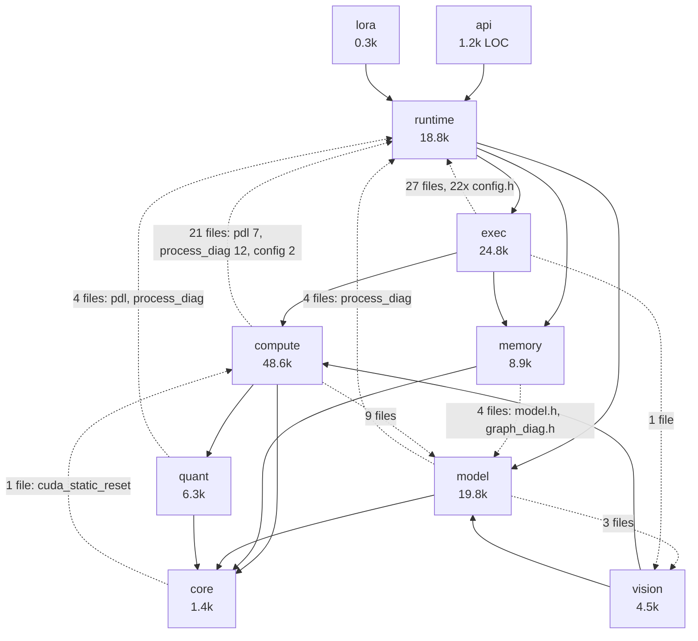

# imp — Full Architecture Audit — 2026-07-29

Read-only structural audit of `imp` at `5474b6c2` (v0.20.2). Eight tracks, scored with evidence.
Raw censuses in `docs/audit/arch_2026_07_29_evidence/`. **No GPU job was run** — the card was 100 % busy with the user's
own workload all session; every number here is either **MEASURED (prior campaign, cited)** or
**DERIVED** from source, and is marked as such.

## 1. Executive summary

1. **imp is accumulating structure, not debt** — and it is unusually easy to prove: 8 of the 13
   dispatch hypotheses came back fully REFUTED (2 more split) because the duplication they describe
   *was already collapsed*. Arch dispatch is a table (`model.cpp:171-347`) read through `ModelProfile`; GEMM
   selection is an 85-line registry pinned by a 40-test contract suite; there is one KV cache, one
   sampling pipeline, one `layer_swa_window()` covering four SWA variants. The memory subsystem has
   a device-free planner, a passkey-typed graph-address invariant, and a *measured* allocation-free
   decode path (0, down from 414).

2. **The one place the pattern broke is where a config flag lives.** `RuntimeConfig` is per-engine;
   `ProcessDiag` (`process_diag.cpp:57`) is a process-global static mirroring **28** kernel- and
   dispatch-affecting flags — installed only by the two tool `main()`s. `Engine::init` promotes
   exactly one of the 28 for library consumers and says so in a comment
   (`engine.cpp:783-790`). So a C-API consumer gets 27 flags silently ignored by the kernels while
   `exec/` honours them, and for `attention.fa2_hd256` the two readers answer the *same question*
   from different storage (`executor_attention_prefill.cu:51` vs
   `attention_fmha_sm120.cu:1900`). **This is the CRITICAL finding and it has a two-line fix.**

3. **Kernel-level routing is invisible.** Policy decisions are centralised and logged beautifully
   (~25 resolved lines from `engine_init_resolver.cpp`, each with its reason). Kernel decisions are
   not: the six-tier FMHA chain and the five-way MoE chain decline by bare `return false` with no
   log, and the pure-function *models* written to make routing testable
   (`attention_dispatch_decision.h`, `moe_prefill_decision.h`) are **never called by production
   code** — only by the test. The routing test tests a hand-maintained replica.

4. **No CI job verifies that any kernel produces the right numbers — and the fix is cheaper than it
   looks.** CI runs `ctest -L unit`; the `gpu` label is defined and never executes. But the job that
   would run it is **fully written and dormant** (`ci.yml:379-435`: unfiltered `ctest` +
   `compute-sanitizer memcheck` + the perf gate), waiting on `vars.HAS_GPU_RUNNER` and a registered
   runner. Today: 172 test files, 12 independent oracles, a bit-identical-greedy guarantee and a
   degeneration battery, all local-only and human-initiated; ~310 of ~340 reachable model
   configurations visited by no test at all.

5. **The two dispatch-level surprises.** *Good:* zero stale-target debt — all 24 mentions of
   `wgmma`/`tcgen05`/`TMEM`/`sm_100` in `src/` are comments saying the feature does **not** exist
   here, and real sm_120a idiom (TMA + mbarrier pipelines, `mxf4nvf4`, PDL, green contexts) is
   present. *Bad:* the "legacy cuBLAS prefill is 0.0 %" claim is false for Gemma-4, whose hd=512
   global layers ride that path by design and by measurement.

## 2. Scorecard

| Track | Weight | Score | Evidence | Ceiling | +1 move (effort) |
|---|---:|:---:|---|---|---|
| **A — Duplication** | 18 % | **3** | Arch dispatch: 15 files, 9 in `src/model/`, arch #17 costs 6 files (§7.2). GEMM: one 85-LOC registry replacing "~33 hand-written kernels". One KV cache, one sampling chain, one `apply_constraint_mask()`. **But** two live competing approaches remain: config storage (`RuntimeConfig` ∥ `ProcessDiag`, A-1) and allocators (5 tiers ∥ `VRAMAllocator`, 84 refs, A-11) | The two surviving twins are unenforced and have measurable cost — the config one is a correctness hazard, not a tidiness issue. Nothing mechanically prevents a 29th mirrored flag or a 21st `VRAMAllocator` consumer | **R-1**: install `ProcessDiag` from `Engine::init` (**S**, 2 lines + 1 test) |
| **B — Path selection** | 20 % | **2** | Policy centralised in `engine_init_resolver.cpp` and logged with reasons — genuinely good. Kernel selection is not resolved anywhere: 6-tier FMHA + 5-way MoE chains, all declines silent (`attention_dispatch.cu:65-116`, `executor_forward_moe_cutlass.cu:53-74`); the decision models are test-only mirrors; `fa2_hd256` is dual-sourced; cuBLASLt algo selection is neither cached nor pinned | No resolved-path dump exists, so every future routing regression is invisible. Two sites answer "can I use FA2" from different storage. One **RED** row on an advertised model (Gemma-4, §4) | **R-2**: resolved-path dump at model load, using the two existing decision functions (**S**, ½ day) — closes F-2 and F-3 together |
| **C — VRAM** | 18 % | **4** | `plan_memory()` never queries the device and is **applied**, not shadow (`engine_kv_cache_init.cpp:274`). Decode is allocation-free — *measured*, 414→0. `span.h` encodes graph-address stability in the type system. `MemAccount` with 10 `RegionTag`s; I1 gated by a two-way CI ratchet | 20-39 % of steady-state VRAM is unattributed against a stated ≥95 % bar; a sixth allocator (`VRAMAllocator`) still has 84 references; the demand estimates the planner consumes still come from a live `cudaMemGetInfo` (`plan.h:6-14`) | **R-8**: tag the prewarm block and the cuBLAS/CUTLASS workspaces (**M**) |
| **D — C++ design** | 14 % | **3** | `cuda_raii.h` is textbook (deleted copy, `noexcept` move, `[[nodiscard]] create`). **Zero virtual dispatch** in `exec/` + `compute/`. C ABI clean: 12 try / 28 catch, public headers CUDA-free. No copyable-type-holding-a-device-pointer anywhere | Ownership is expressed in types for *device memory and streams* and by convention for *everything else*: 6 module-static cuBLAS handles with an 11-entry hand-maintained teardown registry, 21 two-phase-init classes (10 without `[[nodiscard]]`), five coexisting error strategies, a 1200-LOC/150-member `Engine` header | **R-11**: self-registering static-reset hooks (**S**) — also removes the `core → compute` backward edge |
| **E — CUDA** | 12 % | **4** | 436/440 post-launch checks. Nothing on the default stream. Determinism is a real gated mode with a documented exception list and an E2E test. Real sm_120a idiom (TMA+mbarrier, `mxf4nvf4` ×15, `mma.sync` ×53, PDL, green ctx). **Zero** non-comment stale-target references | The launch-check convention is 99 % adopted and **0 % enforced** — the newest file in the tree is at 0/9 (`qwen3vl_encoder_kernels.cu`). NVFP4 grouped-MoE CUTLASS ignores the determinism flag and nobody has checked whether that is observable | **R-3**: CI gate on launch-vs-check counts, baseline = today (**S**) |
| **F — Architecture** | 8 % | **3** | Layer DAG holds for the forward edges; `api → runtime → exec → compute → quant`, `core` at the bottom. Extension costs are low (quant format: 2 files; config key: 1). C ABI is a clean, CUDA-free boundary | `runtime/config.h` (1124 LOC) is included by **22 files in `src/exec/`** — the top layer's type is a hot-layer dependency, which is *why* `ProcessDiag` exists. `core → compute` cycle via `cuda_static_reset`. `kv_cache_dtype` exists in 4 representations. The imp/nina boundary is unresolvable from imp alone | **R-18**: extract a `DispatchPolicy` POD into `core/` (**L**) — the durable version of R-1 |
| **G — Correctness** | 6 % | **3** | 172 test files, 8 binaries; 12 independent-oracle tests with stated tolerances; property batteries for the FSMs, tokenizer and GGUF parser **in CI**; bit-identical greedy across fresh processes under `[runtime] deterministic`; degeneration battery in `verify.sh`. The GPU CI job is fully written (`ci.yml:379-435`: full `ctest` + compute-sanitizer + perf gate) and dormant behind `HAS_GPU_RUNNER` | **The `gpu` ctest label never executes** — no runner is registered, so every numeric-correctness signal is human-initiated. One reachable hot-path kernel (`paged_attention_decode_mxfp4_kv`) has zero tests. The routing test tests a mirror | **R-20**: register a `[self-hosted, gpu, cuda]` runner and flip `HAS_GPU_RUNNER=true` (**S–M**, not L — the pipeline already exists) |
| **H — Operational** | 4 % | **4** | 18 endpoints across 2 dialects; constant-time API-key compare accepting both `Bearer` and `x-api-key`; path-traversal guard with `canonical` + base-escape rejection; Prometheus **histograms** (`_bucket{le=…}`) for latency/TTFT/ITL; 170 config keys, `--set` rejects unknown keys; 8 CI jobs incl. file-size, alloc-sites and release-hygiene gates | 27 CLI flags parsed by two hand-written parsers; `/metrics` unauthenticated by design; no way to observe which kernels a request used (→ Track B); combinatorial config settings untested | **R-9**: one shared arg table for the 27 duplicated flags (**S**) |

**Weighted: 3.14 / 5.**

## 3. Verdict

**imp is accumulating structure.** The evidence is not the absence of duplication but the *shape*
of what remains: every dimension that was deliberately attacked — architecture dispatch, GEMM
selection, KV caching, SWA handling, sampling, constrained-decode masking, memory tiering — came
out collapsed to a table or a single function, usually with a comment recording the bug class it
prevents. The residual duplication is concentrated in the dimensions nobody has run a campaign on
yet, and it is small enough to name exhaustively (§6, 17 entries, 6 of them D6-justified).

The debt that exists is of one specific kind: **decisions that are made but not recorded.** Config
values that live in two places, routing tiers that decline without saying so, a determinism flag
one kernel family does not consult, an allocator invariant that is really a ratchet, a doc that
quotes code that no longer exists. Every one of these is a *loss of legibility*, not a loss of
correctness — with the single exception of F-1, where two readers of the same flag can genuinely
disagree.

**The single change that buys the most is R-2: a resolved-path dump at model load, built by calling
the two decision functions that already exist.** It is half a day of work and it does four things
at once — it makes kernel routing observable for the first time (Track B's ceiling), it converts
`attention_dispatch_decision.h` and `moe_prefill_decision.h` from dead test-only mirrors into
production code so their test stops being a fiction (Track G), it gives `docs/attention-dispatch.md`
a source of truth that cannot rot (§16), and it makes every future routing regression visible
instead of silent. Nothing else on the roadmap has that fan-out per unit of effort.

R-1 is the more urgent item and should land first because it closes a correctness hazard, but it is
a two-line patch on a structural problem; R-18 is its real fix and R-2 is what makes the whole class
of problem detectable.

**What would change this verdict:** if R-4 comes back showing the NVFP4 grouped-MoE GEMM *is*
observably non-deterministic, then golden-output regression testing is impossible for the reference
configuration, and Track G's score is not 3 but 1 — because at that point nothing, not even a
nightly GPU lane, could prove a refactor did not change the answers.
## 4. Routing matrix

**Provenance: DERIVED** (source reading). No cell was measured this session — the GPU was at
100 % utilisation / 29 207 MiB used by the user's `mmm-comfy` container throughout, so per
`CLAUDE.md` no GPU job was run. Where a prior *measured* campaign backs a cell it is cited.

The dispatch's model list (6 models, 9 architectures) is stale. `src/model/model_arch.h:7` has
**16** architecture enumerators and `docs/supported-models.md` lists ~30 validated checkpoints.
The matrix below covers every *distinct routing combination*, not every checkpoint: adding
Qwen3-8B next to Qwen3-4B produces an identical row.

### 4.1 Decision inputs, and where they are resolved

| Stage | Decision site |
|---|---|
| loader | `src/model/gguf_loader.cpp` / `src/model/safetensors_loader.cpp`, arch from `model.cpp:294-347` |
| storage tier | `src/runtime/storage_planner.cpp:16`, `src/exec/weight_handle.cu:54` |
| prefill attention | `src/exec/executor_attention_prefill.cu:51-64` (per-layer gate), then `src/compute/attention_dispatch.cu:45-130` (FMHA chain) |
| decode attention | `src/exec/executor_attention_decode.cu:162-273` (if/else on `cache->qtype()`) |
| MoE prefill | `src/exec/executor_forward_moe.cu:577-597` (5-way chain) → `executor_forward_moe_cutlass.cu` (4 tiers) |
| KV dtype | `src/runtime/engine_init_resolver.cpp:186-225` |
| graph eligibility | 8 in-place demotions, see §5 |
| spec-decode eligibility | `src/runtime/engine_spec_ngram.cpp:271-308` |

### 4.2 Matrix

Legend — **GREEN** intended fast path end-to-end and exercised by a test; **AMBER** intended path
with a gap (untested in CI, unmeasured, or partial); **RED** falls back to a legacy/slow path at
some stage, or the combination is unreachable/untested.

| # | Model (quant, format) | Loader | Weight layout | Quant kernel | Prefill attn | Decode attn | KV layout+dtype | MoE grouped GEMM | Norm | RoPE | Graph? | Cont. batch? | Spec? | Sampler chain | Constrained OK? | Vision | Grade |
|---|---|---|---|---|---|---|---|---|---|---|---|---|---|---|---|---|---|
| 1 | **Qwen3-Coder-30B-A3B NVFP4** (SafeTensors) — *reference config* | safetensors_loader | native NVFP4 + CUTLASS SF cache | `gemm_kernel_cutlass_nvfp4.cu` / `nvfp4_gemv_moe.cu` (decode) | FA2 fp16-QK (hd=128) | `paged_attention_decode` FP16 | paged 16, FP16 (default) | DEVICE_ARGS tier (`moe.nvfp4_device_args`) | RMSNorm | STANDARD | yes | yes | yes (`speculative.moe` + `moe_experts_nvfp4`) | topk/topp | yes | n/a | **GREEN** |
| 2 | Qwen3-8B Q8_0 (GGUF) | gguf_loader | Q8_0 + NVFP4 decode cache | `gemm_kernel_gguf.cu` / dp4a GEMV | FA2 fp16-QK (hd=128) | `paged_attention_decode_fp8` (KV auto→FP8, `model_arch.h:40`) | paged 16, FP8 E4M3 | n/a (dense) | RMSNorm | STANDARD | yes | yes | yes | topk/topp | yes | n/a | **GREEN** |
| 3 | Qwen3-14B NVFP4 (SafeTensors) | safetensors_loader | native NVFP4 | `nvfp4_gemv_dense.cu` | FA2 fp16-QK | FP16 paged | paged 16, FP16 | n/a | RMSNorm | STANDARD | yes | yes | yes | topk/topp | yes | n/a | **GREEN** |
| 4 | Qwen3.6-35B-A3B NVFP4 (GDN+MoE hybrid) | safetensors_loader | NVFP4 + FP8 SSM-proj sidecar (#949) | CUTLASS grouped + `executor_ssm_gdn.cu` | FA2 on attention layers; GDN layers bypass attention | FP16 paged | paged 16, FP16 + GDN recurrent state | GROUPED / DEVICE_ARGS | RMSNorm | STANDARD | yes (GDN is graph-safe, `engine_kv_cache_init.cpp:346` only excludes *pure* SSM) | yes | only with `speculative.hybrid` (`engine_spec_ngram.cpp:300`) | topk/topp | yes | n/a | **AMBER** — hybrid spec path is opt-in and has no CI coverage (GPU lane only) |
| 5 | **Nemotron-3-Nano-30B-A3B NVFP4** (Mamba2+attn+MoE) | safetensors_loader | NVFP4 + FP8 SSM sidecar | CUTLASS grouped + `compute/ssm.cu` | FA2 (NOPE variant — no RoPE) | FP16 paged | paged 16, FP16 + Mamba2 state | GROUPED | RMSNorm | **NOPE** (`ModelProfile::AttnVariant::NOPE`) | **NO** — `has_pure_ssm` forces `use_cuda_graphs=false` (`engine_kv_cache_init.cpp:346-350`) | yes | **NO** (`ssm_state_ && !speculative.hybrid` → false) | topk/topp | yes | n/a | **AMBER** — eager decode by design; the two biggest decode levers (graphs, spec) are both structurally off, which is exactly why it is the slowest 30B (148 tok/s vs 338) |
| 6 | **gpt-oss-20b MXFP4** (SafeTensors, learned sinks) | safetensors_loader | MXFP4 experts → NVFP4 at load | CUTLASS grouped (GPT_OSS_GLU) | **`fmha_sm120_prefill` FP16 WMMA only** — sinks pre-gate at `attention_dispatch.cu:45`; FA2/MXFP4/FP8 tiers are skipped entirely, throw on decline | FP16 paged + sink term | paged 16, FP16 | **GROUPED tier only** — arch-gated off DEVICE_ARGS *and* SMALL_M (`moe_prefill_decision.h:62,68`) | RMSNorm | GPTOSS_SWA | yes | yes | yes | topk/topp | yes | n/a | **AMBER** — correct and fast (391 tok/s) but structurally excluded from the two fastest MoE tiers and from every FA2 tier; a single-tier path with `throw` as its only fallback |
| 7 | **Gemma-4-26B-A4B NVFP4** (dual head_dim 256/512) | safetensors_loader | NVFP4 | CUTLASS grouped | **per-layer split**: hd=256 SWA layers → FA2; hd=512 global layers → `attention_cublas_prefill`, overflowing to `attention_cublas_prefill_sliced` (#1036) then FMHA | FP16 paged | paged 16, FP16, SWA-aware sizing | GROUPED | RMSNorm + softcap | GEMMA4_SWA (local rope_theta) | conditionally — `gemma4.no_graphs` escape hatch (`engine_init_resolver.cpp:581`) | yes | yes | topk/topp | yes | separate BF16 mmproj | **RED** — the hd=512 half of every layer stack rides the *legacy materialised cuBLAS S-matrix path* by design. It is faster there than the fused hd=512 kernel and is documented, but it is the one advertised model where the "legacy path is 0.0 % of prefill" claim in `docs/attention-dispatch.md:9` is false |
| 8 | Gemma-3-12B Q8_0 (GGUF, hd=256, vision) | gguf_loader | Q8_0 + NVFP4 decode cache | dp4a GEMV | FA2 hd=256 (since #932, `attention.fa2_hd256`) | FP16 paged | paged 16, FP16 (FP8 hint gate excludes Gemma) | n/a | RMSNorm + softcap | STANDARD + `sliding_window_pattern` | yes | yes | yes | topk/topp | yes | SigLIP `vision_encoder.cu` | **AMBER** — hd=256 FA2 is enabled by a flag read from **two different sources** (see F-1); vision tower has its own cuBLAS handle and graph gate |
| 9 | **DeepSeek-V2-Lite bf16** (MLA) | safetensors_loader | bf16, experts host-offloaded | cuBLAS dense + `mla_kv_assemble.cu` | FA2 after latent assembly | FP16 paged | paged 16, FP16, MLA latent | LEGACY (host-offload) | RMSNorm | **MLA** variant | **NO** — `experts_on_host_` forces graphs off (`engine_weight_upload.cpp:248-277`) | yes | not exercised | topk/topp | yes | n/a | **RED** — eager + LEGACY MoE + host offload. ~30 tok/s. Known-failing `LongGenerationStability`. Advertised in `docs/supported-models.md:26` |
| 10 | Qwen3-VL-4B BF16 (SafeTensors, vision) | safetensors_loader | BF16 | cuBLAS | FA2 | FP16 paged | paged 16, FP16 | n/a | RMSNorm | 3-axis M-RoPE + DeepStack | yes (unless `runtime.no_vision_graph`) | yes | yes | topk/topp | yes | `qwen3vl_encoder.cu` — **own cuBLAS handle, own kernels, 0 post-launch checks** | **RED** — `src/vision/qwen3vl_encoder_kernels.cu` is the only file in `src/` with kernel launches and *zero* `IMP_CUDA_CHECK_LAUNCH()` (9/9 unchecked, F-4). A launch-config failure in the tower produces silently wrong image embeddings |
| 11 | Phi-4-reasoning-plus NVFP4 (fused QKV) | safetensors_loader | NVFP4, fused projections | `nvfp4_gemv_dense.cu` | FA2 | FP16 paged | paged 16, FP16 | n/a | RMSNorm | STANDARD | yes | yes | yes | topk/topp | yes | n/a | **GREEN** |
| 12 | nomic-embed-text-v1.5 Q8_0 (encoder-only) | gguf_loader | Q8_0 | dp4a | `compute/encoder_forward.cu` — **entirely separate forward**, bidirectional, no KV | n/a | **none** | n/a | post-LN + bias | none | n/a | n/a | n/a | **none** (mean-pool) | n/a | n/a | **AMBER** — a second, private forward path (`is_encoder`) that shares almost nothing with the decoder loop; correctness proven only by an HF cosine oracle (≥0.999) |
| 13 | Qwen3-Reranker-0.6B Q8_0 | gguf_loader | Q8_0 | dp4a | FA2 | FP16 paged | paged 16, FP16 | n/a | RMSNorm | STANDARD | yes | yes | n/a | logit-diff, no sampler | n/a | n/a | **GREEN** |

### 4.3 Supported-but-untested architectures

| Arch enum | Reachable? | Tested? | Grade |
|---|---|---|---|
| `LLAMA`, `MISTRAL` | yes — validated GGUF checkpoints | yes | GREEN |
| `MIXTRAL` | yes | no checkpoint in `docs/supported-models.md` | **AMBER — advertised in the enum, no validated checkpoint** |
| `LLAMA4` | yes — parse entries at `model.cpp:338-339` | no checkpoint listed | **AMBER — same** |
| `QWEN35` (dense) | yes | Qwen3.5-4B/9B/27B GGUF listed | GREEN |
| `QWEN36_MOE` | yes | Qwable-3.6-27B, Qwen3.6-35B-A3B | GREEN |
| `GENERIC` | yes — the fallback of `parse_model_arch` (`model.cpp:350`) | **no** | **RED — `GENERIC` is what an unknown `general.architecture` string silently becomes.** `is_encoder_only_arch` (`model_arch.h:57`) was added because that fallback used to "succeed" and then IMA on the first request (#818). The guard covers BERT-family strings only; any other unknown decoder still loads as `GENERIC` |

### 4.4 Combination explosion, quantified

| | count | basis |
|---|---:|---|
| Nominal cross-product | 16 arch × 2 formats × 12 `QType` × 2 phases × 2 graph × 2 batch × 2 spec = **36 864** | enum sizes |
| (a) **Reachable** | ~**340** | 16 archs, but each arch admits only the quants its checkpoints ship (median 2), and graph/spec/batch are resolved *per model* not per request — 16 × 2 × 2 × 2.7 ≈ 340 distinct resolved configurations |
| (b) **Tested** (any automated test, incl. GPU lane) | ~**30** | `docs/supported-models.md` = 30 checkpoints, each pinned by at most an E2E smoke |
| (b′) **Tested in CI** | **0** model rows | CI executes `ctest -L unit` only (`CMakeLists.txt:857-865`); the `gpu` label never runs because no runner is registered — the job itself exists and is dormant (`ci.yml:379-435`, §12.1) |
| (c) **Documented as supported** | **30** | `docs/supported-models.md` |

**The risk surface is (a) − (b) ≈ 310 resolved configurations that no test ever visits**, and the
gap between (b) and (b′) is total: *every* model-level correctness signal in this project is
local-only and human-initiated.

### 4.5 Feature-interaction table

For each pair: **OK** = supported, **REJECT** = refused with a clear error/skip, **WRONG** =
silently produces wrong results, **UNKNOWN** = no decision site found.

| | constrained decode | continuous batching | vision | Mamba2/GDN state |
|---|---|---|---|---|
| **spec-decode** | **REJECT** — `engine_spec_ngram.cpp:271-272` returns false for any regex/grammar/tool constraint ("verify replicates no FSM masks", #1002) | **OK** | **UNKNOWN** — no gate found either way; a vision request that reaches the spec gate is not distinguished from a text one | **REJECT unless `speculative.hybrid`** — `engine_spec_ngram.cpp:300` |
| **constrained decode** | — | **OK** — per-sequence constrainer in `InferenceState` | **OK** | **OK** |
| **continuous batching** | — | — | **OK** | **OK** |
| **CUDA graphs** | OK | OK (bucketed by `n_sequences-1`) | separate gate `runtime.no_vision_graph` | **REJECT for pure SSM** (`engine_kv_cache_init.cpp:346`) |

The one **UNKNOWN** (spec × vision) is itself a Track B finding: an absent decision site means
nobody decided.

### 4.6 Degradation semantics

| Pressure | Behaviour | Site |
|---|---|---|
| KV pool >90 % full | auto-enables StreamingLLM, evicts middle blocks, **permanently drops the engine out of graph mode**, logs `WARN` | `engine_scheduler.cpp:1457-1470` |
| context exceeds `max_seq_len` | rejected at admission | planner `min_kv_tokens` floor (`memory/plan.h:78`) |
| attention chain exhausted | `throw std::runtime_error` (#654) — deliberately replaced a silent fallback that produced PPL ~1e10 | `attention_dispatch.cu:130` |
| MoE tier preconditions unmet | falls through tiers to `run_moe_legacy_fallback_`, which **does** log once at layer 0 — but the nine `return false` declines that got it there are all silent | `executor_forward_moe_legacy.cu:67`; declines at `executor_forward_moe_cutlass.cu:53-74` |
| unsupported KV dtype in chunked prefill | `IMP_LOG_ERROR` + `std::abort()` | `executor_attention_prefill.cu:31-36` |
| spec-decode buffer alloc fails | logs `WARN`, disables speculation *for that step* | `engine_spec_ngram.cpp:88` |

Degradation is generally loud and generally graceful. What is *not* observable anywhere is the
**reason** a faster tier declined: the MoE CUTLASS entry has nine bare `return false` guards
(`executor_forward_moe_cutlass.cu:53-74`) and the FMHA chain's per-kernel declines are equally
silent. You can read which path ran; you cannot read why the better one did not. See F-2.
## 5. Decision-point census

Every runtime decision that selects between *implementations* (not values). `Observable?` means:
can an operator tell from the default log stream which branch was taken.

| # | Decision | Resolved when | Inputs | Default | Observable? | Silent fallback? |
|---|---|---|---|---|---|---|
| 1 | Architecture identity | load | `general.architecture` / HF `architectures[]` | `GENERIC` | yes (`engine_init_resolver.cpp:47`) | **YES — an unrecognised arch string becomes `GENERIC` and loads** (`model.cpp:350`) |
| 2 | Loader (GGUF vs SafeTensors) | load | file magic / dir layout | — | yes | no |
| 3 | `StorageTier` per tensor | load | `QType` + `TensorKind` + plan | per-tensor | partly — plan is logged, per-tensor tier is not | no (`Undefined` is fatal by contract, `storage_tier.h:8`) |
| 4 | KV cache dtype | init | model hint, arch safe-list (`model_arch.h:32,40`), config | `auto` | **yes, richly** (`engine_init_resolver.cpp:186-225`) | no |
| 5 | NVFP4 decode-cache mode (0/1/2) | init | source qtype, `nvfp4_beneficial()` | `auto` | yes (`:444-461`) | no |
| 6 | FP8 prefill cache on/off | init | quant, GDN presence, NVFP4 native | `auto` | yes (`:367-505`) | no |
| 7 | cuBLAS FP16-accumulate | init, per arch | arch deny-list | `auto` | yes (`:409`) | no |
| 8 | `max_batch_size` auto | init | weights, headroom | `auto` | yes (`:333`) | no |
| 9 | `max_seq_len` auto + SWA sizing | init | plan, SWA layers | `auto` | yes (`:605-640`) | no |
| 10 | KV block count | init | `plan_memory()` — device-free | — | yes | no |
| 11 | **CUDA-graph eligibility** | init **and mid-run** | 8 independent in-place demotions of `config_.use_cuda_graphs` | `true` | **yes — all 8 log** | no |
| 12 | Prefill chunk size | init, per arch | `Engine::resolve_prefill_chunk_size_()` | 2048 | yes | no |
| 13 | **Prefill attention path** | **per layer, per request** | `hd`, `attn_sinks`, `shapes_uniform`, `attention.fa2_hd256`, `fa2_fp16qk`, S-matrix fit | FA2 | **NO** | **YES** — all six tiers decline by returning `false` with no log; only the terminal exhaustion throws |
| 14 | FMHA chain tier | per call | per-kernel accept + 3 config gates | FA2 | **NO** | **YES** (same) |
| 15 | Decode attention kernel | per step | `cache->qtype()` | FP16 | **NO** | no — it is an exhaustive if/else; the `else` is FP16 |
| 16 | NVFP4 decode TC vs non-TC | per step | shape support | TC | **NO** | **YES** — `attention_paged_nvfp4_tc` "falls back to non-TC for unsupported shapes" (`docs/attention-dispatch.md:71`) |
| 17 | **MoE prefill path (5-way)** | per layer, per request | ~30 conjunct workspace/qtype predicates | fp16-batch | partly — the winner logs at layer 0 | **YES** — 9 bare `return false` at `executor_forward_moe_cutlass.cu:53-74` |
| 18 | MoE CUTLASS tier (4-way) | per layer | `moe.no_cutlass3x`, `nvfp4_device_args`, `nvfp4_smallM`, arch==GPT_OSS | DEVICE_ARGS | partly | yes |
| 19 | GEMM kernel per weight | per call | `gemm_kernel_registry.cu` table | table | opt-in (`diagnostics.log_gemm_algo`) | no — registry is a table |
| 20 | cuBLASLt algo | **first call, per shape** | **cuBLASLt autotuning** | heuristic | opt-in only | **YES — and non-reproducible across process restarts** (see 5.2) |
| 21 | Spec-decode eligibility | per request | constraints, SSM, MoE-NVFP4, think budget | on | partly | no — explicit `return false` |
| 22 | Spec draft source (ngram/suffix/MTP/recycle) | per step | config + availability | ngram | `IMP_SPEC_TRACE` env only | yes |
| 23 | StreamingLLM auto-enable | **mid-run**, on KV pressure | free blocks < 10 % | off | yes (`WARN`) | no |
| 24 | Prefix-cache hit | per request | prompt hash | on | metric only | no |
| 25 | Constrainer precedence | per step | which constrainer is set | grammar>regex>schema>json | no | no — single site, `executor.cu:56-71` |
| 26 | Vision graph capture | init | `runtime.no_vision_graph` | on | yes | no |
| 27 | Expert host-offload | init | VRAM plan | off | yes | no |
| 28 | **28 kernel flags via `ProcessDiag`** | **process start, tool `main()` only** | `RuntimeConfig` | config defaults | no | **YES — see F-1** |

### 5.1 Centralised or scattered?

**Both, and the seam between them is the highest-severity structural finding in this audit.**

Policy decisions (rows 1-12, 21-27) *are* centralised: `engine_init_resolver.cpp` (688 LOC) is a
genuine planner that resolves them once, in order, with a log line each. This is the best thing in
the codebase and it should be said plainly.

Kernel-level decisions (rows 13-20) are **not** resolved anywhere. They are re-derived per call from
predicates spread across `exec/` and `compute/`, and two of those predicates read the *same config
key from two different storage locations*:

```
attention.fa2_hd256
  ├── src/exec/executor_attention_prefill.cu:51      runtime_config().attention.fa2_hd256   ← per-engine
  ├── src/exec/executor_workspace_buffers.cu:1489    runtime_config().attention.fa2_hd256   ← per-engine
  ├── src/exec/executor_workspace_buffers.cu:1579    runtime_config().attention.fa2_hd256   ← per-engine
  ├── src/exec/executor_attention_internal.h:41      rcfg.attention.fa2_hd256               ← per-engine
  └── src/compute/attention_fmha_sm120.cu:1900       process_diag_fa2_hd256()               ← PROCESS-GLOBAL
```

`ProcessDiag` is a function-local `static` (`src/runtime/process_diag.cpp:57-60`) populated by
`process_diag_install()` (`:64-105`) with **28 kernel- and dispatch-affecting flags**. It is called
from exactly two places, both tool entry points (`tools/imp-cli/main.cpp:134`,
`tools/imp-server/main.cpp:64`). `Engine::init` knows this and promotes **one** of the 28
(`engine.cpp:783-790`, `deterministic_gemm`) so that "library/test embeddings (C API without a tool
main) honor [runtime] deterministic".

The other 27 are not promoted. Consequences, in increasing order of severity:

1. A C-API consumer (nina) that sets `attention.fa2_hd256=false`, `attention.fp8_tile=false`,
   `moe.mr_nr=16`, `runtime.no_pdl=true`, `runtime.prefill_graph=false`, … gets those values
   honoured by `exec/` and **ignored by the kernels**. Same config, different kernels than
   `imp-cli`.
2. Within one process, two `Engine` instances with different `RuntimeConfig`s share one
   `ProcessDiag`. The second install wins for both.
3. For `fa2_hd256` specifically the two readers *disagree about the same question*: `exec/` sizes
   the attention-scores workspace and decides whether to even attempt FA2 from the per-engine
   value; the kernel decides whether to accept hd=256 from the process-global one. Setting it
   false in a library embedding makes `exec/` route hd=256 to cuBLAS *and* keeps the S-matrix
   workspace, while the kernel would still have accepted — a pure waste; the inverse
   (install() ran with false, engine config says true) makes `exec/` skip the S-matrix allocation
   and then hand hd=256 to a kernel that declines, walking the chain down to
   `flash_attention_blackwell`, which declines hd=256 for smem, reaching the `throw` at
   `attention_dispatch.cu:130`.

This is exactly the "two sites deciding *can I use FA2* with slightly different predicates" hazard,
and it is present, not hypothetical.

### 5.2 Selection stability — the cuBLASLt autotuning question

The dispatch reports prefill varying up to 2.6× across container restarts. Locating it:

- imp holds **six independent module-static cuBLAS/cuBLASLt handles**, each lazily created in its
  own TU: `compute/gemm.cu:59,71`, `compute/attention_cublas.cu:45`,
  `compute/attention_mxfp4_prefill.cu:338`, `compute/gemm_grouped.cu:28`,
  `vision/vision_encoder.cu:24`, `vision/qwen3vl_encoder.cu:27`.
- Algorithm selection enters at `compute/gemm.cu` via cuBLASLt heuristics, with a documented
  reselect/fallback chain (`filesize_thresholds.toml`: "algo-reselect/fallback chain").
  `diagnostics.log_gemm_algo` exists to observe it (`process_diag.h:33`).
- **Nothing caches or persists the selection.** There is no algo cache file, no seeding, no pinning.
  `CUBLAS_WORKSPACE_CONFIG` is set — but only for Gemma-4, and only for *determinism of results*,
  not algo choice (`engine_init_resolver.cpp:577`).
- `process_diag_force_splitk_fallback()` (`process_diag.h:75`) exists as a **test hook** to force
  one branch — i.e. the project already knows the branch matters and has a lever for it, but the
  lever is not exposed as config and is not used to pin production selection.

**What it would take to pin it:** a per-(shape, dtype) algo cache keyed on the same tuple the
registry already uses, written once at warmup and reloaded on start — the plumbing exists
(`gemm_kernel_registry.cu` is already a table, `log_gemm_algo` already prints the choice). Effort
**M** (~2-3 days). This is a prerequisite for any trustworthy prefill A/B, and `AGENTS.md:12-16`
currently works around it by forbidding cross-session comparison — a process rule standing in for a
missing mechanism.

### 5.3 FA2 predicate correctness

Checked against the kernel's own acceptance:

| Property | Predicate (`exec/`) | Kernel (`attention_fmha_sm120.cu:1900`) | Match? |
|---|---|---|---|
| head_dim | `hd == 128 \|\| (hd == 256 && fa2_hd256)` | `head_dim != 128 && !(head_dim == 256 && fp16_qk && process_diag_fa2_hd256())` | **near — the kernel additionally requires `fp16_qk` for hd=256; `exec/` checks `fa2_fp16qk != "never"` separately at :57. Equivalent in practice, expressed twice.** |
| learned sinks | `!attn_sinks` (`:57`) | pre-gate at `attention_dispatch.cu:45` | yes |
| heterogeneous shapes | **per-layer** since the Gemma-4 fix (`:53-56`) | n/a | yes — and the fix is documented in-comment |
| `q_offset > 0` | FA2 declines chunk continuations (blanket, post-#548, "conservative") | — | **over-narrow by design** — a documented conservative gate that costs performance on chunked continuation, not correctness |
| sliding window | threaded through every FMHA variant | accepted | yes |
| GQA ratio | not gated | kernel handles | yes |

Verdict: the predicate is **correct but expressed twice**, and one of the two copies reads from the
wrong storage (5.1). The `q_offset > 0` blanket decline is the one known over-narrow gate; it is
labelled as such in the source.

### 5.4 Is the resolved path inspectable?

**Policy: yes. Kernels: no.** There is no dump of "for this model, these kernels were chosen".
`engine_init_resolver` prints ~25 resolved policy lines; `diagnostics.log_gemm_algo` and
`IMP_SPEC_TRACE` cover two slices opt-in; the attention and MoE tier choices are invisible except
for one `IMP_LOG_INFO` at layer 0 in two of the MoE tiers.

**Cheapest fix** (F-3): the decision *models* already exist as pure functions —
`select_attn_prefill_path()` and `select_moe_prefill_path()`. Call them at the end of
`Engine::init` with the model's real shapes and print the result as a resolved-path block. That
turns the two mirrors from dead test-only code into the production dump, which also fixes the
drift problem in §12. Effort **S** (~half a day).
## 6. Duplication census

Method: own token-based clone detector (`docs/audit/arch_2026_07_29_evidence/clones.py`, 60-token windows, identifiers
and literals normalised away, stride 10) over `src/` + `tools/`, then adjudicated by hand. Raw
output in `docs/audit/arch_2026_07_29_evidence/clone_pairs.txt`. Candidates that survived reading are below; candidates
that did not are recorded as D6 (§15) or dropped.

| ID | Class | Concept | Site A | Site B | Canonical | Other reachable in a default build? | Sev |
|---|---|---|---|---|---|---|---|
| A-1 | **D3** | **Where a config flag lives** — per-engine `RuntimeConfig` vs process-global `ProcessDiag` | `src/runtime/config.h` (170 keys) | `src/runtime/process_diag.cpp:8-55` (28 mirrored) | `RuntimeConfig` | **yes — the kernels read the mirror** | **CRITICAL** |
| A-2 | **D5** | Attention-prefill routing rules | `src/compute/attention_dispatch.cu:45-130` (real) | `src/compute/attention_dispatch_decision.h:57-95` (mirror) | the `.cu` | mirror is test-only, never called | **HIGH** |
| A-3 | **D5** | MoE-prefill routing rules | `src/exec/executor_forward_moe_cutlass.cu` + `executor_forward_moe.cu:577-597` | `src/exec/moe_prefill_decision.h:49-77` (mirror) | the `.cu` | mirror is test-only; **and it models only the 4 CUTLASS tiers, not the outer 5-way chain** | **HIGH** |
| A-4 | **D3** | cuBLAS handle ownership | 6 module-static handles: `gemm.cu:59,71`, `attention_cublas.cu:45`, `attention_mxfp4_prefill.cu:338`, `gemm_grouped.cu:28`, `vision_encoder.cu:24`, `qwen3vl_encoder.cu:27` | — | none | all six | MEDIUM |
| A-5 | **D3** | Lifetime of lazily-created CUDA statics | `src/core/cuda_static_reset.cpp:9-31` — 11 hand-registered hooks | the 11 owning TUs | the aggregator | yes | MEDIUM |
| A-6 | **D4** | CLI flag parsing | `tools/imp-cli/args.cpp` (252 LOC) | `tools/imp-server/args.cpp` (161 LOC) | neither | both — **27 flags parsed twice** | MEDIUM |
| A-7 | **D4** | Paged-decode attention kernels | `attention_paged.cu` (1726) | `_fp8` 743, `_fp8_tile` 574, `_int4` 648, `_int8` 556, `_nvfp4` 545, `_nvfp4_tc` 1217 | `attention_paged.cu` | all — one per KV dtype | **D6 in part** (see §15); the *scaffolding* is duplicated, the decode inner loop is not |
| A-8 | **D4** | Constrained-decode device buffers | `grammar_constrain.{h,cu}`, `json_constrain`, `regex_constrain`, `schema_constrain` — each declares its own `d_token_allow_`, `d_allowed_mask_`, `d_token_categories_` | — | `constrain_common.h` (204 LOC) exists but does not own the buffers | all four | MEDIUM |
| A-9 | **D1** | MoE prefill legacy fallback | `src/exec/executor_forward_moe_legacy.cu` (400 LOC) | `executor_forward_moe_cutlass.cu` etc. | CUTLASS tiers | **yes** — reached by DeepSeek-V2-Lite (host-offload) and any checkpoint whose expert tensors miss the NVFP4 tier | LOW — it is a genuine floor, not a twin |
| A-10 | **D2** | GEMM kernel selection | `src/exec/gemm_kernel_registry.cu` (85 LOC table) | 9 `gemm_kernel_*.cu` leaves | the registry | registry only | **REFUTED as duplication — this is the fix, see §15** |
| A-11 | **D3** | Device-memory allocator concepts | `ArenaAllocator`, `BlockPool`, `ScratchStack`, `GraphSlotPool`, `HostPinnedAllocator` (tiers T2-T5, by design) **+ `VRAMAllocator`** | `src/memory/vram_allocator.h:25` | the tier allocators | **yes — `VRAMAllocator` still has 84 references across 20 files** incl. `kv_cache`, `executor.h`, `batch.cpp` | MEDIUM |
| A-12 | **D4** | Chat/completions request handling | `handlers_chat.cpp:634` | `handlers_chat_core.cpp:894` | `handlers_chat_core.cpp` | both | LOW |
| A-13 | **D5** | KV block size 16 | `memory/plan.h:76` (`kv_block_size = 16`), `kv_cache.h`, `runtime/vram_budget.h` (`kv_block_bytes_per_layer`) | — | `vram_budget.h` says "Single source" and is honoured | n/a | **REFUTED — single-sourced** |
| A-14 | **D4** | `mmq_q8_imma` per-qtype tiles | `mmq_q8_imma.cu:163` | `_q4k.cu:154`, `_q6k.cu:121`, `_q51.cu:204` | `mmq_q8_imma.cu` | all | **D6** — the deltas are the dequant inner step, i.e. control flow |
| A-15 | **D4** | GDN scan | `gdn_scan.cu:257` | `gdn_scan_tc.cu:95` | both live (tensor-core variant) | both | **D6** |
| A-16 | **D2** | `use_cuda_graphs` demotion | 8 sites across 5 files (`engine_kv_cache_init.cpp:347`, `engine_weight_upload.cpp:52,77,274,279`, `engine_workspace_warmup.cpp:180`, `engine_init_resolver.cpp:583`, `engine_scheduler.cpp:1466`) | — | none — it is a mutable bool | all | MEDIUM |
| A-17 | **D4** | Vision towers | `src/vision/vision_encoder.cu` (SigLIP, 963 LOC) | `src/vision/qwen3vl_encoder*.cu` | neither | both | **D6** — genuinely different architectures |

### 6.1 Adjudication notes

**A-1 is the root cause; A-2/A-3 are its detection failure.** The project noticed that routing was
untestable, and responded by writing pure-function *models* of the routing and testing those
(`tests/test_routing_decision.cpp`). That is a real improvement over E2E-only coverage, and the
headers say plainly that keeping them in lock-step "is the point". But nothing enforces the
lock-step: `attention_dispatch.cu:33` only *mentions* `select_attn_prefill_path` in a comment, and
`grep` confirms the only `#include` of either decision header outside its own comment is the test.
A reorder in the `.cu` therefore leaves the test green. §5.4 gives the one-change fix that converts
both mirrors into production code and closes A-2, A-3 and the observability gap at once.

**A-11: `VRAMAllocator` is not dead.** `docs/MEMORY_ARCHITECTURE.md` describes a three-layer design
(backend / tier allocators / typed handles) and lists `vram_allocator.cu` under "Still live from
before". 84 references across 20 files including `executor.h` and `kv_cache.h` is not a residue —
it is a sixth allocator concept coexisting with the five the design doc blesses. This is the single
largest remaining piece of the memory migration and it is honestly logged as such in `AUDIT.md`.

**A-7 needs care.** The six paged-decode variants share ~35 % of their token windows, but almost all
of the shared mass is the online-softmax rescale block (`online_softmax_step`, `m_new`/`l_new`
update) — which `attention_paged_common.cuh` (466 LOC) already factors out where it can. What is
*not* shared is the K/V load-and-dequant inner loop, and that is a per-dtype control-flow
difference in the hottest loop in the engine. **Consolidating this would be the classic false
positive.** The remaining duplication worth removing is the launch scaffolding (grid/block sizing,
head_dim switch, split-K reduce dispatch), which repeats near-verbatim six times.

**A-6 is cheap and worth doing.** 27 flags parsed by two hand-written parsers, in two binaries that
ship together, both writing into the same `RuntimeConfig`. `--set` already provides a generic path
into every one of the 170 config keys (`config.cpp`), so the duplicated flag tables are a
convenience layer that could be one shared table.

### 6.2 Duplication *not* found (hunted, absent)

- No `#if 0` blocks anywhere in `src/` or `tools/`.
- No `_v2`/`_new`/`_old` symbol pairs — the suffix hunt returned only algorithm-local variables
  (`m_new`, `h_old`, `l_new`) and legitimate API names (`inc_ref`, `mirostat_v2`).
- Exactly one file with `legacy` in its name (`executor_forward_moe_legacy.cu`), and it is a
  reachable floor, not a twin.
- Architecture dispatch is **not** duplicated (see §7).
## 7. Dispatch-site table

### 7.1 `ModelArch` (16 enumerators, `src/model/model_arch.h:7`)

Files in `src/` + `tools/` that name any `ModelArch::` value: **15**. Distribution:

| File | refs | What kind of site |
|---|---:|---|
| `src/model/model.cpp` | 78 | **the registry** — one table row per arch (`:171-201`), one parse map (`:294-347`), plus 2 small `switch`es (`:240,274`) for the FP8-KV safe lists |
| `src/model/hf_config_loader.cpp` | 43 | HF `config.json` → `ModelConfig`, one accreting block per arch |
| `src/model/chat_template.cpp` | 14 | arch → `ChatTemplateFamily`, one exhaustive `switch` (`:79-105`) |
| `src/model/safetensors_loader.cpp` | 11 | arch inference from tensor names (`:177-184`) + 4 per-arch load quirks |
| `src/model/gguf_loader.cpp` | 5 | 5 per-arch metadata quirks |
| `src/model/weight_upload.cu` | 5 | 2 per-arch upload quirks (Qwen3.5 norm offset, gpt-oss expert packing) |
| `src/model/model_profile.cpp` | 5 | **arch → 5 booleans, once** (`:42-46`) |
| `src/model/weight_map.cpp` | 4 | multimodal prefix strip |
| `src/model/model_config.h` | 2 | field decl |
| `src/runtime/engine_scheduler.cpp` | 2 | chunk-size resolve |
| `src/exec/executor_forward_moe_cutlass.cu` | 2 | gpt-oss bias seams |
| `src/exec/moe_prefill_decision.h` | 1 | gpt-oss tier gate |
| `src/exec/executor_workspace.cu` | 1 | sizing quirk |
| `src/model/model_profile.h` | 1 | decl |
| `tools/imp-bench/bench_e2e.cpp` | 1 | bench label |

**Only 4 of the 15 are in the hot path**, and three of those (`moe_prefill_decision.h`,
`executor_forward_moe_cutlass.cu`, `executor_workspace.cu`) are gpt-oss-specific. Everything else
lives in `src/model/`. `ModelProfile` (`model_profile.h:18-62`) is the mechanism that achieved
this: the hot path reads `prof.is_gemma4` / `prof.attn_variant`, never `cfg.arch`.

### 7.2 Cost of architecture #17

**Mandatory (6 files):**

1. `src/model/model_arch.h:7` — enumerator.
2. `include/imp/types.h:26-41` — `IMP_ARCH_*` C-API id.
3. `src/model/model.cpp` — **three** edits: the `kApi*` constant (`:150-161`), the registry row
   (`:171-201`), the parse-map entries (`:294-347`).
4. `src/model/hf_config_loader.cpp` and/or `src/model/gguf_loader.cpp` — metadata → `ModelConfig`.
5. `src/model/chat_template.cpp:79-105` — the `switch` is exhaustive; omitting a case is a
   compiler warning at best, a wrong template at worst.
6. `src/model/weight_map.cpp` — tensor-name mapping, if names differ.

**Conditional:** `model_profile.cpp` (only if the arch needs a new `AttnVariant` or boolean),
`safetensors_loader.cpp`/`weight_upload.cu` (only for genuine layout quirks),
`docs/supported-models.md`.

**Verdict: 6 files, and by the dispatch's own >4 rule that is a D2 finding — but a weak one.**
Five of the six are *data* edits into three tables (`model.cpp`'s registry, the parse map, the
template `switch`). Only the loader edit is real code. This is close to the "collapse to one table"
end state the taxonomy asks for; the residue is that the tables are in four files rather than one.

**The sharp edge is #2 + #3.** `src/model/model.cpp:148` carries the comment *"IMP_ARCH_* values
from include/imp/types.h (avoid header dependency)"* and then re-declares all 16 values as `kApi*`
constants. There is **no `static_assert` and no test** binding the two lists — `grep` for `kApi` or
`IMP_ARCH_` across `tests/` returns nothing. A mismatched or forgotten id makes
`imp_model_architecture()` report the wrong architecture to every C-API consumer, silently, with a
green build and a green test suite. This is D5 contract drift with a two-line fix (§17, R-6).

### 7.3 `QType` (23 enumerators, `src/core/qtype.h:15`)

`QType::` is named in **~100 files**, but that number is misleading: `QType` is the dtype tag on
every `Tensor`, so most references are `t.qtype == QType::F16` type checks, not dispatch.

Actual *implementation-selecting* dispatch sites — a `switch` or if-chain over a qtype/tier that
picks between kernels — are **30** (`docs/audit/arch_2026_07_29_evidence/qtype_switches.txt`). Grouped:

| Group | Sites | Files |
|---|---:|---|
| **GEMM/GEMV kernel selection** | 1 | `src/exec/gemm_kernel_registry.cu` — **a table**, consumed by 9 `gemm_kernel_*.cu` leaves |
| Storage-tier → kernel | 6 | `weight_dispatch.cu:44,288,413`, `weight_handle.{cu:54,h:93}`, `pre_dequant_internal.h:75`, `storage_planner.cpp:16` |
| Dequant | 3 | `quant/dequant_gpu.cu:13,735,770` |
| Elementwise/norm/act/rope/softmax | 7 | `layernorm.cu:352,476`, `activation.cu:271,349`, `rope.cu:171`, `softmax.cu:178`, `embedding.cu:179` |
| MoE expert dispatch | 3 | `executor_forward_moe_batch.cu:239,619,652` |
| Attention decode | 1 | `executor_attention_decode.cu:162-273` (if-chain, 6 branches) |
| Attention internal | 2 | `executor_attention_internal.h:74`, `executor_gemv_helpers.h:14,45` |
| Loaders | 2 | `gguf_loader.cpp:962`, `qwen3vl_vision_upload.cpp:23` |
| Other | 5 | `gemm_gemv_dtype.cu:302`, `gemm_dp4a.cu:378`, `executor_kernels.cu:40`, `pre_dequant_phase4:225`, `qtype.h:81` |

**Cost of quant format #24:** the GEMM path is one registry entry (`gemm_kernel_registry.cu`) plus
one leaf `.cu`. But a *new KV dtype* additionally requires: a `paged_attention_decode_*` kernel, a
branch in `executor_attention_decode.cu`, a `kv_block_bytes_per_layer` case in `vram_budget.h`, a
branch in `executor_kv_write.cu`, and the chunked-prefill `kvt_ok` allow-list at
`executor_attention_prefill.cu:28-36` — which currently **`std::abort()`s** on an unknown KV dtype
with the message *"engine should have prevented this"*. Five sites that must agree, enforced by an
abort at the far end rather than by the type system. That is the genuine D2 in the quant dimension,
and it is narrower than the hypothesis assumed: it is specific to KV dtypes, not to quantisation
generally.

### 7.4 What the tables actually bought

For contrast with the hypothesis that "every dispatch is duplicated": `gemm_kernel_registry.cu` is
85 lines and replaced what `filesize_thresholds.toml` records as *"~33 hand-written kernels"*
consolidated into `gemv_dp4a_traits.cuh`'s 8 `DequantTraits<>` specialisations + 6 template
kernels. `tests/test_gemm_kernel_registry.cu` is 1214 LOC / 40 tests pinning that dispatch
contract. This is the single most successful de-duplication in the repo and it is the template for
fixing A-2/A-3.
## 8. VRAM budget table

**Reference config:** Qwen3-Coder-30B-A3B NVFP4 (SafeTensors), 48 layers, d=2048, kv_heads=4,
`max_batch_size = 8`, `ctx = 4096`, RTX 5090 (32 607 MiB usable).

**Provenance is mixed and is marked per row.**
- **MEASURED (prior)** — from the `MemAccount` campaign recorded in
  `docs/MEMORY_ARCHITECTURE.md:106-160` (harness `src/memory/mem_account.{h,cu}` gated by
  `diagnostics.vram_audit`, driver `tools/analysis/vram_audit_load.py`, 2 rounds × N concurrent
  streaming completions, 0 errors, clocks 2857-2932 MHz SM verified healthy). **Not re-measured
  this session** — the GPU was 100 % busy (29 207/32 607 MiB, `mmm-comfy`) for the whole audit.
- **DERIVED** — read from source, no number attached to it by any measurement I can cite.

| Consumer | Bytes (MiB) | Prov. | Alloc site | Lifetime | Owner | Freed by | Grows with |
|---|---:|---|---|---|---|---|---|
| CUDA primary context + WDDM driver | 1 679.6 | MEASURED (prior) | driver | process | driver | process exit | — (fixed on this host) |
| cuBLAS/cuBLASLt/CUTLASS prewarm | 676 | MEASURED (prior) | `gemm.cu:59,71`, `attention_cublas.cu:45`, `gemm_cutlass_grouped_3x` prewarm | **process** (module statics) | 6 TU-scope statics | `cuda_static_reset.cpp:9-31`, only via `imp_gpu_release()` | number of distinct GEMM shapes |
| Model weights (`WEIGHTS`) | 15 467.4 | MEASURED (prior) | `model/weight_upload.cu` → `memory/backend.cpp` `RegionTag::ModelResident` | model | `Model` | model unload | params × bits/param |
| CUTLASS scale-factor cache (`WEIGHT_CACHE_CUTLASS_SF`) | 1 800.5 | MEASURED (prior) | `exec/pre_dequant_phase3_cutlass.cu` | model | `WeightCaches` (`exec/weight_caches.h:33`) | model unload | experts × d_model |
| KV block pool (`KV_BLOCK_POOL`) | 1 536.0 | MEASURED (prior) | `memory/kv_cache.cu:42-49` via `BlockPool` (`RegionTag::KvBlockPool`) | model | `KVCache` | model unload | `n_kv_layers × ctx × batch × kv_bytes/token` |
| Executor workspaces (`EXEC_WORKSPACES`) | 507.1 | MEASURED (prior) | `exec/executor_workspace_buffers.cu` (1689 LOC) → T2 arena | model | `GraphExecutor` | executor dtor | `max_tokens`, `max_batch_size` |
| **Untracked residual** | **4 738.5 (20 %)** | MEASURED (prior) | — | — | **unattributed** | — | — |
| **Tracked total** | **19 311.0** | MEASURED (prior) | | | | | |
| **Steady state (device-used)** | **23 872** | MEASURED (prior) | | | | | |
| Per-request peak above steady state | +178 | MEASURED (prior) | — | request | — | — | concurrency |
| **Peak under load** | **24 050** | MEASURED (prior) | | | | | |
| **Free at peak** | **8 557** | MEASURED (prior) | | | | | |
| CUDA-graph pool | inside `EXEC_WORKSPACES` + `GraphSlotPool` | DERIVED | `memory/graph_slots.cpp:69` (`RegionTag::EnginePersistent`) | model | `GraphSlotPool` | model unload | **× number of graph variants** — one per `n_sequences-1`, × pow2 `max_blocks_per_seq` bucket |
| Prefix-cache retained blocks | inside `KV_BLOCK_POOL` | DERIVED | `memory/kv_cache_manager.cpp:1486` | request→LRU | `KVCacheManager` | LRU eviction / `free_sequence` | prompt reuse |
| Spec-decode draft + verify staging | not separately tagged | DERIVED | `FeatureSet::spec_decode_bytes` (`memory/plan.h:62`) | model | engine | model unload | `speculative.k`, burst |
| SSM/GDN recurrent state | 0 here (dense-MoE) | DERIVED | `memory/ssm_state.cu`, `RegionTag::SsmState` | model | `SSMState` | model unload | `batch × layers × state_size` |
| Recurrent snapshots | 0 here | DERIVED | `memory/recurrent_snapshot_store.cpp`, `RegionTag::RecurrentSnapshots` | request | store | request end | batch |
| Residual FP16 ring (BitDecoding) | 0 here | DERIVED | `RegionTag::ResidualRing` | model | KV | model unload | `bitdecoding_residual_tokens` |
| Vision tower (SigLIP / Qwen3-VL) | 0 here; **1 610** on the gemma-3-4b row | MEASURED (prior) | `vision/vision_encoder.cu`, `vision/qwen3vl_vision_upload.cpp` | model | vision model | model unload | tower size |
| cuBLAS S-matrix (`attn_scores_`) | 0 here — **skipped at init when FA2 serves all prefill** (#932) | DERIVED | `exec/executor_workspace_buffers.cu` | model | executor | executor dtor | `attention.attn_scores_mib`, default **384 MiB** |
| Host-pinned staging | not device VRAM | DERIVED | `memory/host_pinned.cpp`, `RegionTag::HostStaging` | model | `HostPinnedAllocator` | dtor | upload chunk size |
| Best-of-N COW-fork KV | **not found** | DERIVED | — | — | — | — | — |

**Sum vs 32 607 MiB:** steady 23 872 → **8 735 MiB headroom**; peak under load 24 050 →
**8 557 MiB**. Provenance **MEASURED (prior campaign)**, not this session.

**The number that matters is the residual: 20 % of steady-state VRAM (4 738 MiB) is unattributed**
on the reference config, 30 % on the vision config and 39 % on the dense config. The project's own
acceptance criterion is ≥95 % accounted; it is at 61-80 %. That is recorded honestly in
`docs/MEMORY_ARCHITECTURE.md:158-160` and it is the single biggest gap in Track C.

### 8.1 Allocation strategy

**Six device-memory allocator concepts**, five of them the intended tiers:

| Tier | Type | File | Backs |
|---|---|---|---|
| L1 | `Backend` | `memory/backend.{h,cpp}` | the only code that talks to the driver about memory (invariant I1) |
| T2 | `ArenaAllocator` | `memory/arena.{h,cpp}` | engine-persistent |
| T2 | `GraphSlotPool` | `memory/graph_slots.{h,cpp}` | conditional-graph slots |
| T3 | `BlockPool` | `memory/block_pool.{h,cpp}` | KV blocks, `BlockRef` refcounted |
| T4 | `ScratchStack` | `memory/scratch_stack.{h,cpp}` | forward scratch |
| T5 | `HostPinnedAllocator` | `memory/host_pinned.{h,cpp}` | pinned host staging |
| **—** | **`VRAMAllocator`** | `memory/vram_allocator.{h,cu}` | **the pre-migration allocator — still 84 references in 20 files** incl. `exec/executor.h`, `memory/kv_cache.h`, `runtime/batch.cpp` |

Classic `cudaMalloc` (not `cudaMallocAsync`) is the backend primitive. The pool's release
threshold is `UINT64_MAX` — i.e. **it never returns memory to the driver**, which is deliberate:
`docs/MEMORY_ARCHITECTURE.md` and MEMORY both record that WSL2/WDDM never returns a process's peak
commitment anyway, so returning it buys nothing and re-acquiring it can fail.

**Invariant I1 is a ratchet, not an invariant.** `tools/check_alloc_sites.py` is a blocking CI job
(`Alloc sites`), but it gates against `tools/alloc_allowlist.txt`, which today lists **74 files /
492 direct allocation sites** outside `src/memory/` (28 in `exec/`, 25 in `compute/`, 9 in
`runtime/`, 4 each in `vision/` and `quant/`). The list header says "THIS LIST ONLY SHRINKS" and
the gate fails both on a new allocating file and on a listed file that stopped allocating — so the
mechanism is sound and the direction is right. But the honest statement of Track C is: **imp does
not have one allocator; it has six, plus 492 grandfathered direct driver calls.**

### 8.2 Hot-path allocation

**Zero.** This is measured and it is the strongest single result in the memory subsystem:
`0 cudaMalloc, 0 cudaMallocAsync, 0 pinned-host allocations while serving` over 15 requests with
`IMP_ALLOC_INTERPOSE=ON` (`docs/audit/ARCHMAP.md:83-85`). It was **414** when first instrumented.
The interposer (`memory/alloc_interpose.cpp`) is default-OFF and exists purely to keep that claim
checkable.

Degraded-mode per-step allocation paths still exist in source (`batch.cpp` raw upload, MoE
`owns_memory`, `force_cublas_decode`) but are off the live dispatch.

### 8.3 Peak, admission, OOM

- **Peak is at load, not under load.** Load-time peak == steady state on all three measured
  configs; peak under load is only +178…+200 MiB. There is no transient prefill spike to cap
  because every workspace is statically pre-sized to `max_tokens`.
- **Peak is predicted, not discovered.** `plan_memory()` (`memory/plan.h`) is a pure function that
  **never queries the device**, so the same config yields a byte-identical plan every boot, and it
  fails at load time with an itemised report and the largest levers. `engine_kv_cache_init.cpp:274`
  confirms it is applied, not shadow: *"A7 step 2 — APPLIED. The KV block count now comes from
  `plan_memory()`."* This directly retires the #1103 trap (free VRAM swinging 1.6 GB between
  identical invocations → different auto-batch → different KV clamp).
- **But `compute_vram_budget()` still runs and still queries the device** (`runtime/vram_budget.cpp`)
  to produce the *demand* figures the planner consumes. `memory/plan.h:6-14` says so in its own
  header comment: *"its dominant input is a live `cudaMemGetInfo` reading taken after the weight
  upload and before the weight caches are built… the live re-derivation it papered over is still
  here."* So determinism holds for the *distribution* of the residual and not for the residual
  itself. Migrating the demand estimates is A7 step 6, not done.
- **OOM behaviour:** allocation failure surfaces as `MemError` (87 references) through the tier
  allocators, and at the request level the planner's `min_kv_tokens` floor rejects at admission.
  `std::abort()` appears at **5 sites** (`memory/scratch_stack.cpp`, `memory/backend.cpp`,
  `memory/block_pool.cpp`, `exec/executor_attention_prefill.cu:35`,
  `exec/pre_dequant_phase4_tensor_registry.cu`) — all guarding invariant violations
  ("engine should have prevented this"), not capacity. For a server that is the right split: a
  capacity problem is a 503, a broken invariant is a crash.

### 8.4 Lifetime correctness

- **KV blocks:** `BlockRef` (`memory/block_pool.h:37`) is a refcounted handle; `BlockPool::dec_ref`
  logs an error on double release (`block_pool.cpp:135`). `free_sequence` is documented
  refcount-correct, idempotent, handles the `-1` StreamingLLM sentinels, and keeps
  pinned/prefix-cached blocks alive. Enforced by the type, not by convention.
- **Graph capture pinning:** `memory/span.h` distinguishes `StableSpan` from `DeviceSpan` with a
  passkey, encoding *in the type system* which memory a captured graph may bake an address into.
  This is the best piece of C++ design in the repo. It is not yet universal — `AUDIT.md` B9/B13
  record live counter-examples (`residual_meta_d_buf_` freed every decode step with its address
  baked into a replayed graph; six grow-on-demand statics that `cudaFree` a live kernel parameter)
  that are safe only because the release threshold is `UINT64_MAX`.
- **Graph variants:** per-size pool keyed `n_sequences-1`, × pow2 `max_blocks_per_seq` buckets,
  growth handled by `cudaGraphExecUpdate` with full reinstantiate on failure. Combined cost is
  **not separately accounted** — it falls inside `EXEC_WORKSPACES` + `GraphSlotPool`, i.e. inside
  the tracked total but not itemised.
- **Model unload/swap:** `imp_gpu_release()` → `reset_static_cuda_state()` → `cudaDeviceReset()`.
  The 11-hook registry (`core/cuda_static_reset.cpp`) exists precisely because RAII does *not*
  cover the module statics. Adding a 12th lazy static without registering it leaves a dangling
  pointer behind an armed guard — no mechanism prevents this.
- **Best-of-N COW-fork KV:** the dispatch asks who frees it when the parent finishes first.
  **No COW-fork KV implementation was found.** Either the feature does not exist or it is named
  something I did not find; recorded as an open question (§18), not as a finding.

### 8.5 Instrumentation

`MemAccount` (`memory/mem_account.{h,cu}`) with 10 `RegionTag`s, lifecycle checkpoints, per-pool
`note()` attribution and a 2 ms device-used peak sampler, gated by `diagnostics.vram_audit`. Plus
`alloc_interpose.cpp` for driver-level ground truth. **imp can answer "where did the VRAM go"
without a source audit for 61-80 % of it**, and can tell you exactly how much it cannot account
for. That is far better than most engines and still short of its own bar.
## 9. Resource ownership table

| Resource | RAII wrapper? | Copy | Move | Released by | Leak / double-free possible if? |
|---|---|---|---|---|---|
| Device memory (tiered) | **yes** — `Buffer` (`core/buffer.h:12-18`), `BlockRef` (`memory/block_pool.h:37`), `GraphSlotLease` (`memory/graph_slots.h:101`), `PinnedBuffer` (`memory/host_pinned.h:74`) | **deleted** on `Buffer` | `noexcept` | dtor / `dec_ref` | no — `BlockPool::dec_ref` logs on refcount<0 (`block_pool.cpp:135`) |
| Device memory (direct) | **no** — 492 raw sites in 74 files (`tools/alloc_allowlist.txt`) | n/a | n/a | hand-paired `cudaFree` | **yes** — this is the residual risk surface; gated against growth, not against the existing 492 |
| Host-pinned memory | **yes** — `PinnedBuffer`, `HostRegistrar`/`HostRegistration` (`host_pinned.h:143,153`) | — | yes | dtor | no |
| Streams | **yes** — `CudaStream` (`core/cuda_raii.h:10`), move-only, `release()` explicit | **implicitly deleted** (move-only) | `noexcept` | dtor | no — **but 4 managers still create raw**: `layer_offload.cu:159`, `green_ctx.cu:202,208`, `expert_cache.cu:85` |
| Events | **yes** — `CudaEvent` (`cuda_raii.h:57`) | move-only | `noexcept` | dtor | no — **but 6 raw sites**: `engine_kv_cache_init.cpp:706`, `engine_graph_decode.cpp:417`, `executor_workspace_buffers.cu:256`, `weight_upload.cu:102`, `executor_forward.cu:256-263`, `gemm.cu:462` |
| `cudaGraph_t` | **yes** — `CudaGraph` (`cuda_raii.h:110`), has `reset()` | move-only | `noexcept` | dtor | no — one raw create at `cuda_graph.cu:990`, immediately `reset()` into the wrapper (`:276`) |
| `cudaGraphExec_t` | **yes** — `CudaGraphExec` (`cuda_raii.h:151`) | move-only | `noexcept` | dtor | no |
| **cuBLAS / cuBLASLt handles** | **NO** | n/a | n/a | `cuda_static_reset.cpp` hooks, only on `imp_gpu_release()` | **yes, by omission** — 6 module-scope `static` handles (`gemm.cu:59,71`, `attention_cublas.cu:45`, `attention_mxfp4_prefill.cu:338`, `gemm_grouped.cu:28`, `vision_encoder.cu:24`, `qwen3vl_encoder.cu:27`). Never destroyed in normal teardown; a 7th added without a reset hook dangles after `cudaDeviceReset()` |
| CUTLASS workspaces | partial | n/a | n/a | `gemm_grouped_3x_nvfp4_cleanup()` + 2 hooks | **yes, by omission** — same registry mechanism; two TUs deliberately have *no* hook because their lazy workspaces were deleted (`cuda_static_reset.cpp:17-18`) |
| Memory pools | **yes** — `ArenaAllocator`, `BlockPool`, `ScratchStack`, `GraphSlotPool` | — | — | dtor | no |
| **`VRAMAllocator`** | pre-migration allocator, still live | — | — | dtor | **legacy** — 84 refs / 20 files |
| mmap'd weight files | yes — loader-scoped | — | — | loader dtor | no |
| `Tensor` | **non-owning view by design** — raw `void* data` (`core/tensor.h:19`), **copyable** | **allowed** | — | never (does not own) | no — but the contract is documented in a comment (`tensor.h:47`), not in the type. `tensor_view.h` exists as the explicit-view type |

**Every row without an RAII wrapper is a finding, and there are two: the cuBLAS handle family and
the 492 direct allocation sites.** Neither is a *copyable type holding a raw device pointer* —
that CRITICAL class does not occur. `Buffer` deletes copy; `CudaStream`/`CudaEvent`/`CudaGraph`/
`CudaGraphExec` are move-only with `noexcept` moves and `release()` for explicit hand-off; `Tensor`
is copyable but genuinely non-owning.

### 9.1 Rule of 0/3/5

Clean where it is applied. `cuda_raii.h` is textbook: deleted copy, `noexcept` move via
`std::exchange`, `[[nodiscard]] bool create()`, `explicit operator bool()`. `Buffer` matches.
`BlockRef` adds refcount semantics on top.

### 9.2 Two-phase init — 21 classes

`init()`/`setup()`/`create()` after construction, i.e. state machines the type system cannot
enforce (`docs/audit/arch_2026_07_29_evidence/ownership.txt`): `Engine` (`engine.h:145`), `GraphExecutor`
(`executor.h:75`), `Workspace` (`workspace.h:40`), `SSMState`, `ExpertLRUCache`, `LayerOffload`,
`VRAMAllocator`, `GreenCtx`, `RecurrentSnapshotStore`, `VisionEncoder`, `VisionPipeline`,
`Qwen3vlEncoder`, `Qwen3vlPipeline`, `ChatTemplate`, `CudaGraphConditionalRunner` (`cuda_graph.h:225`),
and the four constrainers (`grammar/regex/schema/json_constrain.h`).

Mitigation is real but partial: **11 of the 21 mark `init()` `[[nodiscard]] bool`**, so ignoring
the failure is a warning. `CudaStream::create` / `CudaEvent::create` are `[[nodiscard]]` too. The
remaining 10 return `bool` without `[[nodiscard]]` or return `void`
(`RecurrentSnapshotStore::init`, `Workspace::init`).

### 9.3 God classes

| Class | Header LOC | ~members | ~methods | Mixes |
|---|---:|---:|---:|---|
| `Engine` (`runtime/engine.h`) | 1200 | ~150 | ~120 | config + state + scheduling + spec-decode + graph pool + KV init + sampling |
| `GraphExecutor` (`exec/executor.h`) | 863 | ~102 | — | forward pass + workspaces + weight caches + quant pipeline |
| `KVCacheManager` (`memory/kv_cache_manager.h`) | 533 | ~21 | — | block tables + LRU + prefix cache + pinning |

Churn corroborates: `engine.cpp` 253 commits / `engine.h` 131 in six months — by a wide margin the
most-touched pair in the repo, and `config.h`/`config.cpp` (128/103) right behind it. The
*recompile* cost is already mitigated — `Engine`'s implementation is split across 12 TUs
(`engine_scheduler`, `engine_graph_decode`, `engine_spec_ngram`, `engine_kv_cache_init`,
`engine_weight_upload`, `engine_workspace_warmup`, `engine_init_resolver`, …) — but the *header* is
one 1200-line declaration that all 12 include and that 131 commits touched. `GraphExecutor`'s split
was adjudicated in a prior audit ("intrinsically forward-pass-coupled — do NOT split into runner
classes", `ARCHMAP.md:34`) and I do not reopen it.

### 9.4 Virtual dispatch in the hot path

**None.** `grep -rn "virtual "` across `src/exec/` and `src/compute/` returns four hits, all the
word "virtual" in comments about gpt-oss's *virtual extra softmax column*. There is not one vtable
call per token, per layer or per launch. Polymorphism is templates/traits throughout
(`gemv_dp4a_traits.cuh`'s 8 `DequantTraits<>` specialisations, the FMHA template instances). This
is consistent, deliberate, and worth protecting.

### 9.5 The C API boundary

`src/api/imp_api.cpp` (1010 LOC): **12 `try` / 28 `catch`** — every entry point wraps in try/catch
and translates to `ImpError`, so nothing throws across the ABI. `ARCHMAP.md:38` states the contract
and the code honours it. Public headers are `include/imp/{imp,types,config,error}.h` — 421 LOC
total, and **none of them include a CUDA header**, so a downstream consumer (nina) compiles against
a C ABI with no CUDA toolkit dependency. That is a clean boundary.

Caveat: `imp_api.cpp` is not the only entry — `imp_api_suspend.cpp` calls `cudaDeviceSynchronize`
and `reset_static_cuda_state()` directly (`:68`).

### 9.6 Error strategy count — five coexist

| Strategy | Count | Where |
|---|---:|---|
| exceptions | 36 `throw` sites | internal; translated at the C ABI (intentional, `CLAUDE.md`) |
| `bool` return + `IMP_LOG_ERROR` | dominant | every `init()`, every `try_run_*`, every kernel accept/decline |
| `MemError` enum | 87 refs | the whole `memory/` tier stack |
| `std::abort()` | 5 sites | invariant violations only |
| log-and-continue | `IMP_CUDA_CHECK_LOG`, `IMP_CUDA_CHECK_LAUNCH` | post-launch and cleanup paths |

`std::optional` appears once; `std::expected` **zero times** despite C++23. The seams are: `bool`
→ exception at the loader boundary, exception → `ImpError` at the C ABI, `MemError` → `bool` at the
allocator boundary. Three seams, all documented. The one that costs is `bool`-returning
`try_run_*`: it is exactly the mechanism that makes every routing decline silent (§5).

### 9.7 Thread safety

`ARCHMAP.md:46-68` documents the model and it holds: N httplib handler threads → `submit()` under
`queue_mutex_` → **one** `BatchingEngine::worker_loop` thread that is the sole caller of
`Engine::step()`/`add_request()`. No mutex is held across GPU work. `state.mtx` guards only short
snapshots. Request threads never touch engine state directly — the handoff is by queue, not by
shared mutable state.

The documented gap (F-A2): the non-streaming unbounded conditional-graph burst does not re-poll
cancellation between device-side tokens.

**The undocumented gap is `ProcessDiag`** (§5.1): a process-global mutable singleton with
non-atomic setters (`process_diag_set_deterministic_gemm`, `process_diag_set_cublas_fp16_acc`,
`process_diag_set_fa2_hd256`) written during `Engine::init` and read from kernels. Single-engine
single-init makes this benign today; it is not documented as single-threaded anywhere.

### 9.8 Header hygiene

Public headers: CUDA-free, 421 LOC, C ABI. Internal headers are the problem surface:
`gemv_dp4a_traits.cuh` is 1676 LOC of templates and is allowlisted with the reason "header — wide
include blast radius"; `runtime/config.h` is 1124 LOC and is included by **22 files in `src/exec/`**
(§11). No PIMPL internally.

### 9.9 C++23 usage

`CMakeLists` targets C++23 and `docs/audit/cpp23_migration_2026_07_08.md` records the migration.
Evidence of deliberate use: `std::exchange` throughout `cuda_raii.h`, `std::to_underlying`
(`executor_attention_decode.cu:283`), `[[nodiscard]]`, `constexpr` predicates in `qtype.h`,
`enum class` everywhere (34 distinct). Evidence of *un*even modernisation: `std::expected` unused
where `bool`+out-param is pervasive; `std::span` not used for the raw-pointer+length pairs that
dominate every kernel launch wrapper; one `std::optional` in the whole tree. The idiom is C++17
with C++23 spelling, which is a defensible choice for CUDA host code — `nvcc` constrains what is
usable in `.cu` — but the split is not documented anywhere.
## 10. CUDA hygiene

### 10.1 Unchecked-call census

Method: for every `.cu` in `src/`, count `<<<` lines against
`IMP_CUDA_CHECK_LAUNCH()` / `cudaGetLastError` occurrences
(`docs/audit/arch_2026_07_29_evidence/launch_check_census.txt`).

| | count |
|---|---:|
| kernel-launch lines in `src/` | **440** |
| post-launch checks | **436** |
| files with a deficit | **3** |

| File | launches | checks | Verdict |
|---|---:|---:|---|
| `src/vision/qwen3vl_encoder_kernels.cu` | 9 | **0** | **HIGH — every launch in the Qwen3-VL tower is unchecked** (`:202,208,213,217,221,225,232,237,242`) |
| `src/exec/executor_elementwise.cu` | 11 | 6 | MEDIUM |
| `src/compute/sampling_topk_topp.cu` | 11 | 9 | LOW |

**The convention is 99 % adopted and 0 % enforced.** No CI job checks it; nothing in
`.github/workflows/ci.yml` greps for launches without checks; `.clang-tidy` does not cover it.
The one file at 0/9 is the *newest* code in the tree (the Qwen3-VL port, 2026-07-31) — which is
exactly what an unenforced convention looks like from the outside: uniform adherence in mature
code, a clean miss in the newest.

**The macro semantics are worth stating.** `IMP_CUDA_CHECK_LAUNCH()` (`core/logging.h:95-103`)
uses `cudaPeekAtLastError()` — read-without-clear, so the sticky error still propagates to the next
`IMP_CUDA_CHECK_*` — and **logs only**. It never aborts, never returns, never throws. It surfaces
the failure at the launch site rather than at the next sync; it does not stop wrong output from
being produced. It is also **not** compiled out in release builds (no `NDEBUG` guard), so the check
is present in shipped binaries. Both choices are defensible; neither is documented as a decision.

### 10.2 Synchronization census

| Primitive | sites in `src/` |
|---|---:|
| `cudaDeviceSynchronize` | **16** |
| `cudaStreamSynchronize` | ~100 across 38 files |
| blocking `cudaMemcpy` (non-Async) | **68** across 19 files |

**Reachable from the per-token decode path: effectively none.** The `cudaDeviceSynchronize` sites
are all in load/teardown/diagnostic paths: `weight_upload.cu:2244,2488`,
`engine_workspace_warmup.cpp:472,481`, `weight_snapshot.cpp:179`, `weight_cache_file.cpp:169`,
`imp_api_suspend.cpp:68`, `imp_api.cpp:982`, `mem_account.cu:380`, `pre_dequant_phase3_moe.cu:188`,
`activation_calibrator.cu:87`, `executor_perplexity.cu:498`, `cuda_graph.cu:1264`,
`engine_scheduler.cpp:375`, `attention_cublas.cu:103`, `executor_forward_moe_batch.cu:146`.

The last three deserve a note: `attention_cublas.cu:103` and `executor_forward_moe_batch.cu:146`
are on *prefill* paths (the materialised cuBLAS attention and the FP16 batched-MoE prefill), and
`engine_scheduler.cpp:375` is in the scheduler. None is per-token, but `attention_cublas.cu:103` is
per-layer on the one path that Gemma-4's hd=512 layers take (§4 row 7) — i.e. a full device sync
per layer on an advertised model's prefill. Not measured this session; flagged as DERIVED.

The MoE prefill legacy and host-args paths carry a deliberate `cudaMemcpyAsync` + `cudaStreamSynchronize`
of `expert_offsets` (`executor_forward_moe_legacy.cu:71-75`), guarded by
`moe_host_args_capture_guard(stream)` — a D2H round-trip per layer, which is precisely why
`engine_weight_upload.cpp:280-282` notes "prefill is never captured in CUDA graphs".

### 10.3 Stream & graph inventory

| Stream | Owner | Purpose |
|---|---|---|
| `prefill_stream_` / `decode_stream_` | `GreenCtx` (`runtime/green_ctx.h:40-41`) | green-context split, priority-differentiated |
| `transfer_stream` × N slots | `LayerOffload` (`memory/layer_offload.h:62`) | host-offload weight transfer |
| `prefetch_stream_` | `ExpertLRUCache` (`exec/expert_cache.h:107`) | expert prefetch |
| `capture_stream_` | `CudaGraphRunner` (`runtime/cuda_graph.h:62`) — **non-owning**, borrows the engine's | graph capture |

**Nothing runs on the default stream.** `grep` for `cudaStreamDefault` / `cudaStreamLegacy` /
`, 0)` launch configs returns nothing. Cross-stream dependencies are expressed with `cudaEvent`
waits (`CudaEvent`, `cuda_raii.h:57`), not syncs.

**Graph variants:** decode graphs are pooled per `n_sequences-1` and bucketed by pow2
`max_blocks_per_seq`; growth triggers `cudaGraphExecUpdate` with a full reinstantiate on failure.
Prefill graphs are separate and gated (`runtime.prefill_graph`). Conditional-graph buffers lease
from `GraphSlotPool` with the alloc-once + re-upload path as the decline fallback. Re-capture
triggers: batch-size change, `max_blocks` bucket crossing, and the 8 demotion sites of §5 row 11
(which disable graphs entirely rather than re-capture).

### 10.4 Determinism

`[runtime] deterministic` is a real, gated, documented mode (`docs/determinism.md`), and the
default mode carries its own guarantee — **greedy request-order independence within a process**,
which is a stronger and rarer property than most engines claim.

Catalogued non-determinism sources and their gating:

| Source | Gated by the flag? | Site |
|---|---|---|
| MoE permute/scatter atomics | **yes** | `compute/moe_routing_permute.cu:180`, `compute/moe_routing.cu:606,724` |
| Top-k softmax stats (`top_k ≤ 128`) | **yes** | `compute/sampling_topk_topp.cu:585` |
| cuBLASLt split-K | **yes** | `compute/gemm.cu:398` |
| CUB top-k `> 128` | documented exception | `docs/determinism.md` |
| `typical_p` smem `atomicAdd` | documented exception | ” |
| GDN cross-context | documented exception | ” |
| **NVFP4 grouped-MoE CUTLASS GEMM** | **NO** | `compute/gemm_cutlass_grouped_3x.cu` / `exec/executor_forward_moe_cutlass.cu` — `grep "deterministic"` returns **one hit and it is an unrelated comment about a replay address**. Confirms audit gap F-A9 |
| **cuBLASLt algo selection across processes** | **NO** | no algo cache, no pinning (§5.2) — the flag makes results reproducible *given* an algo, not the algo choice reproducible |

The exact reduction the dispatch asks about is `moe_scatter_kernel_impl`'s `atomicAdd` on FP32
(`moe_routing_permute.cu:88`, documented at `:95`). The fused token-centric scatter path
(`:260`, "No atomicAdd, no output zeroing, no intermediate FP32 buffer") is already the
deterministic-by-construction replacement and is the default when
`routing.token_to_expanded && compute_dtype_ == F16` (`executor_forward_moe.cu:611`). So the
non-determinism is on the *fallback* scatter, not the primary one.

**Cost of a fully deterministic mode:** the two remaining uncovered sources are the CUTLASS grouped
GEMM (F-A9) and the algo selection. The first is unquantified — nobody has checked whether it is
observable. That is the cheap experiment: run the existing `DetEvalE2ETest` on an NVFP4-MoE
checkpoint with the flag on and see whether greedy output is bit-identical. If it is, F-A9 is a
documentation fix; if it is not, golden-output testing for MoE models stays impossible.

### 10.5 sm_120a idiom — and the stale-target question

**Positive evidence of real sm_120a idiom** (occurrences in `src/`):

| Feature | hits | Where |
|---|---:|---|
| `mma.sync` | 53 | FA2, paged-attention TC, NVFP4 GEMM |
| `mxf4nvf4` block-scaled MMA | 15 | the NVFP4 GEMM path |
| packed `cvt.e4m3x2` | 21 | FP8 conversion |
| `cp.async` | 220 | every pipelined kernel |
| **TMA** (`cp.async.bulk.tensor` + mbarrier) | real | `gemm_grouped_nvfp4_smallM.cu:41,196-208` — "mbarrier + TMA PTX wrappers", 3-stage producer/consumer with `mbarrier_arrive_expect_tx`, `cp.async` retained only for the SFA/SFB tiles whose 16-byte stride is too small for TMA |
| **PDL** | 34 | `runtime/pdl.h:47-49` — `cudaLaunchAttributeProgrammaticStreamSerialization` |
| **Green Contexts** | 24 | `runtime/green_ctx.{h,cu}` — prefill/decode SM split with stream priorities |

**Stale-target debt: none.** Precise census over `src/`:

| Token | hits | All in comments? | Nature |
|---|---:|---|---|
| `wgmma` | 3 | **yes** | *negative* — "This is NOT wgmma/tcgen05/TMEM" (`attention_fmha_sm120.cu:7`, `.h:12`) |
| `tcgen05` | 2 | **yes** | same |
| `TMEM` | 3 | **yes** | same |
| `sm_100` | 2 | **yes** | "Hopper- and datacenter-Blackwell-only (sm_90+/sm_100) and do not exist on [sm_120]" |
| `sm_90` | 10 | **yes** | **correct, not stale** — `cp.async` pipelining and DSMEM cluster launch are sm_90+ features that sm_120 *has*; `cluster_launch.h:5` says "sm_90+; works on [sm_120]" |
| `Hopper` | 3 | **yes** | negative |
| `B200` | 1 | **yes** | negative |

**Zero non-comment references.** Every one of the 24 mentions is an explicit statement that the
feature does *not* apply — i.e. the codebase carries anti-debt: comments whose job is to stop the
next reader (human or agent) from reaching for a datacenter-Blackwell design. That is the opposite
of the failure mode the dispatch feared and it should be preserved.

### 10.6 PTX fallback

`compute_120f` PTX is **built by default** (`CMakeLists.txt:47-53`), behind
`IMP_DISABLE_120F_FALLBACK` (default OFF), with a `message(STATUS)` naming the target GPUs
(RTX 5080 / 5070 Ti). It is compiled; there is no 5080/5070 Ti in this environment, so it is
**not exercised**. Aspirational in the sense that no test runs it, real in the sense that it
compiles on every build and would JIT.

### 10.7 Launch configuration & numerics

- `__launch_bounds__` is used (e.g. `executor.cu:37`), not universally.
- Shared memory: the 99 KB sm_120 opt-in limit is treated as a first-class constraint —
  `flash_attention_blackwell` declines hd=256 *because* it needs ~176 KB at Br=64
  (`docs/attention-dispatch.md:52`), and that decline is the documented reason the chain has a
  final `throw` rather than a silent fallback.
- Accumulation: FP16/BF16 → FP32 is the default; the exception is explicit and per-arch —
  `gemm.cublas_fp16_acc` resolved to ON except Gemma-3/4 and gpt-oss
  (`engine_init_resolver.cpp:409`), plus `attention.fa2_f16acc` / `fa2_pv_f16acc` (default on).
  Every one of these is a config key with a resolved-at-init log line.
- Softmax uses online rescale (`online_softmax_step`) shared via
  `attention_paged_common.cuh` — one implementation, six consumers.
- Epsilons come from `ModelConfig`, not from kernel constants.

### 10.8 Profiling hooks

`tools/roofline/` and `tools/analysis/` depend on kernel names. `docs/audit/roofline_*.md` and
MEMORY both record that the roofline pipeline has broken silently before (Nsight 2026.2.1) and that
`nsys` needs `--trace=cuda-sw`. There is a `Roofline` CI workflow with a regression gate against a
pinned baseline (`.github/workflows/roofline.yml:35`), which is the right mechanism — but it gates
*numbers*, not *name resolution*, so a renamed kernel shows up as a metric change rather than as
"the tool stopped finding the kernel". NVTX ranges: present but not systematically audited here.
## 11. Layering & dependency graph

Derived from `#include` edges over `src/` (`docs/audit/arch_2026_07_29_evidence/layering.txt`, `layering_tally.txt`).



Solid = intended forward edge. Dashed = **backward edge**.

### 11.1 Backward edges and cycles

| Edge | files | Content | Verdict |
|---|---:|---|---|
| `exec → runtime` | **27** | 22× `runtime/config.h`, plus `pdl.h`, `storage_planner.h`, `vram_budget.h` | **algorithmic, not instrumentation** — `RuntimeConfig` drives every dispatch decision in `exec/`. `ARCHMAP.md:43` claims these edges are "for diagnostics/PDL only"; that is **doc drift** |
| `compute → runtime` | **21** | 12× `process_diag.h`, 7× `pdl.h`, 2× `config.h` (`attention_dispatch.cu:4`, `attention_dispatch_decision.h:3`) | mostly instrumentation, as documented — but the 2 `config.h` edges are the attention routing gates, which is algorithmic |
| `compute → model` | 9 | `model_config.h` (for `QType`, `FFNActivation`), `tokenizer.h` (the 4 constrainers), `mtp_head.h`, `model.h` (`encoder_forward.cu`) | **avoidable in part** — `embedding.cu:2` and `gemm_dp4a.cu:4` include `model/model_config.h` with the comment `// QType`, but `QType` lives in `core/qtype.h`. Two includes of an 800-line header to reach a type that is one layer down |
| `memory → model` | 3 | `model/model.h` in `layer_offload.h`, `weight_snapshot.cpp`, `weight_cache_file.cpp` | real coupling — these three genuinely operate on a `Model` |
| `memory → runtime` | 1 | `kv_cache.cu:4` → `graph_diag.h` | instrumentation |
| `model → vision` | 3 | `model.cpp`, `hf_config_loader.cpp`, `weight_map.cpp` | multimodal checkpoints carry a tower; the model layer has to know |
| `exec → vision` | 1 | `executor_forward.cu:2` → `deepstack_inject.h` | DeepStack taps inject into the LM's first layers — inherent to the feature |
| `quant → runtime` | 4 | `pdl.h`, `process_diag.h` | instrumentation |
| `core → compute` | 1 | `cuda_static_reset.cpp:3` → `gemm_cutlass_grouped_3x.h` | **the aggregator inverts the layering by construction** — `core` calling into `compute` to free `compute`'s statics |

**Cycles:** `core ↔ compute` (via `cuda_static_reset`), `compute ↔ model` (compute needs
`model_config.h`/`tokenizer.h`; model does not include compute — so this one is a *forward* edge
into a lower layer's client, i.e. layer inversion rather than a cycle), and `exec ↔ runtime`
(runtime → exec is the intended direction; exec → runtime/config.h closes the loop).

**The dominant finding is one edge: `runtime/config.h` (1124 LOC) is included by 22 files in
`src/exec/`.** `RuntimeConfig` is declared in the *top* layer and consumed in the *hot* layer.
That is why `ProcessDiag` exists at all (`process_diag.h:6-13` says so: "a handful of leaf utilities
… are called from hundreds of sites that don't otherwise carry a RuntimeConfig"), and therefore why
the CRITICAL finding of §5.1 exists. **The layering violation and the config-duplication finding
are the same defect seen from two angles.**

### 11.2 Config flow — one value, end to end

Tracing `kv_cache_dtype` from surface to kernel:

| # | Representation | Type | Site |
|---|---|---|---|
| 1 | `--kv-fp8` / `--kv-nvfp4` / `--kv-int8` / `--kv-int4` / `--kv-mxfp4` / `--kv-fp16` | 6 boolean CLI flags | `tools/imp-cli/args.cpp:181-193` **and** `tools/imp-server/args.cpp` (duplicated, A-6) |
| 2 | `kv_cache.dtype` | `std::string` (`"auto"`) | `runtime/config.h:157`, registered `config.cpp:130` |
| 3 | `ImpDType kv_cache_dtype` | **a second C enum** | `include/imp/config.h:39`, mapped by `map_dtype()` at `api/imp_api.cpp:134` |
| 4 | `EngineConfig::kv_cache_dtype` | `QType` | `runtime/engine.h:60` |
| 5 | resolved policy | `QType`, after the arch safe-lists | `engine_init_resolver.cpp:166-225` |
| 6 | `KVCache::qtype()` | `QType` | `memory/kv_cache.h:115` |
| 7 | kernel branch | `QType` | `exec/executor_attention_decode.cu:150,162-273` |

**Four distinct representations** (bool flags, `std::string`, `ImpDType`, `QType`) for one value.
The dispatch's threshold is two. `ImpDType` is a genuine second enum for the same concept — it
exists so the public header stays C and CUDA-free, which is a good reason; but it is
hand-maintained against `QType` with a hand-written `map_dtype()` and, like the arch enum (§7.2),
**no `static_assert` or test binds them**.

### 11.3 Extension points

| Adding… | Files | Notes |
|---|---:|---|
| a new architecture | **6** | §7.2 |
| a new quant format (GEMM only) | **2** | registry entry + leaf `.cu` — genuinely cheap |
| a new **KV** dtype | **5+** | decode kernel, `executor_attention_decode.cu` branch, `vram_budget.h` block-bytes case, `executor_kv_write.cu`, the `kvt_ok` allow-list at `executor_attention_prefill.cu:28` that `abort()`s on a miss |
| a new API endpoint | **3-4** | `handlers.h` decl + a `handlers_*.cpp` + route registration in `handlers.cpp` + (usually) `tests/` mock-API contract |
| a new sampler | **2-3** | `compute/sampling_*.cu` + `runtime/engine_sampling_stop.cpp` + config key |
| a new config key | **1** | `config.h` field + one `B()`/`I()`/`S()` line in `config.cpp` — 170 keys already, and `--set` reaches all of them |

### 11.4 The imp / nina / Gateway boundary

**UNRESOLVED, and honestly so.** `grep -rli "nina\|gateway"` over the entire repo (all extensions)
returns **zero hits**. imp contains no reference to its consumer, which is the correct state for a
library. Everything below is therefore inference from the API surface, not from evidence about what
nina does.

**What is in imp that plausibly belongs above it:**
- **Chat templating.** `src/model/jinja.cpp` is a **2645-LOC from-scratch Jinja2 engine** (Value +
  Lexer + Parser + Evaluator) plus `chat_template.cpp` (959) and `chat_template_families.cpp`.
  ~4 000 LOC of text templating inside a CUDA inference engine. It is there because GGUF
  checkpoints embed a Jinja template and imp wants to be usable without a wrapper — a real
  requirement — but it is the largest single block of non-inference code in `src/`.
- **Tool-call parsing and streaming filters.** `tools/imp-server/tool_call.cpp` (815),
  `tool_call_gemma.cpp` (261), `tool_stream_filter.h` (429), `reasoning_split.h` (339) — ~1 850 LOC
  of provider-dialect text munging. This is above the engine already (it is in `tools/`), so the
  boundary is drawn correctly here.
- **Scheduling policy.** `BatchingEngine` (`tools/imp-server/batching_engine.cpp`) is in `tools/`;
  `Scheduler` is in `src/runtime/`. The admission/priority policy split between them is the one
  place a consumer might reasonably want to override and cannot.

**What has to reach into imp's internals:** nothing, for the C API surface as it stands — the
public headers are CUDA-free and everything routes through `imp_api.cpp`. **Except** the
`ProcessDiag` gap (§5.1): a C-API consumer cannot make 27 of the 28 kernel flags take effect at
all, because the only function that installs them is not part of the public API. That is the one
concrete, evidenced statement this audit can make about the boundary, and it says the boundary is
*leaky in the outward direction*: imp's own tools have a capability its library consumers do not.
## 12. Correctness assurance

172 test files, 8 GTest binaries (`test-core`, `test-text`, `test-compute`, `test-attention`,
`test-quant`, `test-kv`, `test-moe-gdn`, `test-e2e`), 3 ctest labels (`unit`, `gpu`, `perf`).

### 12.1 The structural fact that dominates this track

**CI effectively runs `ctest -L unit` only.** The `Build` job (the sole required check, per the
branch ruleset) runs "Run CPU unit tests (ctest -L unit)". The `gpu` label — `test-compute`,
`test-attention`, `test-quant`, `test-kv`, `test-moe-gdn` and the non-subset of `test-e2e`
(`CMakeLists.txt:867-872`) — **never executes**.

The important nuance: **the job that would run it is fully built and dormant, not missing.**
`.github/workflows/ci.yml:379-435` defines a `Test` job on `runs-on: [self-hosted, gpu, cuda]`
that downloads the build artifact, runs *unfiltered* `ctest` (all three labels), runs
`compute-sanitizer memcheck` over the three kernel-heavy binaries (advisory, with a comment
explaining it is "the real linter for CUDA kernels: catches out-of-bounds, misaligned and
use-after-free device accesses that clang-tidy fundamentally cannot see"), and runs the perf
regression gate through the same `scripts/bench_gate.sh` the local pre-push hook uses. It is gated
on `vars.HAS_GPU_RUNNER == 'true'` and the comment states it *"flips automatically when a runner
appears"*.

So: **every kernel-correctness test in this project is currently local-only and human-initiated**,
and the reason is the absence of a registered runner, not the absence of a pipeline. What CI
enforces today is: it compiles, the CPU-lane tests pass, clang-format on changed lines, file-size
hard thresholds, the I1 alloc allowlist, release hygiene, and a mock-API contract. What it does not
enforce is that any kernel produces the right numbers.

This is the ceiling on this track — but it is a **cheaper** ceiling to raise than it looks (F-5).

### 12.2 Kernel-level — what has an independent oracle

**12 tests carry an explicit reference/oracle/golden in their name**, and `AGENTS.md:85-86`
requires exactly that of the `test-writer` role ("an **independent** oracle with a justified,
inline-documented tolerance"). 48 of 91 `.cu` tests declare a tolerance.

| Kernel family | Oracle test | Lane |
|---|---|---|
| GGUF dequant (all Q types) | `test_gguf_dequant_ref.cu` | gpu |
| NVFP4 quant | `test_nvfp4_quant_ref.cu`, `test_nvfp4_quant_hw.cu` | gpu |
| NVFP4 compressed-tensors | `test_nvfp4_compressed_tensors_ref.cu` | gpu |
| NVFP4 outlier handling | `test_nvfp4_outlier_ref.cu` | gpu |
| CUTLASS grouped GEMM | `test_cutlass_grouped_ref.cu` | gpu |
| gpt-oss MXFP4 convert | `test_gpt_oss_mxfp4_convert_ref.cu` | gpu |
| gpt-oss learned sinks | `test_gpt_oss_sinks_ref.cu` | gpu |
| gpt-oss YaRN RoPE | `test_gpt_oss_yarn_ref.cu` | gpu |
| paged attention (all dtypes) | `test_attention_paged_oracle.cu` | gpu |
| vision | `test_vision_golden.cu` | gpu |
| GEMM dispatch contract | `test_gemm_kernel_registry.cu` (1214 LOC / 40 tests) | gpu |
| Harmony chat format | `test_gpt_oss_harmony_golden.cpp` | **unit** |

### 12.3 Untested hot-path kernels

| Kernel | Reachable via | Test? |
|---|---|---|
| `paged_attention_decode_mxfp4_kv` | `kv_cache.dtype = mxfp4`, `--kv-mxfp4` (both CLI **and** server) | **NONE** — `grep` across `tests/` returns zero references |
| `attention_cublas_prefill_sliced` (#1036, hd=512) | Gemma-4 global layers — an advertised model's default path | no dedicated test; `test_attention_fmha_hd512.cu` covers the *fused* hd=512 kernel, not the sliced cuBLAS overflow |
| `qwen3vl_encoder_kernels.cu` (9 kernels) | Qwen3-VL | `test_qwen3vl_encoder.cu` exists — but the kernels have no post-launch checks (§10.1), so a launch failure is invisible to the test unless it changes the numbers |
| `run_moe_legacy_fallback_` | DeepSeek-V2-Lite, any checkpoint missing the NVFP4 expert tier | no dedicated test |

### 12.4 Model-level

- **Perplexity**: `imp-cli --perplexity` / `imp_perplexity`, teacher-forced, described in
  `docs/determinism.md` as "the determinism-proof A/B instrument". Not in CI.
- **Degeneration battery**: `scripts/verify.sh:568-595` — smoke prompts on real models with a
  distinct-token detector ("degenerate — only N distinct tokens in last 32"). Local, part of
  `make verify`, not CI. `tests/test_degeneration.cpp` exists in the gpu/e2e lane.
- **Greedy lock**: `tests/test_e2e_greedy_lock.cpp` + `test_determinism_e2e.cpp` — bit-identical
  greedy output across runs and across fresh processes, gated by `[runtime] deterministic`
  (`DetEvalE2ETest`, PR #542).
- **Per-arch × per-quant matrix**: **none.** `MODEL_VALIDATION_SUMMARY.csv` and
  `docs/supported-models.md` record human validation runs; there is no automated per-combination
  quality check. This is the (a)−(b) gap quantified in §4.4.

### 12.5 Quant correctness

Per-format validation is the strongest sub-area: every quant format that landed has a `_ref` test
comparing against an independent CPU implementation with a stated tolerance, plus
`test_quant_integration.cu` (1442 LOC / 24 tests) and `test_quantize_policy.cpp` in the unit lane.
Error bounds are per-test, not codified as a per-format contract. The known trap is documented
outside the tests: `tools/analysis/ppl_corpus.txt` is 199 tokens, which makes any perplexity
judgement on it worthless and can invert the trend — the 45k corpus is the valid one.

### 12.6 Tokenizer

Three unit-lane test files — `test_tokenizer.cpp`, `test_tokenizer_robustness.cpp`,
`test_tokenizer_compat.cpp` — plus `test_sentencepiece_loader.cpp`, `test_chat_template.cpp`,
`test_jinja.cpp`. Round-trip and per-architecture special-token handling are covered, and all of it
runs in CI (CPU-only). This is the best-protected subsystem relative to its risk.

### 12.7 Regression protection, and the determinism interaction

What stops a refactor from silently changing outputs:

| Mechanism | In CI? |
|---|---|
| `test_e2e_greedy_lock.cpp` | **no** (gpu lane) |
| `test_determinism_e2e.cpp` | **no** |
| degeneration smoke (`verify.sh`) | **no** |
| perf gate (`tests/perf_baseline.json`, 3 %/5 %/10 %) | **no** — runs on `git push` via `verify-fast` on the local GPU, and is *also* wired into the dormant `Test` job via the same `scripts/bench_gate.sh` |
| `test_routing_decision.cpp` (routing shape) | **yes** — but it tests the *mirror*, not the dispatch (§6, A-2/A-3) |
| `test_gemm_kernel_registry.cu` (dispatch contract) | **no** (gpu lane) |
| mock API contract | **yes** |

The determinism interaction the dispatch asks about is real but **narrower than feared**: greedy
output *is* bit-reproducible across fresh processes with `[runtime] deterministic`, including for
GDN/hybrid models, so golden-output testing is possible today for everything the flag covers. What
it does not cover is NVFP4 grouped-MoE CUTLASS (F-A9) — so golden-output testing is blocked
specifically for the MoE-NVFP4 checkpoints, which is the reference config. Whether it is *actually*
non-deterministic there has never been checked (§10.4), and checking it is a one-run experiment.

### 12.8 Test architecture — what can be tested in isolation

**Can** (CPU lane, no GPU, no `Model`): the memory planner (`plan_memory()` is a pure function of a
plain struct — `test_memory_plan.cpp`), the tier allocators via `fake_backend.cpp`, all four
constrained-decode FSMs (including property batteries: `test_json_constrain_property.cpp`,
`test_schema_constrain_property.cpp`), the tokenizer, the Jinja engine, both API transforms, the
config parser, the routing *models*, all four draft sources, `TensorKind` matching.

**Cannot**: anything touching `GraphExecutor` (863-LOC header, 102 members, `init()`-then-use),
anything needing a `Model` with real weights, every kernel. The seam that made the CPU lane
possible is `fake_backend` + pure-function extraction; the same technique has not been applied to
`GraphExecutor`, and the prior audit ruled that it should not be (`ARCHMAP.md:34`).
## 13. Findings

25 findings. Severity `CRITICAL`/`HIGH`/`MEDIUM`/`LOW`; effort `S` (≤1 d) / `M` (2-5 d) / `L` (>1 w);
blast = files touched by the fix; confidence in the finding itself.

> **Resolution log (2026-08-03).** 20 of 25 closed across #1205-#1211. Three findings
> were wrong or incomplete as written, and those corrections matter more than the fixes:
>
> - **F-16's "device sync per layer" is false.** The only `cudaDeviceSynchronize` in all
>   646 lines of `attention_cublas.cu` is at `:103`, inside `attention_cublas_prewarm()`,
>   called once from `engine.cpp:910`. `attention_cublas_prefill` (lines 417-646) contains
>   none. The audit read one call site; grepping the file settles it without a profile.
> - **F-17 does not reproduce.** The CUTLASS grouped GEMM genuinely never consults
>   `process_diag_deterministic_gemm()` — but `DetEvalE2ETest` on Qwen3.6-35B-A3B-NVFP4
>   with `IMP_DETERMINISTIC=1` is 3/3 green, greedy output and perplexity bit-identical,
>   and the resolved-dispatch line confirms the run went through `moe_prefill=cutlass3x →
>   device_args`. Scoped to same-context repeats (server steady state); the
>   across-fresh-contexts `DISABLED_` pair is untouched.
> - **F-4's count was wrong** (3 files → 1); see #1206.
>
> And one finding turned up a defect in its own fix: **#1205's resolved-dispatch line never
> printed.** The call sat before the final `return` of `Engine::step()`, which the graphs-ON
> decode path never reaches. Fixed in #1210 — and it is what made F-17 measurable.

**Still open, with the reason each was not shipped blind:**

| # | Finding | Why it is still open |
|---|---|---|
| F-3 (rest) | routing replica | A tier reordered *ahead* of the winner that would have accepted stays invisible. Needs per-kernel `*_supports()` predicates; two of FA2's seven decline points depend on the computed tile selection, so predicates written beside them would be a **third** copy of the rules. Five-TU refactor of the hottest prefill kernel. |
| F-5 (rest) | GPU CI lane | **Declined by the repo owner, 2026-08-03: there will be no GPU runner for now.** The job and its nightly trigger stay in `ci.yml`, dormant. The consequence is load-bearing and stated below. |
| F-6 (rest) | 20-39 % VRAM unattributed | The reporting bug is fixed; the attribution needs a per-consumer measurement loop, not a formatting change. |
| F-9 | cuBLASLt algo unpinned | Needs a cache-file format with invalidation on driver/CUDA version — a feature, not a cleanup. |
| F-10 | `config.h` in 22 `exec/` files | The `DispatchPolicy` extraction (~30 files) changes what dispatch reads. The perf gate currently passes with **0.06 percentage points** of margin and the GPU test lane does not run in CI; this is the wrong week to land it unmeasured. |
| F-12 | `VRAMAllocator`, 84 refs | Allocator migration; same gate argument. |
| F-24 | `engine.h` god-header | 42 members / 308 use sites across 10 scattered clusters, each with load-bearing doc comments. An automated transplant mis-captured `return mtp_chain_accept_w_;` as a member on the first attempt. LOW severity, and the audit itself calls the recompile cost "already mitigated". |


---

**F-1 — `ProcessDiag` makes 27 kernel flags unreachable for every non-tool consumer, and dual-sources one of them** — ✅ FIXED in #1205
`CRITICAL` · effort `M` · blast ~8 files · confidence **HIGH**

*Evidence:* `src/runtime/process_diag.cpp:57-60` is a function-local `static`;
`process_diag_install()` (`:64-105`) mirrors **28** kernel- and dispatch-affecting flags out of
`RuntimeConfig`; the only two callers are `tools/imp-cli/main.cpp:134` and
`tools/imp-server/main.cpp:64`. `src/runtime/engine.cpp:783-790` promotes exactly one
(`deterministic_gemm`) with the comment *"process_diag_install() only runs in tool mains"*.
`attention.fa2_hd256` is then read from `runtime_config()` at
`src/exec/executor_attention_prefill.cu:51`, `executor_workspace_buffers.cu:1489,1579`,
`executor_attention_internal.h:41` — and from `process_diag_fa2_hd256()` at
`src/compute/attention_fmha_sm120.cu:1900`.

*Impact:* a C-API consumer (the stated purpose of `include/imp/`) that sets any of
`attention.fp8_tile`, `splitk_pipe`, `fa2_f16acc`, `fa2_pv_f16acc`, `fa2_hd256`, `mxfp4_*`,
`moe.mr_nr`, `moe.expert_overhead_pct`, `moe.force_host_experts`, `gdn.layout_override`,
`runtime.no_pdl`, `runtime.prefill_graph`, `runtime.graph_capture_mode`, … gets it honoured by
`exec/` and ignored by `compute/`. Two `Engine`s in one process share one snapshot. For
`fa2_hd256` the two readers can disagree about the *same question*, and the divergent branch walks
the FMHA chain to the `throw` at `attention_dispatch.cu:130`.

*Incremental fix:* make `Engine::init` call `process_diag_install(runtime_config_)` (it already
calls the one-flag promotion at the same point), and add a `static_assert`-style unit test that
every `ProcessDiag` field has a `RuntimeConfig` source. That is 2 lines + a test and closes the
library-vs-tool divergence immediately. The durable fix is to thread a `const DispatchPolicy&`
resolved once at init into the kernel launch wrappers — but that is `L` and the 2-line version
removes the correctness hazard today.

*Rejected alternative:* deleting `ProcessDiag` and passing `RuntimeConfig` everywhere. Its header
(`process_diag.h:6-13`) explains why that was rejected before — hundreds of leaf call sites that
cannot carry a config — and re-litigating it would be a rewrite, not a fix.

---

**F-2 — Every routing decline is silent; there is no resolved-path dump** — ✅ FIXED in #1205
`HIGH` · effort `S` · blast 2 files · confidence **HIGH**

*Evidence:* the FMHA chain declines by `bool` return with no log
(`src/compute/attention_dispatch.cu:65,81,96,108,116`); the MoE CUTLASS entry has nine bare
`return false` (`src/exec/executor_forward_moe_cutlass.cu:53-74`); `attention_paged_nvfp4_tc`
"falls back to non-TC for unsupported shapes" with no signal. Only two MoE tiers log a winner, at
layer 0.

*Impact:* a model silently dropping to a slower or lower-quality path is undetectable from logs.
This makes every future routing regression invisible, which is why it is HIGH independently of
whether any path is wrong today.

*Incremental fix:* §5.4 — call the existing `select_attn_prefill_path()` / `select_moe_prefill_path()`
at the end of `Engine::init` with the model's real shapes and print a resolved-path block. Half a day.

*Rejected alternative:* logging at each decline site. That is per-layer per-request spam and would
be turned off; the once-at-init dump is what an operator actually reads.

---

**F-3 — The routing tests test a hand-maintained replica, not the dispatch** — ⚠️ MOSTLY FIXED in #1205 + #1211 (residual named below)
`HIGH` · effort `S` · blast 3 files · confidence **HIGH**

*Evidence:* `src/compute/attention_dispatch_decision.h:57-95` and
`src/exec/moe_prefill_decision.h:49-77` are pure functions reproducing the dispatch order. `grep`
for their `#include`: the only non-comment includer is `tests/test_routing_decision.cpp:7-8`.
`attention_dispatch.cu:33` mentions `select_attn_prefill_path` in a comment and does not call it.
`moe_prefill_decision.h` additionally models only the 4 CUTLASS tiers, not the outer 5-way chain at
`executor_forward_moe.cu:577-597`.

*Impact:* reordering the real dispatch leaves `test_routing_decision.cpp` green. The test's stated
purpose — "any reorder or gate change shows up as a diff" — is not achieved.

*Incremental fix:* the same change as F-2. Once the `.cu` *calls* the model to produce the startup
dump, drift is impossible by construction and the test becomes meaningful.

> **What #1205 actually did — and did not do.** The fix takes the *other* road: rather than calling
> the models from production, it records the branch that won from inside the real dispatch
> (`compute/dispatch_record.h`). That was forced by a fact the finding missed — **the kernels expose
> no "would you accept this" predicate**; they signal acceptance by *executing*
> (`fmha_sm120_fa2_prefill(...)` launches and returns `false` on decline). Calling
> `select_attn_prefill_path()` at init would therefore have required reconstructing every kernel's
> entry guard, i.e. a *third* copy of the routing rules, wrong exactly when it matters.
>
> So the observability half of F-2/F-3 is closed and cannot drift. **The replica problem is not:**
> `select_attn_prefill_path()` and `select_moe_prefill_path()` are still test-only, and
> `test_routing_decision.cpp` still tests them rather than the dispatch. Closing it properly means
> extracting a real `*_supports()` predicate per kernel that the launcher itself consults — a `M`
> change across five hot-path TUs, and the honest successor to this finding.

*Rejected alternative:* deleting the mirrors. They are the right abstraction; they are just not
wired in.

---

**F-4 — All 9 kernel launches in the Qwen3-VL tower are unchecked** — ✅ FIXED in #1206
`HIGH` · effort `S` · blast 1 file · confidence **HIGH**

*Evidence:* `src/vision/qwen3vl_encoder_kernels.cu:202,208,213,217,221,225,232,237,242` — 9 `<<<`
launches, 0 `IMP_CUDA_CHECK_LAUNCH()`. The newest file in the tree (2026-07-31).

*Impact:* an invalid launch configuration in the vision tower produces silently wrong image
embeddings, which is what an unenforced convention looks like from the outside.

> **Correction (2026-08-02, from building the gate).** This finding's *count* was wrong. The audit
> compared per-file `grep -c '<<<'` against `grep -c IMP_CUDA_CHECK_LAUNCH` and reported **three**
> files with deficits. A proper per-launch scan with a lookahead window
> (`tools/check_launch_guards.py`) finds **one**: the Qwen3-VL tower. `executor_elementwise.cu`
> (11/6) and `sampling_topk_topp.cu` (11/9) were artifacts — several launches there legitimately
> share one downstream check. The repo-wide ratio is not 440/436 but **407/407 in-scope**, with a
> further 25 launches inside `#define` bodies that the gate reports as out of scope rather than
> guessing at (`paged_attention_splitk` guards two macros with one `cudaGetLastError` 67 lines
> below and falls back to the single-split path on failure — correct code that a line-distance
> heuristic would have flagged). The finding stands; the number attached to it did not.

*Fix, as shipped:* the 9 checks, plus `tools/check_launch_guards.py` as a blocking CI job
(`Launch guards`), so the convention is enforced rather than observed.

*Rejected alternative:* clang-tidy check. No existing check matches, and writing one is `L` for the
same guarantee the gate gives.

---

**F-5 — No CI job verifies that any kernel produces the right numbers — but the job exists and is one repo variable away from running** — ⛔ WON'T FIX (owner decision 2026-08-03: no GPU runner). Schedule + enablement steps landed in #1211 and the job stays dormant in `ci.yml`.

> **The consequence, since it constrains every other decision in this report.** With no GPU
> runner, `make verify-fast` on the developer's box is the *only* thing that ever executes a
> CUDA kernel against a correctness or perf bar. Nothing in GitHub-hosted CI can — the runners
> have no GPU. So:
>
> - The full `ctest`, compute-sanitizer and the perf gate run only when someone runs them.
> - A change that alters what dispatch or allocation reads at runtime (F-10, F-12) has no
>   automated net beneath it. That is why those two are deferred rather than shipped.
> - The local gate therefore has to be trustworthy. #1214 medians it over three independent
>   processes and prints the spread, because a single-shot 3.00 % threshold on a host with
>   4.01 % run-to-run spread was reporting its own noise.
`HIGH` · effort **`S`** · blast infra · confidence **HIGH**

*Evidence:* the `Build` job runs `ctest -L unit` and is the only required check. The **`Test` job
(`.github/workflows/ci.yml:379-435`) is fully written** — it downloads the build artifact, runs
unfiltered `ctest` (all labels, incl. `gpu` and `perf`), runs `compute-sanitizer memcheck` over
`test-kv`/`test-moe-gdn`/`test-quant` (advisory), and runs the perf regression gate via
`scripts/bench_gate.sh`. It is gated on
`if: ${{ vars.HAS_GPU_RUNNER == 'true' && … }}` with `runs-on: [self-hosted, gpu, cuda]`, and the
comment says it *"flips automatically when a runner appears"*.

*Impact:* today, the 12 oracle tests, the greedy-lock test, the determinism E2E and the
degeneration battery gate nothing. But the gap is **operational, not architectural** — the pipeline
is built, wired to the same `bench_gate.sh` the local hook uses, and dormant.

*Incremental fix:* register a self-hosted runner labelled `[self-hosted, gpu, cuda]` and set
`HAS_GPU_RUNNER=true`. Then decide the trigger: per-PR would serialise on one card that the user
also uses interactively, so a `schedule:` trigger (nightly) plus `workflow_dispatch` is the
realistic shape — `.github/workflows/ci.yml` already gained an on-demand ref trigger in #1202.

*Rejected alternative:* moving kernel tests into the CPU lane via `fake_backend`. It works for
allocators; it cannot validate numerics.

---

**F-6 — 20-39 % of steady-state VRAM is unattributed** — ⚠️ REPORTING FIXED in #1211; the attribution itself is open
`HIGH` · effort `M` · blast `memory/` · confidence **HIGH** (project's own measurement)

*Evidence:* `docs/MEMORY_ARCHITECTURE.md:150-160` — tracked total 19 311 of 23 872 MiB on the
reference config (untracked 4 738 MiB = 20 %); 39 % on dense, 30 % on vision. Stated acceptance
criterion is ≥95 %.

*Impact:* capacity planning on a 32 GB card is the binding constraint, and the planner
(`memory/plan.h`) is only as good as its demand inputs. `plan.h:6-14` says the live
`cudaMemGetInfo` re-derivation is still there.

*Incremental fix:* tag the remaining `RegionTag::Other` consumers — the 676 MiB prewarm block and
the CUTLASS/cuBLAS workspaces are the two largest known-unattributed families and both have
identifiable owners (§9). That alone should move 61-80 % well past 90 %.

*Rejected alternative:* a full A7 step 6 migration of the demand estimates. Correct, but `L`, and
attribution is the prerequisite for it anyway.

---

**F-7 — The architecture↔C-API enum is duplicated with no compile-time or test binding** — ✅ FIXED in #1206
`MEDIUM` · effort `S` · blast 2 files · confidence **HIGH**

*Evidence:* `include/imp/types.h:26-41` defines `IMP_ARCH_*` 0..15; `src/model/model.cpp:148-161`
re-declares all of them as `kApi*` with the comment *"IMP_ARCH_* values from include/imp/types.h
(avoid header dependency)"*. `grep "kApi\|IMP_ARCH_" tests/` → **zero hits**; no `static_assert` in
`model.cpp`.

*Impact:* a mismatched or forgotten id makes `imp_model_architecture()` report the wrong
architecture to every C-API consumer, with a green build and green tests.

*Incremental fix:* one `static_assert` per arch in a small `.cpp` that may include both headers, or
a unit test that round-trips `model_arch_c_api_id()` against `parse_model_arch()`. Two hours.

*Rejected alternative:* letting `model.cpp` include the public header. Rejected by the existing
comment; the assert gets the guarantee without the dependency.

---

**F-8 — `paged_attention_decode_mxfp4_kv` is reachable and has zero tests** — ✅ FIXED in #1210
`MEDIUM` · effort `S` · blast 1 file · confidence **HIGH**

*Evidence:* reachable via `kv_cache.dtype = mxfp4` and the `--kv-mxfp4` flag in **both** binaries
(`docs/audit/arch_2026_07_29_evidence/args_dup.txt`); dispatched at `src/exec/executor_attention_decode.cu:243-251`.
`grep -rl "paged_attention_decode_mxfp4_kv" tests/` → empty, while every sibling dtype appears in
`test_attention_paged_oracle.cu`.

*Impact:* a user-selectable KV dtype with no correctness oracle.

*Incremental fix:* add the `MXFP4_KV` case to `test_attention_paged_oracle.cu`, which already has
the harness for the other five dtypes.

*Rejected alternative:* removing the dtype. It is advertised in `imp.conf.example` and the CLI.

---

**F-9 — cuBLASLt algorithm selection is neither cached nor pinned** — ⚠️ mechanism CONFIRMED, magnitude REFUTED (3.50 %, not 2.6×; see open question 5)
`MEDIUM` · effort `M` · blast 2 files · confidence **MEDIUM** (mechanism confirmed; the 2.6× figure
is from the dispatch, not re-measured)

*Evidence:* six independent lazily-created cuBLAS/cuBLASLt handles (§9); no algo cache file, no
seeding; `CUBLAS_WORKSPACE_CONFIG` is set only for Gemma-4 and only for result determinism
(`engine_init_resolver.cpp:577`); `process_diag_force_splitk_fallback()` (`process_diag.h:75`)
exists as a *test hook* to force one branch — the project knows the branch matters.

*Impact:* the engine chooses differently on identical inputs across process restarts. `AGENTS.md:12-16`
compensates with a process rule ("only compare within one run"), i.e. a documented workaround
standing in for a missing mechanism.

*Incremental fix:* persist the resolved algo per (shape, dtype) at warmup and reload it on start;
`diagnostics.log_gemm_algo` already prints the choice and `gemm_kernel_registry.cu` already keys on
the tuple.

*Rejected alternative:* forcing a fixed algo. Would cost throughput on shapes where the heuristic
is right.

---

**F-10 — `runtime/config.h` (1124 LOC) is included by 22 files in `src/exec/`**
`MEDIUM` · effort `L` · blast wide · confidence **HIGH**

*Evidence:* `docs/audit/arch_2026_07_29_evidence/layering_tally.txt` — `exec → runtime` 27 files, 22 of them `config.h`;
`compute → runtime` 21. `ARCHMAP.md:43` describes these as "for diagnostics/PDL only
(instrumentation, not algorithmic coupling)", which is doc drift: `config.h` in `exec/` is
algorithmic.

*Impact:* this is the *cause* of F-1 — `ProcessDiag` exists because the leaf layers cannot carry a
`RuntimeConfig` (`process_diag.h:6-13`). It is also a recompile amplifier: 131 commits touched
`config.h` in six months.

*Incremental fix:* extract the ~30 dispatch-relevant keys into a small POD `DispatchPolicy` struct
in `core/`, resolved once at init, and pass it where `RuntimeConfig` is passed today. That is the
durable version of F-1's fix.

*Rejected alternative:* moving `config.h` down to `core/`. It would invert the meaning of the layer,
not fix the coupling.

---

**F-11 — Six module-static cuBLAS handles and an 11-hook manual teardown registry, unenforced** — ✅ FIXED in #1207
`MEDIUM` · effort `S` · blast 1 file · confidence **HIGH**

*Evidence:* handles at `gemm.cu:59,71`, `attention_cublas.cu:45`,
`attention_mxfp4_prefill.cu:338`, `gemm_grouped.cu:28`, `vision_encoder.cu:24`,
`qwen3vl_encoder.cu:27`. `core/cuda_static_reset.cpp:9-31` lists 11 hooks by hand and inverts the
layering (`core` → `compute`).

*Impact:* a 12th lazy static added without a hook dangles behind an armed guard after
`imp_gpu_release()` → `cudaDeviceReset()` — exactly the failure the file was written to prevent.

*Incremental fix:* a self-registering hook (a static registrar object in each owning TU pushing
into a vector) removes both the hand-maintained list and the backward include edge.

*Rejected alternative:* one shared handle. cuBLAS handles carry stream state; sharing across the
attention/GEMM/vision paths is a change with its own risk.

---

**F-12 — `VRAMAllocator` is a sixth allocator with 84 live references**
`MEDIUM` · effort `L` · blast 20 files · confidence **HIGH**

*Evidence:* `src/memory/vram_allocator.{h,cu}`; 84 references across 20 files including
`exec/executor.h`, `memory/kv_cache.h`, `runtime/batch.cpp`, `exec/expert_cache.cu`,
`vision/*_pipeline.h`. `docs/MEMORY_ARCHITECTURE.md` lists it under "Still live from before".

*Impact:* the tier design (`Backend` / `Arena` / `BlockPool` / `ScratchStack` / `GraphSlotPool`)
coexists with the thing it replaced.

*Incremental fix:* migrate by consumer, starting with the four `vision/` sites (smallest, and the
vision tower is the one place where the tier model was never applied).

*Rejected alternative:* a big-bang migration. `AUDIT.md` records the A7 step sequence precisely
because that was rejected.

---

**F-13 — Invariant I1 is a ratchet over 492 grandfathered allocation sites** — ✅ FIXED in #1208 (docs)
`MEDIUM` · effort `L` · blast 74 files · confidence **HIGH**

*Evidence:* `tools/alloc_allowlist.txt` header: *"remaining: 74 files, 492 sites"*; the `Alloc
sites` CI job gates growth in both directions. `ARCHMAP.md:20-22` states I1 as *"`backend.{h,cpp}`
is the **only** code that talks to the driver about memory"*.

*Impact:* the invariant as documented is not true; as implemented it is a correct and well-run
ratchet. The gap is between the two statements.

*Incremental fix:* restate I1 in `ARCHMAP.md` and `MEMORY_ARCHITECTURE.md` as "no new sites" and
publish the count. Then keep shrinking — `compute/gemm_grouped_nvfp4_smallM.cu` alone is 24 sites.

*Rejected alternative:* nothing here needs a code fix; the mechanism is right.

---

**F-14 — Graph eligibility is a mutable bool demoted from 8 sites, one of them mid-run** — ✅ FIXED in #1210
`MEDIUM` · effort `M` · blast 5 files · confidence **HIGH**

*Evidence:* `config_.use_cuda_graphs = false` at `engine_init_resolver.cpp:583`,
`engine_kv_cache_init.cpp:347`, `engine_weight_upload.cpp:52,77,274,279`,
`engine_workspace_warmup.cpp:180`, `engine_scheduler.cpp:1466` (mid-run, on KV pressure).

*Impact:* mitigated — **all 8 log**, so it is observable. The residual cost is that "is this model
graph-eligible" has no single answer site, and the mid-run demotion is a permanent one-way state
change with no path back when pressure drops.

*Incremental fix:* fold the 7 init-time demotions into one `resolve_graph_eligibility_()` in
`engine_init_resolver.cpp` returning a reason enum; leave the runtime demotion where it is and log
it as a distinct event.

*Rejected alternative:* making it re-armable after eviction ends. That is a behaviour change with
capture-safety implications, not a cleanup.

---

**F-15 — 27 CLI flags are parsed by two hand-written parsers** — ✅ FIXED in #1209
`MEDIUM` · effort `S` · blast 3 files · confidence **HIGH**

*Evidence:* `tools/imp-cli/args.cpp` (252 LOC) and `tools/imp-server/args.cpp` (161 LOC) share 27
identical flags (`docs/audit/arch_2026_07_29_evidence/args_dup.txt`); the clone detector puts them at 17 shared windows.

*Impact:* a flag fixed in one binary and not the other. Both write into the same `RuntimeConfig`.

*Incremental fix:* one shared `tools/common/args_common.cpp` holding the 27-flag table; each binary
keeps only its own flags.

*Rejected alternative:* dropping the flags in favour of `--set`. `--set` already reaches all 170
keys, but the short flags are the documented UX.

---

**F-16 — Gemma-4's hd=512 layers ride the legacy cuBLAS path, with a device sync per layer** — ✅ RESOLVED; the sync claim was WRONG (see below)
`MEDIUM` · effort `M` · blast 2 files · confidence **MEDIUM** (routing confirmed; the sync's
per-layer cost is DERIVED, not measured)

*Evidence:* `src/exec/executor_attention_prefill.cu:417-430` — hd=512 global layers take
`attention_cublas_prefill`, overflowing to `attention_cublas_prefill_sliced`;
`src/compute/attention_cublas.cu:103` contains a `cudaDeviceSynchronize()`.
`docs/attention-dispatch.md:9` states the legacy path is "0.0 % of prefill time".

*Impact:* the "legacy path is dead" claim is false for an advertised model, and its S-matrix
workspace (default 384 MiB) is retained for it. The routing choice itself is deliberate and
measured (`docs/audit/gemma4_attn_routing_2026_07_16/`) — the finding is the *sync* and the *doc*.

*Incremental fix:* confirm whether the `cudaDeviceSynchronize` at `attention_cublas.cu:103` is on
the per-layer path or a one-time warmup, and if the former, replace with a stream sync. Then update
`docs/attention-dispatch.md`.

*Rejected alternative:* forcing Gemma-4's hd=512 onto the fused kernel. Measured slower.

---

**F-17 — The NVFP4 grouped-MoE CUTLASS GEMM ignores `[runtime] deterministic`** — ✅ MEASURED in #1210: not observable
`MEDIUM` · effort `S` to *measure*, unknown to fix · blast 2 files · confidence **HIGH**

*Evidence:* `grep "deterministic"` over `compute/gemm_cutlass_grouped_3x.cu` +
`exec/executor_forward_moe_cutlass.cu` returns one hit, an unrelated comment about a replay address
(`:208`). Every other gated source consults `process_diag_deterministic_gemm()` (`gemm.cu:398`,
`moe_routing.cu:606,724`, `moe_routing_permute.cu:180`, `sampling_topk_topp.cu:585`). Confirms the
audit's own F-A9.

*Impact:* if observable, golden-output regression testing is impossible for exactly the reference
config (NVFP4 MoE). Whether it is observable **has never been checked**.

*Incremental fix:* run the existing `DetEvalE2ETest` on an NVFP4-MoE checkpoint with the flag on.
One run. If bit-identical → document the exception; if not → it becomes the highest-value
correctness item in the project.

*Rejected alternative:* assuming it is fine because the fused scatter is deterministic. The fused
scatter is a *different* kernel (`moe_routing_permute.cu:260`); this is the CUTLASS GEMM.

---

**F-18 — The four constrained-decode implementations each own private copies of the same device buffers** — ✅ FIXED in #1210
`MEDIUM` · effort `M` · blast 8 files · confidence **HIGH**

*Evidence:* `d_token_allow_` declared in `grammar_constrain.h`, `json_constrain.h`,
`regex_constrain.h`, `schema_constrain.h`; `d_allowed_mask_` and `d_token_categories_` in two each
(`docs/audit/arch_2026_07_29_evidence/alloc_census.txt`). `constrain_common.h` (204 LOC) exists but does not own them.

*Impact:* four buffer lifetimes to get right instead of one, and four allocation sites on the I1
allowlist. #1197 (the `char`-is-signed category-mask bug) was in exactly this family.

*Incremental fix:* move the three buffers into a `ConstrainDeviceBuffers` struct in
`constrain_common.h` and have all four hold one. The mask *logic* stays separate — that part is D6.

*Rejected alternative:* merging the four FSMs. They are genuinely different grammars.

---

**F-19 — An unrecognised architecture string silently becomes `GENERIC` and loads** — ✅ FIXED in #1206
`LOW` · effort `S` · blast 1 file · confidence **HIGH**

*Evidence:* `src/model/model.cpp:350` — `return (it != registry.end()) ? it->second :
ModelArch::GENERIC;`. `is_encoder_only_arch()` (`model_arch.h:52-57`) was added because that
fallback "succeeds" and then hits an illegal memory access on the first request (#818) — but it
guards BERT-family strings only.

*Impact:* an unknown decoder architecture loads as `GENERIC` and produces plausible-looking wrong
output rather than an error.

*Incremental fix:* log at `WARN` when `parse_model_arch` falls through, naming the unrecognised
string. Optionally gate behind `--allow-generic-arch`.

*Rejected alternative:* rejecting `GENERIC` outright. It is a deliberate best-effort path for
Llama-shaped checkpoints and `model.cpp:315-347` maps 30 strings onto known archs through it.

---

**F-20 — Speculative decoding × vision has no decision site** — ✅ FIXED in #1207 (resolved: no gate needed)
`LOW` · effort `S` · blast 1 file · confidence **MEDIUM**

*Evidence:* `engine_spec_ngram.cpp:271-308` gates spec against constraints, SSM state, MoE-NVFP4
coverage and think budget. No gate mentions vision, DeepStack or image tokens.

*Impact:* unknown. Either it works (likely — draft/verify operate on the token stream after
embedding injection) or a DeepStack-injected sequence is drafted against a stale context. Nobody
decided, so nobody knows.

*Incremental fix:* determine and then either document the pairing as supported with a test, or add
an explicit reject.

*Rejected alternative:* assuming it works. The whole point of §4.5 is that the third case —
silently wrong — is the one that costs.

---

**F-21 — `kv_cache_dtype` exists in four representations; `ImpDType` is unbound to `QType`** — ✅ FIXED in #1206
`LOW` · effort `S` · blast 2 files · confidence **HIGH**

*Evidence:* §11.2 — 6 boolean CLI flags → `std::string` (`config.h:157`) → `ImpDType`
(`include/imp/config.h:39`) → `QType` (`engine.h:60`), mapped by a hand-written `map_dtype()`
(`imp_api.cpp:134`). No test binds `ImpDType` to `QType`.

*Incremental fix:* same as F-7 — a round-trip test over `map_dtype()`.

*Rejected alternative:* exposing `QType` in the public header. It would drag `core/qtype.h` into
the C ABI.

---

**F-22 — 21 classes use two-phase init; 10 of them without `[[nodiscard]]`** — ✅ FIXED in #1206
`LOW` · effort `S` · blast 10 files · confidence **HIGH**

*Evidence:* `docs/audit/arch_2026_07_29_evidence/ownership.txt`. `Engine::init` (`engine.h:145`), `GraphExecutor::init`
(`executor.h:75`) and `VisionPipeline::init` are `[[nodiscard]]`; `Workspace::init`
(`workspace.h:40`) and `RecurrentSnapshotStore::init` return `void`; the four constrainers,
`SSMState`, `ExpertLRUCache`, `LayerOffload`, `GreenCtx`, `VRAMAllocator`, `ChatTemplate`,
`VisionEncoder`, `Qwen3vlEncoder/Pipeline`, `CudaGraphConditionalRunner::setup` return plain `bool`.

*Incremental fix:* add `[[nodiscard]]` to the 10. Mechanical, compiler-verified.

> **Outcome (#1206).** 14 methods marked; the compiler then surfaced **one production site that
> ignored an init failure**: `engine_workspace_warmup.cpp:72` discarded `ChatTemplate::init()`, so a
> failed template init left the template inert and every `/v1/chat/completions` request fell back to
> raw prompt concatenation with no role markers — indistinguishable from a model-quality problem.
> The other 27 hits were in `test_chat_template.cpp` and now assert. This finding was scored LOW on
> the assumption that it was hygiene; it was not.

*Rejected alternative:* converting to factory functions returning `std::optional`. Correct but `L`
and touches every construction site.

---

**F-23 — Four undocumented `IMP_*` env reads have crept back in** — ✅ FIXED in #1207
`LOW` · effort `S` · blast 4 files · confidence **HIGH**

*Evidence:* `CLAUDE.md` states *"The only env vars still seeded are `IMP_DETERMINISTIC` and
`IMP_FMHA_FA2`; don't reintroduce ad-hoc env reads."* `grep getenv` finds
`IMP_SPEC_TRACE` (4×), `IMP_JUMP_TRACE` (4×), `IMP_PPL_DUMP`, `IMP_CONFIG`.

*Incremental fix:* either promote them to `diagnostics.*` config keys (the pattern
`diagnostics.graph_diag` already established) or document them as debug-only in
`imp.conf.example`.

---

**F-24 — `Engine` is a 1200-LOC header with ~150 members and 131 commits in six months**
`LOW` · effort `L` · blast wide · confidence **HIGH**

*Evidence:* `src/runtime/engine.h`; churn `engine.cpp` 253 / `engine.h` 131 (six months), the
highest pair in the repo.

*Impact:* recompile blast radius is already mitigated (implementation split across 12 TUs) — the
residual cost is that all 12 include one declaration that a third of the repo's churn touches.

*Incremental fix:* move the spec-decode member block (~30 members, `engine.h:831` region) behind a
`SpecDecodeState` struct declared in its own header. It is the largest self-contained cluster.

*Rejected alternative:* splitting `Engine` into collaborating objects. `GraphExecutor`'s equivalent
proposal was adjudicated and rejected in a prior audit; the same argument applies.

---

**F-25 — `/metrics` and `/health` bypass authentication** — ✅ FIXED in #1207
`LOW` · effort `S` · blast 1 file · confidence **HIGH**

*Evidence:* `tools/imp-server/main.cpp:148` — `if (req.path == "/health" || req.path ==
"/metrics" || req.method == "OPTIONS")` short-circuits before the API-key check at `:187`.
`/metrics` emits model name, `d_model`, cumulative token counts and latency histograms.

*Impact:* on an exposed port, unauthenticated disclosure of which model is loaded and how much it
is used. Conventional for Prometheus; worth being a choice rather than a default.

*Incremental fix:* a `--metrics-require-auth` flag defaulting to off.

*Rejected alternative:* authenticating `/metrics` unconditionally. Would break the standard
Prometheus scrape setup in `monitoring/`.
## 14. Hypothesis results

| # | Hypothesis | Verdict |
|---|---|---|
| 1 | Attention prefill has two paths; legacy cuBLAS ≈18 % of prefill | **REFUTED, with one exception** |
| 2 | NVFP4 grouped-GEMM has two paths (CUTLASS vs dequant+cuBLAS) | **CONFIRMED — but as a designed tier, not a twin** |
| 3 | Architecture dispatch duplicated across ~8 sites | **REFUTED** |
| 4 | Quant dispatch duplicated across 8 formats × 5 concerns | **REFUTED as stated; CONFIRMED narrowly for KV dtypes** |
| 5 | GGUF vs SafeTensors loaders duplicate tensor mapping | **REFUTED** |
| 6 | Two API dialects duplicate request handling | **PARTIALLY CONFIRMED — and the streaming premise is stale** |
| 7 | Execution paths multiply (eager/graph × batch × spec) | **REFUTED** |
| 8 | KV cache has more than one implementation | **REFUTED** |
| 9 | Per-architecture layer primitives re-pasted | **REFUTED** |
| 10 | Nemotron-H and vision carry private mini-runtimes | **SPLIT: REFUTED for Nemotron-H/SSM, CONFIRMED for vision** |
| 11 | Sampling stack is several overlapping chains; constrained decode bypasses part of it | **REFUTED** |
| 12 | More than one allocator/pool/workspace concept | **CONFIRMED** |
| 13 | `tools/` vs `tests/` vs bench CLI duplicate benchmark logic | **REFUTED for benching; CONFIRMED for arg parsing** |

---

**1 — REFUTED, with one exception.** The materialised cuBLAS path is not ~18 % of prefill; the
measured figure is **0.0 %** at pp512-pp4096 on hd=128 models
(`docs/audit/roofline_2026_06_07.md`, quoted at `docs/attention-dispatch.md:7-14`), and since #932
hd=256 rides FA2 too. The engine has *six* prefill tiers, not two, ordered by an explicit
short-circuit chain that terminates in `throw` rather than a silent fallback
(`attention_dispatch.cu:130`, #654). **The exception is Gemma-4's hd=512 global layers**, which take
`attention_cublas_prefill` / `_sliced` deliberately because the fused hd=512 kernel measured slower
(§4 row 7, F-16). So: the legacy path is not a vestige, it is a *deliberately retained tier for one
head-dim*, and the "0.0 %" claim in the doc is now wrong for that model.

**2 — CONFIRMED, reclassified.** Both paths compile and both are reachable:
`try_run_moe_cutlass3x_nvfp4_prefill_` and, on its decline,
`try_run_moe_nvfp4_dequant_batch_prefill_` (`executor_forward_moe.cu:587-593`,
`executor_forward_moe_batch.cu:56`), then `run_moe_legacy_fallback_`. But this is a **designed
4-tier degradation ladder**, not a legacy twin: `moe_prefill_decision.h` documents the tiers, each
is selected by explicit preconditions, and the bottom tier is what serves host-offloaded experts
(DeepSeek-V2-Lite). No "intended death date" exists in `docs/archive/README.md` — the archive
consolidated ~70 memos on 2026-06-13 and this path is not among the retirements. **Verdict: keep,
but make the tier selection observable (F-2).**

**3 — REFUTED.** `ModelArch::` appears in **15** files, 9 of them in `src/model/`. The hot path
reads `ModelProfile` booleans (`model_profile.h:38-61`), not the enum — `model_profile.h:33-37`
states this is deliberate: *"these booleans are the ONE place that maps the arch enum to those
branches"*. Arch #17 costs **6 files**, five of which are data edits into three tables (§7.2). The
D2 that remains is the *unbound* duplicate C-API enum (F-7), not the dispatch.

**4 — REFUTED as stated.** `QType::` appears in ~100 files but only **30** are
implementation-selecting dispatch sites (`docs/audit/arch_2026_07_29_evidence/qtype_switches.txt`), and GEMM/GEMV — the
biggest of the five concerns — is **one table** (`gemm_kernel_registry.cu`, 85 LOC, pinned by a
1214-LOC / 40-test contract suite). A new quant format on the GEMM path costs **2 files**.
**CONFIRMED narrowly:** a new *KV* dtype costs 5+ sites that must agree, enforced by a `std::abort()`
at the far end (`executor_attention_prefill.cu:35`, "engine should have prevented this").

**5 — REFUTED.** Name normalisation and layer indexing live once in `src/model/weight_map.cpp`
(1408 LOC), shared by both loaders. `TensorKind` matching is a table
(`model/tensor_kind_table.cu`) with three dedicated unit tests
(`test_tensor_kind_table/matcher/coverage.cpp`). The loaders differ where the formats differ
(header validation, arch inference from tensor names at `safetensors_loader.cpp:177-184`, GGUF
metadata quirks) — that is D6.

**6 — PARTIALLY CONFIRMED, premise stale.** The clone detector finds `handlers_chat.cpp:634` ↔
`handlers_chat_core.cpp:894` (14 windows) and `handlers_misc.cpp:451` ↔ `handlers_rerank.cpp:201`
(10). But the shared streaming layer the hypothesis asks for **exists**: `stream_driver.{h,cpp}`
(620 LOC), `stream_pipeline.h`, `tool_stream_filter.h`, `reasoning_split.h`, with
`test_stream_pipeline.cpp` and `test_sse_stream_utils.cpp` in the CPU lane. And the "synthetic
`/v1/messages` streaming (TTFT = full latency)" premise is stale — `/v1/messages` is served through
`handlers_messages.cpp` (497 LOC) alongside `anthropic.cpp` (589), with
`test_anthropic_transform.cpp` covering the transform. Residual duplication is chat-vs-chat_core,
which is one dialect, not two.

**7 — REFUTED.** One `step()` → `step_decode()` → `step_decode_forward()` path
(`ARCHMAP.md:72-79`). Graph vs eager is a replay-or-launch choice inside it; batching is
`n_sequences` in the same state struct; spec-decode is a gate at the top that either drafts or does
not. The multiplication is in *kernel selection*, not in control flow — and that is the actual
Track B finding.

**8 — REFUTED.** One `KVCache` (`memory/kv_cache.{h,cu}`, 751 LOC) backed by one `BlockPool`, with
one `KVCacheManager` (block tables, LRU, prefix cache, pinning). Every dtype is a
*parameterisation*: `cache->qtype()` selects the decode kernel; `kv_block_bytes_per_layer()` in
`runtime/vram_budget.h` is the single source for block sizing and is honoured by `plan.h:76`. The
NVFP4 *decode cache* is a **weight** cache (`exec/weight_caches.h`), not a KV cache — a naming
collision, not a second implementation. SSM/GDN state is a separate structure because it is a
separate thing, and it lives in the same `memory/` tier (`ssm_state.{h,cu}`,
`recurrent_snapshot_store.{h,cpp}`, both with `RegionTag`s).

**9 — REFUTED.** RMSNorm, RoPE, SwiGLU and MoE top-k each have one implementation.
The four SWA variants (Gemma-4 `swa_layers`, gpt-oss even/odd, Gemma-3 `sliding_window_pattern`,
plain Mistral) are unified behind **one function**, `layer_swa_window()`
(`model_profile.h:66-73`), explicitly so that "the attention dispatch mask AND the SWA-aware KV
sizing can't drift". RoPE variants are an `AttnVariant` enum with 5 values, decided once. This is
the opposite of re-pasting.

**10 — SPLIT.** *Nemotron-H/SSM: REFUTED* — `SSMState` and `RecurrentSnapshotStore` are in
`src/memory/`, carry `RegionTag::SsmState` / `RecurrentSnapshots`, are sized by `plan_memory()`
(`plan.h:63-64`) and are excluded from graphs by one flag at one site
(`engine_kv_cache_init.cpp:346`). Fully integrated. *Vision: CONFIRMED* — `src/vision/` (4462 LOC)
uses `VRAMAllocator` rather than the tier allocators, holds **two** of the six module-static cuBLAS
handles, has its own graph gate (`runtime.no_vision_graph`), its own preprocessing, two independent
encoder families, and the one file in `src/` with zero post-launch checks (F-4). Vision is the
subsystem the memory-architecture migration has not reached.

**11 — REFUTED.** Sampling is `sampling.cu` (greedy) + `sampling_topk_topp.cu` +
`sampling_filters.cu` + `sampling_penalties.cu` (penalties/DRY/Mirostat-v2) — a *composed*
pipeline, penalties applied in-place before sampling (`executor.cu:110`). Constrained decoding does
**not** bypass it: `apply_constraint_mask()` (`executor.cu:52-71`) is explicitly *"the one place
that decides which constrainer masks a step"*, and its own comment records the fix — *"There are
four sampling paths in this file and they used to carry four copies of this chain — a new
constrainer then had to be added to all four, and the two easy-to-miss ones are exactly how an
unmasked path ships."* The hypothesis describes the pre-fix state.

**12 — CONFIRMED.** Six device-memory allocator concepts. Five are the intended tiers
(`Backend` / `ArenaAllocator` / `BlockPool` / `ScratchStack` / `GraphSlotPool`, + `HostPinnedAllocator`
for host); the sixth is `VRAMAllocator`, the pre-migration allocator, with **84 references in 20
files** (F-12). Plus 492 direct driver calls in 74 files behind a shrinking allowlist (F-13).

**13 — SPLIT.** *Benchmarking: REFUTED* — `tools/imp-bench/` is 1199 LOC across 4 files with no
overlap against `tests/`; the perf gate reads `tests/perf_baseline.json` through
`scripts/bench_gate.sh`; the roofline pipeline is separate and CI-gated. *Arg parsing: CONFIRMED* —
27 flags parsed twice (F-15).
## 15. What is good — must survive any cleanup

Named, specific, and load-bearing. Several of these are the reason hypotheses 1, 3, 4, 5, 7, 8, 9
and 11 came back REFUTED.

1. **`ModelProfile` (`src/model/model_profile.h`).** 62 lines that collapse arch dispatch from
   "scattered inline `if (arch==…)` in the executors" to five booleans and one `AttnVariant` enum,
   decided once. It is why the hot path contains almost no architecture branching and why arch #17
   costs 6 files instead of 15. `layer_swa_window()` (`:66-73`) unifies four SWA variants behind one
   function *specifically so the attention mask and the KV sizing cannot drift* — that is exactly
   the right instinct applied at exactly the right seam.

2. **`memory/span.h` — `StableSpan` vs `DeviceSpan`, passkey-enforced.** Encoding *in the type
   system* which memory a captured CUDA graph may bake an address into. This is the single best
   piece of C++ design in the repo: it turns a class of bug that `AUDIT.md` B9/B13 records as having
   actually happened into a compile error. Extend it; do not weaken it.

3. **`memory/plan.h` / `plan_memory()`.** A capacity planner that *never queries the device*, is a
   pure function of a plain struct, runs in the CPU-only CI lane with no GPU and no `Model`, and
   fails at load time with an itemised report instead of mid-generation. `engine_kv_cache_init.cpp:274`
   confirms it is applied, not shadow. This is what retired the #1103 class of bug (free VRAM
   swinging 1.6 GB between identical invocations → different plan).

4. **`exec/gemm_kernel_registry.cu` + `compute/gemv_dp4a_traits.cuh`.** 85 lines of table plus 8
   `DequantTraits<>` specialisations replacing what the file-size baseline records as *"~33
   hand-written kernels"*, pinned by `tests/test_gemm_kernel_registry.cu` (1214 LOC / 40 tests of the
   dispatch *contract*). This is the template every other dispatch in the repo should be measured
   against — and it is why hypothesis 4 failed.

5. **`apply_constraint_mask()` (`exec/executor.cu:52-71`).** Nine lines, and the comment on them is
   a small masterpiece of institutional memory: *"There are four sampling paths in this file and
   they used to carry four copies of this chain — a new constrainer then had to be added to all
   four, and the two easy-to-miss ones are exactly how an unmasked path ships."* Keep the comment
   with the code.

6. **The `throw` at `compute/attention_dispatch.cu:130` (#654).** Replacing a silent fallback that
   produced teacher-forced PPL ~1e10 with a loud failure. The whole FMHA chain is built so that
   "no tier accepted" is an error, not a degraded answer. This is the correct default for an
   inference engine and it should never be softened back into a fallback.

7. **Zero virtual dispatch in `src/exec/` and `src/compute/`.** Not one vtable call per token, per
   layer or per launch. Polymorphism is templates and traits throughout. Consistent, deliberate,
   and rare.

8. **`core/cuda_raii.h`.** Textbook move-only wrappers: deleted copy, `noexcept` moves via
   `std::exchange`, `[[nodiscard]] bool create()`, explicit `release()` for hand-off,
   `explicit operator bool()`. Four resource types, no exceptions in destructors.

9. **The measured allocation-free decode claim.** `0 cudaMalloc, 0 cudaMallocAsync, 0 pinned-host
   allocations while serving`, down from **414**, measured with `IMP_ALLOC_INTERPOSE=ON` and kept
   checkable by an interposer that ships default-OFF. Claims like this are usually asserted; this
   one is instrumented.

10. **`engine_init_resolver.cpp` as a resolution log.** ~25 `IMP_LOG_INFO` lines that state each
    resolved policy *and its reason* ("KV cache dtype: FP8_E4M3 (auto — %s measured PPL-neutral
    for …)", "NVFP4 decode: auto → mode 2 (%s)", "max_seq_len auto: SWA sizing — %d/%d windowed
    layers excluded"). An operator can read what the engine decided and why. F-2 asks for the same
    treatment one layer down; it does not ask for anything new in kind.

11. **Anti-debt comments about the target architecture.** Every one of the 24 mentions of
    `wgmma`/`tcgen05`/`TMEM`/`sm_100`/`Hopper`/`B200` in `src/` is a comment saying the feature does
    **not** exist here (`attention_fmha_sm120.h:12`: *"NOT wgmma: wgmma.mma_async / TMEM / tcgen05
    are Hopper-and-later … and do not exist on [sm_120]"*). These exist to stop the next reader
    reaching for a datacenter-Blackwell design. They read like clutter and they are load-bearing.

12. **Genuine D6 specialisations — leave them alone:**
    - **Paged-decode kernels per KV dtype** (`attention_paged{,_fp8,_fp8_tile,_int4,_int8,_nvfp4,_nvfp4_tc}.cu`,
      6475 LOC). ~35 % token overlap, but the overlap is the online-softmax rescale, which
      `attention_paged_common.cuh` (466 LOC) already factors out. What differs is the K/V
      load-and-dequant inner loop — per-dtype control flow in the hottest loop in the engine.
      Consolidating this is the classic false positive.
    - **`mmq_q8_imma{,_q4k,_q6k,_q51}.cu`** — same reasoning, the delta is the dequant inner step.
    - **`gdn_scan.cu` vs `gdn_scan_tc.cu`** — scalar vs tensor-core scan, different arithmetic
      intensity.
    - **Prefill vs decode kernels throughout** — different arithmetic intensity, by definition.
    - **`vision_encoder.cu` (SigLIP) vs `qwen3vl_encoder.cu`** — genuinely different tower
      architectures.
    - **GGUF vs SafeTensors loader bodies** — they differ where the formats differ; the shared part
      (`weight_map.cpp`, `tensor_kind_table.cu`) is already shared.

13. **Property-based test batteries in the CPU lane.** `test_json_constrain_property.cpp`,
    `test_schema_constrain_property.cpp`, `test_tokenizer_robustness.cpp`,
    `test_gguf_fault_injection.cpp` — the FSM and parser surfaces are fuzzed, in CI, with no GPU.

14. **The `[allow]` mechanism in `tools/filesize_thresholds.toml`.** Every oversized file carries a
    *reason string* and a classification letter, the gate rejects an empty reason, and the header
    explains that the metric is recompile blast radius rather than readability. It is being used to
    *manage* file size, not to silence it: 30 entries, each with a justification, and "split
    candidate" marked explicitly where it applies.

15. **`tools/alloc_allowlist.txt` as a two-way ratchet.** The gate fails on a new allocating file
    *and* on a listed file that stopped allocating, so the list cannot go stale in either direction.
    That is a better mechanism than most invariants get.

### Scratch directory

`docs/audit/arch_2026_07_29_evidence/` holds the raw censuses this report cites — clone-pair output,
the launch/sync/alloc censuses, layering tallies, the enum and dispatch-site dumps — plus the clone
detector itself (`clones.py`) and the run log (`progress.md`). 40 files, ~200 KB.

It is committed for one reason: the twenty `docs/audit/arch_2026_07_29_evidence/...` citations in
this report are only checkable if the evidence is where the reader is. A report whose evidence lives
in one person's working tree is an assertion. Regenerating it needs the commands in §19 and a tree
at `144d18b3`, which is a worse deal than 200 KB of text.
## 16. Doc drift

Ordered by how likely the drift is to mislead someone into a wrong change.

| # | Claim | Where | Reality | Sev |
|---|---|---|---|---|
| 1 | *"a few `compute/quant/memory → runtime` includes exist for diagnostics/PDL only (instrumentation, not algorithmic coupling)"* | `docs/audit/ARCHMAP.md:43` | **27 files in `src/exec/` include `runtime/`, 22 of them `config.h`** — `RuntimeConfig` drives dispatch in `exec/`. The claim understates the coupling by roughly an order of magnitude, and the coupling it hides is the root cause of F-1 | **HIGH** |
| 2 | *"`backend.{h,cpp}` is the **only** code that talks to the driver about memory (invariant I1)"* | `ARCHMAP.md:20-22` | I1 is a **ratchet**: `tools/alloc_allowlist.txt` grandfathers **74 files / 492 sites**. The file's own header is accurate ("THIS LIST ONLY SHRINKS"); the ARCHMAP summary is not | **HIGH** |
| 3 | The prefill gate code block, quoting `force_cublas_attn`, `s_matrix_fits`, `prefer_fmha` at *"~line 338"* | `docs/attention-dispatch.md:16-35` | **`force_cublas_attn` does not exist** — `grep` returns nothing. The gate is now per-layer (`executor_attention_prefill.cu:51-64`) so Gemma-4's hd=256 SWA layers take FA2 while its hd=512 layers do not; the doc says heterogeneous shapes force cuBLAS wholesale | **HIGH** |
| 4 | *"the legacy materialized cuBLAS+softmax path is **0.0 % of prefill time**"* | `docs/attention-dispatch.md:9` | True for hd=128/256. **False for Gemma-4**, whose hd=512 global layers take `attention_cublas_prefill` by design and by measurement (F-16). An advertised model's default prefill path is the one the doc calls dead | **HIGH** |
| 5 | The hd=512 sliced-cuBLAS tier (#1036) and MLA are absent | `docs/attention-dispatch.md` | `attention_cublas_prefill_sliced` (`executor_attention_prefill.cu:427`) and `ModelProfile::AttnVariant::MLA` exist; neither appears in the canonical attention-routing doc | MED |
| 6 | *"~100k LOC (src/ + include/)"* | `CLAUDE.md` | **134 878** LOC in `src/` + `include/` (`docs/audit/arch_2026_07_29_evidence/largest_files.txt`); 220k with `tests/`. The dispatch's "~161k" is also stale in the other direction | MED |
| 7 | *"The only env vars still seeded are `IMP_DETERMINISTIC` and `IMP_FMHA_FA2`; don't reintroduce ad-hoc env reads"* | `CLAUDE.md` | Four more are read: `IMP_SPEC_TRACE`, `IMP_JUMP_TRACE`, `IMP_PPL_DUMP`, `IMP_CONFIG` (F-23) | MED |
| 8 | *"`src/{core,compute,memory,model,quant,graph,runtime,vision,api}`"* | the dispatch itself | There is no `src/graph/` — it was renamed to `src/exec/` (git history still shows `src/graph/executor_forward.cu` in the 6-month churn list). `src/lora/` exists and is unlisted | MED |
| 9 | *"9 architectures"*, *"6 tested models"*, *"C++20"* | the dispatch itself | **16** architecture enumerators (`model_arch.h:7`), ~30 validated checkpoints (`docs/supported-models.md`), **C++23** (`docs/audit/cpp23_migration_2026_07_08.md`) | MED |
| 10 | *"no p50/p99 histograms"*, *"synthetic `/v1/messages` streaming (TTFT = full latency)"* | the dispatch itself | Prometheus histograms exist with `_bucket{le=…}` for `imp_request_duration_seconds`, `imp_ttft_seconds`, `imp_inter_token_seconds` (`handlers_misc.cpp:186-224`). `/v1/messages` has a real handler (`handlers_messages.cpp`, 497 LOC) plus the shared `stream_driver` | MED |
| 11 | `ProcessDiag` is documented as *"snapshotted from RuntimeConfig once at startup (tool main calls `process_diag_install()`)"* | `runtime/process_diag.h:3-4` | **Accurate — and that is the problem.** The header honestly states the limitation; nothing states the *consequence* for C-API consumers, and `engine.cpp:783-790` patches exactly one of 28 flags without noting the other 27 (F-1) | MED |
| 12 | *"`check-release.sh` runs in CI"* (prior state, per MEMORY) | — | **Now true** — `.github/workflows/ci.yml` job `Release hygiene` at `:352-356`. Recorded here as drift *repaired*, so nobody re-fixes it | — |
| 13 | `docs/MEMORY_ARCHITECTURE.md` vision-config substitution | `:130-136` | **Not drift — exemplary.** The doc states plainly that the dispatch asked for Gemma-3-12B + mmproj, that no 12B mmproj exists on this host, that gemma-3-4b was substituted, and why the finding's shape is unaffected. This is how a substitution should be reported | — |

### The pattern

Drift here is **not** in the narrative docs — `docs/architecture.md`, `docs/MEMORY_ARCHITECTURE.md`
and `docs/determinism.md` all track the code closely. It is concentrated in exactly two places:

- **`docs/attention-dispatch.md`** (items 3-5), which is the one doc that quotes *code* rather than
  describing behaviour. Quoted code rots; described behaviour does not. The doc even says "If this
  doc and the code disagree, the code wins" — which is honest, and also an admission that nothing
  keeps them from disagreeing.
- **`ARCHMAP.md`'s summary lines** (items 1-2), which compress a nuanced state ("ratchet with 492
  grandfathered sites") into an absolute ("the **only** code"). Both underlying mechanisms are
  sound; both summaries overstate them.

The fix for both classes is the same and is already the project's own convention elsewhere: state
the number and where it comes from, not the adjective. `tools/alloc_allowlist.txt` does this
correctly in its header; `ARCHMAP.md` does not when it cites it.
## 17. Roadmap

The eight `+1 moves` from the scorecard, plus the findings that ride along with them. Ordered by
value/effort. Every item is independently landable and reversible; none is a rewrite.

| # | Move | Track | Fixes | Effort | Blast | Depends on |
|---|---|---|---|---|---|---|
| **R-1** | **Call `process_diag_install(runtime_config_)` from `Engine::init`** | B, A, D | F-1 | **S** (2 lines + 1 test) | 2 | — |
| **R-2** | **Resolved-path dump at model load** — call the existing `select_attn_prefill_path()` / `select_moe_prefill_path()` with the model's real shapes and log the result | **B**, G | F-2, F-3 | **S** | 3 | — |
| **R-3** | **CI gate: post-launch checks** — fail when a `src/**.cu` has more `<<<` lines than `IMP_CUDA_CHECK_LAUNCH`/`cudaGetLastError`, baseline = today's census; fix the 3 deficits first | **E** | F-4 | **S** | 4 | — |
| **R-4** | **Measure F-A9** — run `DetEvalE2ETest` on an NVFP4-MoE checkpoint with `[runtime] deterministic=true` and record whether greedy output is bit-identical | E, G | F-17 | **S** (one GPU run) | 0 | free GPU |
| **R-5** | **`static_assert`/round-trip tests for the two duplicated enums** — `ModelArch`↔`IMP_ARCH_*`, `QType`↔`ImpDType` | A, F | F-7, F-21 | **S** | 2 | — |
| **R-6** | **Doc-drift sweep** — rewrite `docs/attention-dispatch.md` to describe behaviour instead of quoting a code block that no longer exists; correct the two `ARCHMAP.md` absolutes to cite their numbers; fix the LOC and env-var lines in `CLAUDE.md` | — | §16 items 1-8, F-23 | **S** | 4 docs | R-2 (the dump gives the doc its source of truth) |
| **R-7** | **Add `MXFP4_KV` to `test_attention_paged_oracle.cu`** | **G** | F-8 | **S** | 1 | free GPU |
| **R-8** | **Tag the unattributed VRAM** — give the 676 MiB prewarm block and the cuBLAS/CUTLASS workspaces real `RegionTag`s | **C** | F-6 | **M** | ~8 | — |
| **R-9** | **Shared CLI arg table** — one `tools/common/args_common.cpp` for the 27 duplicated flags | **A** | F-15 | **S** | 3 | — |
| **R-10** | **`[[nodiscard]]` on the 10 remaining `init()`s** | **D** | F-22 | **S** | 10 | — |
| **R-11** | **Self-registering static-reset hooks** — replace the 11-entry hand list; removes the `core → compute` backward edge as a side effect | D, F | F-11 | **S** | 12 | — |
| **R-12** | **One `resolve_graph_eligibility_()`** — fold the 7 init-time `use_cuda_graphs = false` sites into one resolver returning a reason enum | A, B | F-14 | **M** | 5 | — |
| **R-13** | **`ConstrainDeviceBuffers` in `constrain_common.h`** — one buffer set for the four FSMs, mask logic untouched | A | F-18 | **M** | 8 | — |
| **R-14** | **Warn on `GENERIC` arch fallback**, naming the unrecognised string | B | F-19 | **S** | 1 | — |
| **R-15** | **Decide spec × vision** — document as supported with a test, or add an explicit reject | B | F-20 | **S** | 1 | — |
| **R-16** | **cuBLASLt algo cache** — persist the resolved algo per (shape, dtype) at warmup, reload on start | **B** | F-9 | **M** | 2 | R-2 |
| **R-17** | **Confirm/fix the `attention_cublas.cu:103` sync** on Gemma-4's per-layer hd=512 path | E | F-16 | **M** | 2 | free GPU |
| **R-18** | **`DispatchPolicy` POD** — extract the ~30 dispatch-relevant keys from `runtime/config.h` into `core/`, resolved once at init; retires `ProcessDiag` properly and cuts the 22-file `exec → runtime/config.h` edge | **F**, A, B, D | F-10, and makes F-1 structurally impossible | **L** | ~30 | R-1, R-2 |
| **R-19** | **Migrate `VRAMAllocator` consumers to the tier allocators**, starting with the four `vision/` sites | C | F-12 | **L** | 20 | R-8 |
| **R-20** | **Turn on the GPU lane** — register a `[self-hosted, gpu, cuda]` runner, set `HAS_GPU_RUNNER=true`, add a `schedule:` trigger. The job is already written (`ci.yml:379-435`): full `ctest`, compute-sanitizer, perf gate | **G** | F-5 | **S–M** | 1 file + infra | free GPU window |
| **R-21** | **Split `SpecDecodeState` out of `engine.h`** | D | F-24 | **L** | ~12 | — |
| **R-22** | **`--metrics-require-auth` flag** | H | F-25 | **S** | 1 | — |

### Sequencing

**Week 1 — R-1, R-2, R-3, R-5, R-14** (all `S`, no dependencies, five findings closed including the
CRITICAL one). R-4 and R-7 slot in whenever the card is free.

**Week 2 — R-6, R-9, R-10, R-11, R-15, R-22**, then start R-8.

**Then** R-12, R-13, R-16, R-17 as capacity allows.

**R-20 is not a `L` item and should not be scheduled like one.** The pipeline exists; what is
missing is a registered runner and a trigger decision. It is the only change that raises Track G's
ceiling, and it is a day of infrastructure work rather than a quarter of test-writing.

**Standing items** — R-18, R-19, R-21 are the genuine `L` items. R-18 is the one that changes the
score: it is the durable version of R-1 and it retires the layering inversion that produced the
whole cluster.

### Cheap now, expensive later

Three items get monotonically more expensive with every week they are deferred, because each one is
a foundation others are about to build on:

- **R-1/R-18 (`ProcessDiag`).** Every new kernel flag added to `RuntimeConfig` and read from a leaf
  kernel adds one more member to the mirror. It went from 0 to 28; the 29th costs the same to add
  and one more to unwind.
- **R-2 (resolved-path dump).** Every new dispatch tier added before the dump exists is one more
  invisible decision — and the FMHA chain grew from 2 tiers to 6, the MoE chain from 1 to 5.
- **R-3 (launch-check gate).** The convention is at 99.1 % today. It is cheap to ratchet from 99 %
  and expensive from 90 %; `qwen3vl_encoder_kernels.cu` is what the first percent of erosion looks
  like.
## 18. Open questions

Things this audit could not resolve from source, ordered by how much the answer would change.

1. **Is the NVFP4 grouped-MoE CUTLASS GEMM actually non-deterministic?** (F-17, R-4.) The flag is
   not consulted; whether that is *observable* has never been checked. If it is, golden-output
   regression testing is impossible for the reference config and that becomes the highest-value
   correctness item in the project. If it is not, it is a one-line documentation fix. One GPU run
   decides it, and the harness (`DetEvalE2ETest`) already exists.

2. **Does speculative decoding interact correctly with vision?** (F-20.) No decision site exists in
   either direction. The plausible answer is "yes, because draft/verify operate on the token stream
   after DeepStack injection" — but that is inference, and the whole point of the feature-interaction
   table is that the silent-wrong case is the one that costs.

3. **Is there a Best-of-N COW-fork KV path?** The dispatch asks who frees a forked block when the
   parent finishes first. I found no COW-fork implementation: `KVCacheManager` has refcounted
   `BlockRef`s and prefix-cache sharing, but nothing named or shaped like a per-request fork. Either
   the feature does not exist, or it exists under a name I did not find. Recorded as unresolved
   rather than as "absent".

4. **Is the `cudaDeviceSynchronize` at `attention_cublas.cu:103` on the per-layer path?** (F-16.)
   It matters only for Gemma-4's hd=512 prefill, which is an advertised model's default path.
   Reading the call site did not settle whether it is a one-time prewarm or per-invocation;
   a profile would settle it in minutes.

5. **What is the real prefill selection variance today?** — ✅ **ANSWERED 2026-08-03: 3.50 %, not 2.6×.**
   Nine runs of one binary (`imp:test`, Qwen3-8B Q8_0, pp512) from nine independent `docker run`
   process starts, i.e. nine fresh cuBLASLt handle creations: min 12039.3, max 12460.9 tok/s,
   spread **3.50 %**. Sub-groups: 0.90 % (n=3), 3.50 % (n=4), 0.94 % (n=2).

   The *mechanism* stands exactly as §5.2 describes it — six independent lazily-created handles,
   no algo cache, no pinning. What does not stand is the magnitude: the 2.6× figure was a citation
   carried forward, and at this shape the observable variance sits **inside the prefill gate's own
   5 % threshold**.

   That re-prices R-16. A persistent algo cache needs a file format plus invalidation on
   cuBLAS/driver/GPU change, to recover ≤3.5 % on a metric the gate already tolerates.

   **Bound, not a universal claim:** all nine runs are the same model and the same shape. A shape
   whose heuristic sits on a genuine tie could still swing further, and this measurement says
   nothing about that case — it only removes 2.6× as the working assumption.

6. **Where does the 20-39 % untracked VRAM actually go?** (F-6.) The `MemAccount` campaign
   quantified the gap without closing it. My reading points at the 676 MiB prewarm block and the
   cuBLAS/CUTLASS workspaces as the two largest identifiable families, but that is DERIVED — a
   tagged re-run (R-8) would replace inference with attribution.

7. **The imp / nina / Gateway boundary.** (§11.4.) `grep` for "nina" or "gateway" across the whole
   repo returns **zero hits**, which is correct for a library and leaves the question unanswerable
   from imp's side alone. The one evidenced statement is that the boundary leaks *outward*: imp's
   own tools can install 28 kernel flags that its library consumers cannot (F-1). Everything else —
   whether the 4 000 LOC of Jinja/chat-templating belongs in imp, whether scheduling policy should
   be overridable — needs input from whoever owns the consumer. An honest UNRESOLVED.

8. **Are `MIXTRAL` and `LLAMA4` supported or aspirational?** Both have full registry rows, parse-map
   entries and C-API ids; neither has a checkpoint in `docs/supported-models.md`. The enum advertises
   more than the docs validate, and nothing distinguishes the two states.

9. **Does the `compute_120f` PTX fallback work?** It is built by default (`CMakeLists.txt:47-53`)
   and there is no RTX 5080/5070 Ti in this environment. Compiled, never executed.

10. **Would consolidating the paged-decode launch scaffolding pay for itself?** §6 A-7 argues the
    inner loops are genuine D6 but the grid/block sizing, head_dim switch and split-K reduce
    dispatch repeat near-verbatim six times. Whether extracting that is worth the churn in the
    hottest file family in the engine is a judgement I did not make without a measurement.
## 19. Method & coverage

### What was run

| Step | Tool | Output |
|---|---|---|
| LOC / largest files | `find` + `wc` | `docs/audit/arch_2026_07_29_evidence/largest_files.txt` |
| Clone detection | **own** token-based detector, 60-token windows, identifiers+literals normalised, stride 10 | `docs/audit/arch_2026_07_29_evidence/clones.py`, `clone_pairs.txt` |
| Arch dispatch census | `grep ModelArch::` per file | `arch_dispatch_sites.txt`, `arch10.txt` |
| Quant dispatch census | `grep QType::` + `switch` census | `quant_dispatch_sites.txt`, `qtype_switches.txt` |
| Legacy/suffix hunt | `_v2/_new/_old/legacy/fallback/ref/naive`, `#if 0` | `legacy_hunt.txt` |
| Allocation census | **the repo's own** `tools/alloc_census.py` + `tools/check_alloc_sites.py` | `alloc_census.txt`, `check_alloc_sites.txt` |
| Launch/sync census | `<<<` vs `IMP_CUDA_CHECK_LAUNCH` per file; `cudaDeviceSynchronize`/`cudaStreamSynchronize`/blocking `cudaMemcpy` | `launch_check_census.txt`, `sync_census.txt` |
| Layering | `#include` edges per layer pair | `layering.txt`, `layering_tally.txt` |
| sm_120 idiom / stale-target | case-sensitive census of `wgmma`/`tcgen05`/`TMEM`/`sm_90`/`sm_100`/`Hopper`/`B200` vs `mma.sync`/`mxf4nvf4`/`e4m3x2`/`cp.async`/TMA/PDL/green-ctx | `sm120_precise.txt` |
| Churn × size | `git log --name-only --since="6 months ago"` ∩ largest files | `churn.txt` |
| Ownership / RAII | `cudaStreamCreate`/`EventCreate`/`cublasCreate` outside `cuda_raii.h`; copy/move on device-pointer types; `init()`/`setup()` census | `raii.txt`, `ownership.txt` |
| Config / API / test / security surface | targeted greps | `config.txt`, `server.txt`, `tests.txt`, `security.txt`, `errors.txt` |

Everything cited in this report is reproducible from `docs/audit/arch_2026_07_29_evidence/`.

### What was NOT run, and why

**No build. No test run. No benchmark. No profile. No GPU job of any kind.**

The GPU was occupied for the entire session by the user's own workload —
`nvidia-smi` reported **29 207 / 32 607 MiB used, 100 % utilisation**, with `mmm-comfy` and two
other containers up. `CLAUDE.md` and `AGENTS.md` both require the card to be free before any GPU
job, on the grounds that a busy GPU corrupts numbers and can OOM. Building would have been possible
(`make dev`, CPU-only) but pointless without the ability to run anything against it, and this audit
is read-only with respect to source by dispatch.

**Consequence:** every VRAM figure, every routing-matrix cell and every performance statement in
this report is either **MEASURED (prior)** — cited to the campaign that produced it, with its
harness named — or **DERIVED** from source. Nothing is presented as measured this session, because
nothing was.

### Per-track depth

| Track | Weight | Depth | Notes |
|---|---:|---|---|
| **A — Duplication** | 18 % | **full** | Own clone detector over 698 files; every candidate hand-adjudicated to D1-D6; both sites named with file:line for every finding |
| **B — Path selection** | 20 % | **full** | Routing matrix over 13 model rows + 6 untested archs; 28-row decision census; feature-interaction table; predicate-correctness comparison. **All matrix cells DERIVED** — the *implementation* per stage is read from the decision sites, but no cell was confirmed by running a model |
| **C — VRAM** | 18 % | **full, on cited measurements** | Budget table complete per consumer with alloc site, lifetime, owner and growth term. Numbers are the project's own `MemAccount` campaign, not mine |
| **D — C++ design** | 14 % | **full** | Ownership table covers all 13 resource types; every non-RAII row is a finding |
| **E — CUDA** | 12 % | **full** | Complete launch/sync/stream censuses; stale-target census is exhaustive and case-correct. Determinism *catalogued*, not *tested* (F-17 is the missing run) |
| **F — Architecture** | 8 % | **full except the boundary** | Include graph and cycles complete; config-flow traced end to end. The imp/nina boundary is **UNRESOLVED** — zero references to the consumer exist in the repo, so it cannot be answered from imp alone |
| **G — Correctness** | 6 % | **full** | Test inventory, oracle census, untested-hot-path list, CI-vs-claimed enforcement |
| **H — Operational** | 4 % | **medium** | API surface, config mechanisms, observability, CI jobs and security spot-checked. Not covered: the `Responses` API surface, `monitoring/`, and combinatorial config testing |

### Confidence caveats

- **The routing matrix is the deliverable most exposed to being wrong.** It is assembled from
  decision sites, not from observation. Where I could not find a decision site I wrote `UNKNOWN`
  (one cell: spec × vision, F-20) rather than inferring.
- **F-9's 2.6× figure is the dispatch's, not mine.** The mechanism is confirmed; the magnitude is
  not re-measured.
- **F-16's per-layer sync cost is DERIVED.** The routing is confirmed by reading
  `executor_attention_prefill.cu:417-430`; whether `attention_cublas.cu:103` executes per layer is
  open (§18 item 4).
- **Several dispatch priors were stale and are recorded as such in §16** — 9 vs 16 architectures,
  C++20 vs C++23, `src/graph/` vs `src/exec/`, missing histograms that exist, synthetic
  `/v1/messages` streaming that is no longer synthetic. Where the dispatch and the repo disagreed,
  the repo won, per the dispatch's own instruction.

### Repository state

Read-only with respect to source. `git status` shows only the new report and the untracked
`docs/audit/arch_2026_07_29_evidence/` directory. No file under `src/`, `tools/`, `tests/`, `docs/` or any config was
modified.
