<!--
layer: L2
audience: kernel-devs
verified: 2026-09-22
commit: 9cbb8004
-->

# imp - Architecture

If the code and this document disagree, the code wins.

## Target architecture

**This is the one place in the repository that states what consumer Blackwell has and lacks.** Every other document links here; `docs_lint.py`'s forbidden-token check keeps it that way.

imp compiles for **`sm_120a` exclusively**, emitting raw SASS via direct gencode, with a `compute_120f` PTX fallback for other consumer Blackwell SKUs. No portability layer, no second target.

| Absent on `sm_120a` | Where it exists | Consequence for imp |
|---|---|---|
| `tcgen05` async MMA | datacenter Blackwell (`sm_100`, B200) | the MMA always blocks the issuing warp; no producer/consumer pipeline around it |
| TMEM | `sm_100` | no tensor-memory accumulator ring; accumulators live in registers |
| `wgmma` | Hopper, `sm_100` | tensor-core path is register-based `mma.sync`; the FA4-style warpgroup split is not expressible |

| Present on `sm_120a`, and used | Detail |
|---|---|
| NVFP4 block-scaled `mma.sync`, `kind::mxf4nvf4` | FlashAttention-2-style block scaling, not a B200 kernel design |
| FP8 MMA `kind::f8f6f4` | `f` family-feature suffix; used for attention scores |
| TMA bulk-tensor loads, including a CUTLASS warp-specialized grouped-GEMM mainloop | `src/compute/gemm_grouped_nvfp4_smallM.cu:65` wraps `cp.async.bulk.tensor.2d...`, emits `UTMALDG`; the shipped grouped-NVFP4 cubin was verified (`cuobjdump`, #1543) to contain a TMA-WS mainloop on native `sm_120a` SASS - the `compute_120f` PTX fallback loses it |

Kernel designs published for B200 or Hopper do not port as-is; check which architecture a reported FP4 win was measured on. Deeper hardware notes, MMA shapes, measured ceilings: [`SM120.md`](SM120.md).

## Pipeline

```mermaid
flowchart LR
    subgraph L["1. Load - src/model/"]
        A["GGUF / SafeTensors loader"] --> B["WeightMap + Tokenizer + ModelConfig"]
    end
    subgraph I["2. Engine init - src/runtime/engine.cpp"]
        C["RuntimeConfig"] --> D["Upload weights + pre-dequant caches"]
        D --> E["Open T2 arena + graph-slot pool"]
        E --> F["Init KV cache (caches first, pool takes the residual)"]
        F --> G["Allocate workspaces"]
        G --> H["Warmup: capture decode CUDA graph"]
    end
    subgraph P["3. Prefill - Engine::step_prefill"]
        J["Per-chunk forward: RMSNorm to LM head"] --> K["Attention dispatcher"]
    end
    subgraph De["4. Decode - Engine::step_decode_forward"]
        M["Replay CUDA graph"] --> N["Paged attention decode"]
        N --> O["FFN + LM head GEMV"]
        O --> Q["Penalties + sampler"]
        Q --> R["Stop check"]
        R -->|continue| M
    end
    B --> C
    H --> J
    K --> M
```

Entry points, all in `include/imp/imp.h`, dispatched via `src/api/imp_api.cpp`:

| Phase | Signature |
|---|---|
| Load | `imp_model_load(path) → ImpModel` |
| Engine init | `imp_context_create(model, ImpConfig) → ImpContext` |
| Prefill | `imp_prefill_with_params(tokens, n) → status` |
| Decode | `imp_decode_step(params) → next_token` (or streaming: `imp_generate_streaming`) |

## Components

| Component | File | Responsibility |
|---|---|---|
| GGUF loader | `src/model/gguf_loader.cpp` | `.gguf` format detection and parse |
| SafeTensors loader | `src/model/safetensors_loader.cpp` | HF directory (`config.json` + `*.safetensors`) parse |
| LLM-Compressor recipe loader | `src/model/llm_compressor_loader.cpp` | quantization recipe metadata for compressed-tensors checkpoints |
| WeightMap | `src/model/weight_map.cpp` | tensor name -> role |
| Tokenizer + chat template | `src/model/tokenizer.cpp`, `chat_template.cpp`, `jinja.cpp`, `sentencepiece_loader.cpp` | tokenization, Jinja chat templating |
| Model / ModelConfig | `src/model/model.cpp`, `src/model/model_arch.h` | parsed model object and per-arch config |
| Engine init orchestrator | `src/runtime/engine.cpp` | `Engine::init()`, delegates to 6 per-subsystem TUs (resolver, weight upload, KV cache, workspaces, scheduler, sampling/stop) |
| Runtime config | `src/runtime/config.cpp` | `imp.conf` + `--config` + `--set` |
| VRAM budget (live pass) | `src/runtime/vram_budget.cpp` | current sizing pass; shadowed by `src/memory/plan.cpp` (see `MEMORY.md`) |
| Weight upload | `src/model/weight_upload.cu` | H2D upload, expert weights |
| Pre-dequant cache pipeline | `src/exec/executor_pre_dequant.cu` + `pre_dequant_phase0_nvfp4_loader.cu`, `pre_dequant_phase1_fp16_cache.cu`, `pre_dequant_phase2_fp8_cache.cu`, `pre_dequant_phase3_nvfp4_decode.cu`, `pre_dequant_phase3c_mxfp4.cu`, `pre_dequant_phase4_tensor_registry.cu` | FP16/FP8/NVFP4/MXFP4 weight caches; `pre_dequant_phase4_tensor_registry.cu` also does drop-source reclaim (`phase4b`) and reclaimed-VRAM second-pass FP8 (`phase4c`) |
| KV cache | `src/memory/kv_cache.cu`, `src/runtime/engine_init_resolver.cpp` | paged block pool; `kv_block_size` 16 for every model since 2026-09-07 (`kv_cache.block_size` overrides; the retired "32 when `n_kv_heads <= 4`" rule measured a 1.5-4.3 % decode loss; #1819 is the bug class of sizing off the constant instead of the resolved value) |
| CUDA graph capture/replay | `src/runtime/cuda_graph.cu`, `src/runtime/graph_eligibility.h` | decode graph capture; demotion reasons (`GraphDemotionReason`: config `never`, `debug_raw`, calibration, streaming KV, host-resident experts, no pinned sample buffer, KV pressure) |
| Prefill forward (dense) | `src/exec/executor_forward.cu` | per-layer RMSNorm -> attention -> FFN loop |
| Prefill forward (MoE) | `src/exec/executor_forward_moe.cu` | MoE top-k grouped-GEMM variant of the same loop |
| Attention dispatcher | `src/exec/executor_attention_prefill.cu`, `src/exec/executor_attention.cu` | per-layer prefill/decode kernel choice; full table: [`ATTENTION_DISPATCH.md`](ATTENTION_DISPATCH.md) |
| Decode FFN | `src/exec/executor_ffn.cu` | dp4a / mma.sync / NVFP4 GEMV variants |
| Sampling / penalties | `src/compute/sampling.cu`, `src/compute/sampling.h`, `src/exec/executor.cu` | repeat/freq/presence/DRY penalties (params in `src/runtime/request.h`); temp/top-p/top-k/min-p/typical/mirostat via `sample_greedy`, `sample_topk_topp`, `sample_mirostat_v2`, `apply_typical_p` |
| Speculative decoding | `src/runtime/engine_spec_ngram.cpp`, `src/runtime/suffix_draft.{h,cpp}`, `src/runtime/ngram_draft.h`, `src/runtime/engine_spec_mtp.cpp`, `src/compute/mtp_forward.cu` | n-gram/suffix draft and opt-in MTP head (`speculative.hybrid` gates hybrid SSM/GDN participation), batch-1 greedy only |
| Memory subsystem | `src/memory/backend.{h,cpp}` (device), `memory/host_pinned.{h,cpp}` (host); tier allocators `arena`/`block_pool`/`scratch_stack`/`graph_slots`; older still-live pieces `src/memory/vram_allocator.cu`, `src/memory/kv_cache_manager.cpp`, `src/memory/layer_offload.cu`, `src/memory/recurrent_snapshot_store.cpp`, `src/exec/storage_planner.cpp` | tiers, allocators, planner; canonical doc [`MEMORY.md`](MEMORY.md) |
| Kernels | `src/compute/`, `src/quant/` | attention, GEMM, RMSNorm, RoPE, SwiGLU, softmax, sampling, dequant/quant |
| Constrained decoding | `src/runtime/constraint_manager.h` (`ConstraintManager`), `src/compute/gbnf_grammar.cpp` | `JsonConstrainer`, `SchemaConstrainer`, `RegexConstrainer` (shares `RegexNfa` with JSON-Schema `pattern`), `GrammarConstrainer` (GBNF); one `apply_mask(logits, vocab, stream)` contract applied via `apply_constraint_mask` in `src/exec/executor.cu`; routed through `Engine::step_constrained_pipeline` on the `needs_constrained` flag |
| Vision | `src/vision/` | SigLIP/gemma4v (fixed token count) and Qwen3-VL (dynamic, patch-budget-sized, DeepStack taps, M-RoPE); merged embeddings replace the expanded `<\|image_pad\|>` positions before layer 0 |
| Public C API | `src/api/imp_api.cpp`, `include/imp/{imp,types,error,config}.h` | ABI-stable entry points (`CONTRIBUTING.md`) |

## Known limitations

| Limitation | Affected | Detail |
|---|---|---|
| cuBLAS attention path allocates ~384 MiB S-matrix workspace (`attention.attn_scores_mib`) | legacy cuBLAS fallback configs only (heterogeneous per-layer shapes, learned sinks, opted-out hd=256) | FA2 is primary for hd=128 (#687) and hd=256 (#932); S-matrix is skipped at init on FA2-served configs |
| `process_diag` is a process-wide config snapshot (`src/core/process_diag.h`) | multi-`Engine` process with different diagnostics/attention-variant settings per Engine | `RuntimeConfig` itself is per-Engine; the leaf-utility diagnostics cache is seeded once per process |

Also owned by [`docs/LIMITATIONS.md`](../LIMITATIONS.md).
